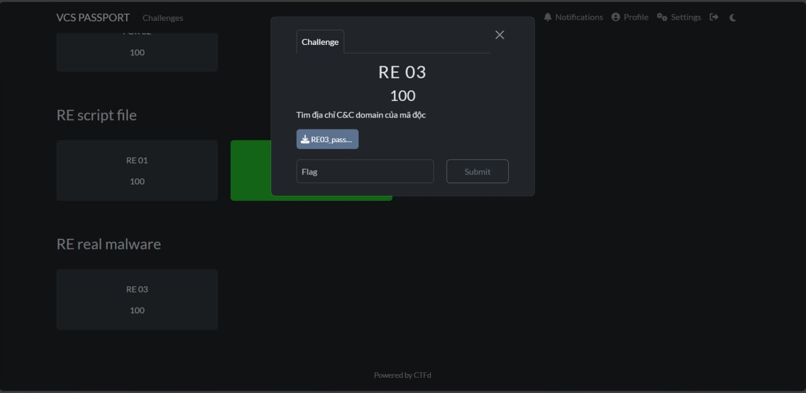
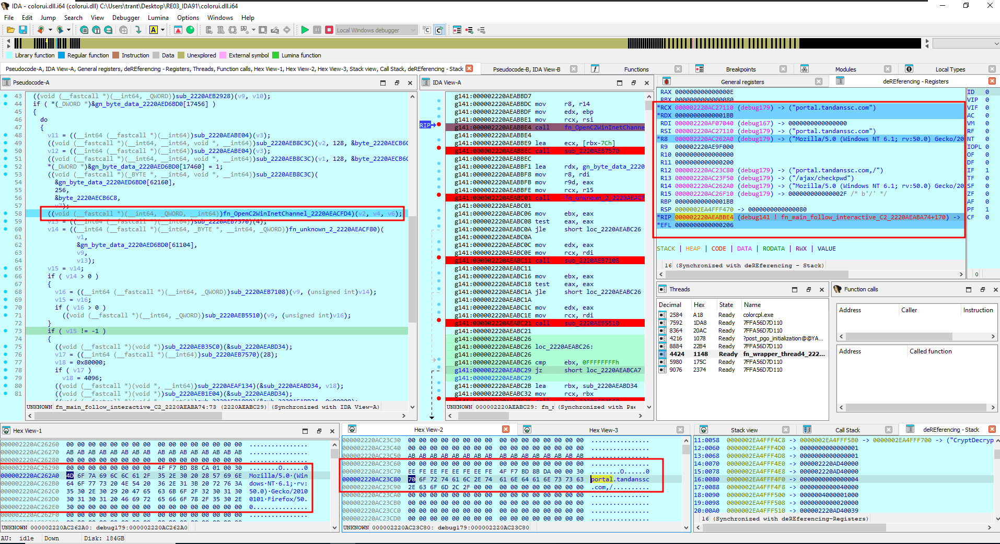
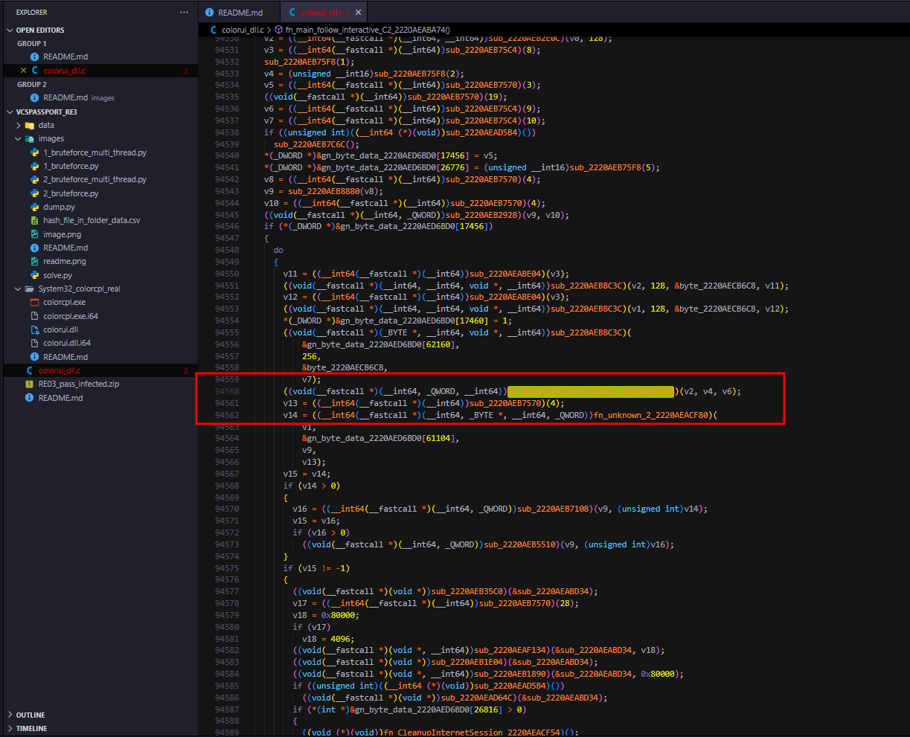

> Đây là challenge Rev 03 của VCSpassport 2024 - một kỳ thi tuyển Intern của Viettel-Cyber-Security bằng CTF kèm theo một vài đánh giá khác. Mục tiêu của thử thách này là "Tìm địa chỉ C&C domain của mã độc", sau đây là một báo cáo ngắn được tổng hợp bằng ChatGPT đối với các NOTE trong quá trình phân tích của mình.



# Table of Contents

- [Executive Summary](#executive-summary)

- [1. Scope and Artifact Overview](#1-scope-and-artifact-overview)

- [2. Sample Identification](#2-sample-identification)
  - [2.1. Challenge Sample Hashes](#21-challenge-sample-hashes)
  - [2.2. Clean Reference Comparison](#22-clean-reference-comparison)
  - [2.3. Identification Result](#23-identification-result)

- [3. Execution Overview](#3-execution-overview)

- [4. Technical Analysis](#4-technical-analysis)
  - [4.1. Dynamic API Resolution](#41-dynamic-api-resolution)
  - [4.2. Behavior of `LaunchColorCpl()`](#42-behavior-of-launchcolorcpl)
  - [4.3. Staging in `C:\Users\Public`](#43-staging-in-cuserspublic)
  - [4.4. Payload Carrier Selection](#44-payload-carrier-selection)
  - [4.5. DES-ECB Decryption and Shellcode Execution](#45-des-ecb-decryption-and-shellcode-execution)
  - [4.6. Shellcode Stage 1](#46-shellcode-stage-1)
  - [4.7. Shellcode Stage 2 and Environment Binding](#47-shellcode-stage-2-and-environment-binding)
  - [4.8. Network Communications](#48-network-communications)

- [5. Timeline of Execution](#5-timeline-of-execution)

- [6. ATT&CK Mapping](#6-attck-mapping)

- [7. Indicators of Compromise (IOC Table)](#7-indicators-of-compromise-ioc-table)
  - [7.1. File and Hash IOCs](#71-file-and-hash-iocs)
  - [7.2. Path and Host IOCs](#72-path-and-host-iocs)
  - [7.3. Key and Runtime IOCs](#73-key-and-runtime-iocs)
  - [7.4. API / Behavior IOCs](#74-api--behavior-iocs)

- [8. Assessment](#8-assessment)

- [9. Conclusion](#9-conclusion)

# Executive Summary

Mẫu `colorui.dll` là một DLL độc hại được triển khai theo mô hình **DLL side-loading** thông qua binary hợp pháp `colorcpl.exe` của Microsoft. Sau khi được nạp, DLL này tạo một chuỗi thực thi nhiều giai đoạn gồm: staging trong `C:\Users\Public`, duyệt và chọn một file mang payload trong thư mục `data/`, giải mã stage tiếp theo bằng **DES-ECB**, thực thi shellcode thông qua callback của `EnumUILanguagesA`, tiếp tục qua một stage có cơ chế ràng buộc môi trường bằng **Volume Serial Number**, và cuối cùng thiết lập kênh liên lạc C2 bằng **WinInet**.

Mẫu không hoạt động theo kiểu nhúng trực tiếp toàn bộ payload trong DLL. Thay vào đó, nó giấu stage kế tiếp bên trong một tập file gây nhiễu và xác định file đúng bằng điều kiện runtime thay vì tên file hiển nhiên. Đồng thời, nó sử dụng khóa DES lấy từ **16 byte cuối** của file đã chọn, làm tăng độ khó cho cả phân tích tĩnh lẫn phân tích động.

Kết quả đối chiếu giữa hash, ghi chú phân tích, bản decompile, script hỗ trợ và quan sát hành vi cho thấy địa chỉ C2 cuối cùng của mẫu là:

```text
portal[.]tandanssc[.]com
```

---

# 1. Scope and Artifact Overview

Workspace phân tích là một bộ hồ sơ hỗn hợp gồm mẫu challenge, file sạch để so sánh, output từ IDA, bản decompile, script brute-force, ghi chú debug và tập dữ liệu nhiễu. Các artifact quan trọng gồm:

- `RE03_pass_infected.zip`: gói challenge gốc, chứa `colorcpl.exe`, `colorui.dll`, `data/`
- `colorui_dll.c`: bản decompile C lớn, là nguồn mạnh nhất để tái dựng hành vi
- `colorui.dll.i64`, `colorcpl.exe.i64`: cơ sở dữ liệu IDA
- `System32_colorcpl_real/`: các bản sạch dùng để so sánh
- `README.md`: ghi chú tổng hợp quy trình phân tích và phát hiện C2
- `images/README.md`: ghi chú debug chi tiết theo từng giai đoạn
- `images/1_bruteforce*.py`, `images/2_bruteforce*.py`, `images/solve.py`, `images/dump.py`: script hỗ trợ brute-force và kiểm tra khóa theo máy
- `data/`: tập file gây nhiễu mà malware duyệt qua trong quá trình chạy

Điểm quan trọng là các artifact này phải được đọc liên kết với nhau. Chỉ khi đối chiếu giữa `README.md`, `images/README.md`, `colorui_dll.c`, thư mục `data/` và các script hỗ trợ thì mới tái dựng được toàn bộ chuỗi hành vi của malware.

---

# 2. Sample Identification

## 2.1. Challenge Sample Hashes

Các hash của bộ challenge được ghi nhận như sau:

- `colorcpl.exe` SHA1: `62B0273CD43E21DC9E55A100BE1F7C52D6C5F249`
- `colorui.dll` SHA1: `A72AF54F10EF9B9ABFDFF395BAB0E747137276D8`

## 2.2. Clean Reference Comparison

Kết quả băm SHA1 trên bản sạch trong `C:\Windows\System32`:

```powershell
PS C:\Users\Admin\Downloads\VCSpassport_RE3\System32> certutil -hashfile .\colorcpl.exe
SHA1 hash of .\colorcpl.exe:
62b0273cd43e21dc9e55a100be1f7c52d6c5f249
CertUtil: -hashfile command completed successfully.

PS C:\Users\Admin\Downloads\VCSpassport_RE3\System32> certutil -hashfile .\colorui.dll
SHA1 hash of .\colorui.dll:
e7092dede941e6e0949760d7489d2b6f26dc460b
CertUtil: -hashfile command completed successfully.
```

## 2.3. Identification Result

Việc đối chiếu cho thấy:

- `colorcpl.exe` trong challenge trùng khớp với binary hợp pháp của Microsoft
- `colorui.dll` trong challenge khác hoàn toàn với `colorui.dll` sạch

Điều này xác nhận rằng:

- `colorcpl.exe` là signed host hợp pháp
- `colorui.dll` là DLL độc hại bị thay thế
- mô hình thực thi là **DLL side-loading**

Đường đi thực thi được ghi nhận là:

- `wWinMain() -> LaunchColorCpl()`

---

# 3. Execution Overview

Chuỗi thực thi tổng quát của mẫu có thể tóm tắt như sau:

1. `colorcpl.exe` hợp pháp nạp `colorui.dll` độc hại
2. DLL resolve động nhiều API quan trọng
3. Tạo thread mới để thao tác với `C:\Users\Public`
4. Duyệt thư mục và tạo `desktop.ini`
5. Xác định file payload trong `data/`
6. Lấy 16 byte cuối file làm khóa DES-ECB
7. Giải mã stage tiếp theo vào bộ nhớ
8. Dùng `VirtualProtect` để cấp quyền thực thi
9. Dùng `EnumUILanguagesA` callback để chạy shellcode
10. Shellcode stage 1 nạp `Advapi32.dll`, gọi `StartServiceCtrlDispatcherW`
11. Shellcode stage 2 kiểm tra `Volume Serial Number` qua `GetVolumeInformationA` + MD5
12. Nếu điều kiện máy phù hợp, malware mở kênh C2 qua WinInet

---

# 4. Technical Analysis

## 4.1. Dynamic API Resolution

Mẫu resolve động nhiều API, thể hiện qua các chuỗi được tìm thấy:

```c
VirtualProtect
PathFile
ExpandEnvi
CreateFi
GetFileS
SetFileP
CloseHan
ReadFile
FindClos
FindFirs
FindNext
EnumUILang
WaitForSin
CreateTh
```

Dữ liệu chuỗi đầy đủ trong bộ nhớ gồm:

```c
VirtualProtect
PathFileExistsW
CreateFileW
GetFileSize
SetFilePointer
CloseHandle
ReadFile
FindClose
FindFirstFileW
FindNextFileW
CreateThread
```

Ngoài ra, vùng dữ liệu chuỗi trong bộ nhớ thể hiện đầy đủ các tên API được malware chuẩn bị sử dụng:

```c
00007FFA4BA63D40  56 69 72 74 75 61 6C 50  72 6F 74 65 63 74 00 00  VirtualProtect..
00007FFA4BA63D60  50 61 74 68 46 69 6C 65  45 78 69 73 74 73 57 00  PathFileExistsW.
00007FFA4BA63DA0  43 72 65 61 74 65 46 69  6C 65 57 00 00 00 00 00  CreateFileW.....
00007FFA4BA63DC0  47 65 74 46 69 6C 65 53  69 7A 65 00 00 00 00 00  GetFileSize.....
00007FFA4BA63DE0  53 65 74 46 69 6C 65 50  6F 69 6E 74 65 72 00 00  SetFilePointer..
00007FFA4BA63E00  43 6C 6F 73 65 48 61 6E  64 6C 65 00 00 00 00 00  CloseHandle.....
00007FFA4BA63E20  52 65 61 64 46 69 6C 65  00 00 00 00 00 00 00 00  ReadFile........
00007FFA4BA63E40  46 69 6E 64 43 6C 6F 73  65 00 00 00 00 00 00 00  FindClose.......
00007FFA4BA63E60  46 69 6E 64 46 69 72 73  74 46 69 6C 65 57 00 00  FindFirstFileW..
00007FFA4BA63E80  46 69 6E 64 4E 65 78 74  46 69 6C 65 57 00 00 00  FindNextFileW...
00007FFA4BA63EC0  43 72 65 61 74 65 54 68  72 65 61 64 00 00 00 00  CreateThread....
```

Bộ API này phản ánh đúng logic thao tác file, duyệt thư mục, cấp quyền bộ nhớ và chạy shellcode gián tiếp.

---

## 4.2. Behavior of `LaunchColorCpl()`

Dựa trên decompile và ghi chú debug, `LaunchColorCpl()` thực hiện:

- `GetModuleHandleW(L"kernel32.dll")`
- `LoadLibraryW(L"Shlwapi.dll")`
- resolve động `CreateThread`
- resolve động `WaitForSingleObject`

Sau đó tạo một thread phụ để xử lý logic chính.

---

## 4.3. Staging in `C:\Users\Public`

Thread phụ này nhắm vào:

- `C:\Users\Public`

Nó lần lượt gọi:

- `ExpandEnvironmentStringsW("C:\\Users\\Public", ..., 260)`
- `PathFileExistsW("C:\\Users\\Public")`

Nếu thư mục tồn tại, malware duyệt:

- `C:\Users\Public\*`

qua các API:

- `FindFirstFileW`
- `FindNextFileW`
- `FindClose`

Đồng thời, nó tạo file:

- `C:\Users\Public\desktop.ini`

bằng:

- `CreateFileW(..., CREATE_ALWAYS, ...)`

Nội dung được ghi:

```ini
[.ShellClassInfo]
LocalizedResourceName=@%SystemRoot%\system32\shell32.dll,-21816
```

Điều này cho thấy `C:\Users\Public` được dùng làm vị trí staging, còn `desktop.ini` được sử dụng để làm thư mục trông bình thường hơn.

---

## 4.4. Payload Carrier Selection

Malware không xác định file payload chỉ theo tên. Thay vào đó, nó áp dụng điều kiện kích thước:

- `512000 < x < 716800`

Trong workspace, chỉ một file thỏa điều kiện:

- `data/ntuser.pol` — kích thước `512024`

Điều này xác nhận `ntuser.pol` là file mang payload.

16 byte cuối file là:

```text
66 E9 36 BA 9C 17 BD 94 EE 7C 12 A7 19 DE 55 37
```

Đây chính là vật liệu khóa DES dùng để giải mã stage tiếp theo.

---

## 4.5. DES-ECB Decryption and Shellcode Execution

Sau khi xác định `data/ntuser.pol`, malware:

- đọc nội dung file
- lấy 16 byte cuối làm khóa
- giải mã payload bằng **DES-ECB**
- dùng `VirtualProtect` để đổi quyền bộ nhớ sang thực thi
- thực thi shellcode qua callback của `EnumUILanguagesA`

Thay vì gọi trực tiếp shellcode, malware dùng API callback hợp lệ của Windows để che giấu luồng thực thi thật.

---

## 4.6. Shellcode Stage 1

Shellcode đầu tiên:

- lấy module base từ PEB
- resolve động API
- gọi `CreateThread`
- nạp `Advapi32.dll` bằng `LoadLibraryA`

Một hành vi rất đáng chú ý là gọi động đến:

- `StartServiceCtrlDispatcherW`

Điều này cho thấy stage này hoạt động theo kiểu service hoặc ngụy trang dưới mô hình Windows Service. Trong quá trình debug, một tên service đáng ngờ được quan sát là:

- `SVDll2`

Tên này nên được xem là IOC quan sát động, còn lời gọi `StartServiceCtrlDispatcherW` là bằng chứng kỹ thuật trực tiếp.

---

## 4.7. Shellcode Stage 2 and Environment Binding

Stage tiếp theo resolve thêm nhiều API:

- `LoadLibraryExA`
- `GetProcAddress`
- `VirtualProtect`
- `GetProcessHeap`
- `HeapAlloc`
- `HeapFree`
- `VirtualAlloc`
- `VirtualFree`
- `GetVolumeInformationA`
- `CryptAcquireContextA`
- `CryptCreateHash`
- `CryptHashData`
- `CryptGetHashParam`
- `CryptDecrypt`
- `GetAdaptersInfo`
- `CryptUnprotectData`

Nó cấp phát vùng nhớ bằng `VirtualAlloc`, sau đó chuyển sang `PAGE_EXECUTE_READWRITE` bằng `VirtualProtect`.

Phần quan trọng nhất ở stage này là kiểm tra máy đích bằng `Volume Serial Number`:

1. dùng `GetVolumeInformationA` để lấy serial ổ đĩa
2. băm 4 byte serial bằng MD5
3. lấy phần `hash[10:14]`
4. XOR với hằng số nội bộ
5. chỉ tiếp tục nếu giá trị khớp điều kiện

Ví dụ hash được ghi nhận:

```text
18 B1 4E B2 03 BA 0B 3C C2 81 62 AC 53 8D BD 47
```

Brute Force 4-bytes để tìm Volume Serial Number:

```powershell
PS C:\Users\nigmaz\Desktop\Code> python .\multi_thread.py
[+] Brute-force 32-bit * 16 threads * chunk = 1,048,576
[=>] FOUND 0x95FCE4BA  |  VS = 95FC-E4BA
[=>] FOUND 0xF22B5592  |  VS = F22B-5592

========== SUMMARY ==========
  1: 0x95FCE4BA  |  VS = 95FC-E4BA
  2: 0xF22B5592  |  VS = F22B-5592
[+] Tổng cộng 2 giá trị khớp.
PS C:\Users\nigmaz\Desktop\Code>
```

Các script brute-force trong `images/` hỗ trợ tìm các serial phù hợp. Hai giá trị thỏa mãn điều kiện là:

- `95FC-E4BA`
- `F22B-5592`

Sau khi kiểm tra lại bằng phân tích động, serial chính xác là:

- `F22B-5592`

Script PATCH byte sau khi call `GetVolumeInformationA()` để test giá trị :

```python
# IDA setup data
# Địa chỉ đích (cần thay đổi thành địa chỉ bạn muốn ghi vào)
address = 0x0000002EA4FFF650

# Dữ liệu byte cần ghi
# data = b"\xBA\xE4\xFC\x95"
data = b"\x92\x55\x2B\xF2"

# Dùng vòng lặp for để ghi từng byte một vào bộ nhớ
for i, byte in enumerate(data):
    current_address = address + i  # Tính địa chỉ hiện tại
    ida_bytes.patch_byte(current_address, byte)  # Ghi từng byte vào địa chỉ
    print(f"Write byte {hex(byte)} into address {hex(current_address)} success!")

print(f"The {len(data)} byte written into memory.")
```

Điều này cho thấy malware có cơ chế ràng buộc môi trường và anti-analysis rõ ràng.

---

## 4.8. Network Communications

Khi vượt qua điều kiện máy, stage cuối sử dụng WinInet để mở kênh C2. Các API liên quan gồm:

- `InternetOpenA`
- `InternetSetOptionA`
- `InternetConnectA`
- `HttpOpenRequestA`
- `HttpSendRequestA`
- `InternetReadFile`

Điểm mấu chốt là tham số thứ hai của `InternetConnectA` chính là tên máy chủ C2:

```c
HINTERNET InternetConnectA(
    HINTERNET hInternet,
    LPCSTR    lpszServerName,
    INTERNET_PORT nServerPort,
    LPCSTR    lpszUserName,
    LPCSTR    lpszPassword,
    DWORD     dwService,
    DWORD     dwFlags,
    DWORD_PTR dwContext
);
```

Tham số thứ hai `lpszServerName` chính là tên miền hoặc địa chỉ IP của máy chủ điều khiển. Ghi chú debug xác định rằng việc khôi phục C2 được thực hiện qua quá trình theo dõi động API WinInet, không phải do chuỗi plaintext hiện sẵn rõ ràng trong bản dump. Địa chỉ C2 được xác định là:

```text
portal[.]tandanssc[.]com
```

---

# 5. Timeline of Execution

| Stage | Mô tả                                                                    |
| ----- | ------------------------------------------------------------------------ |
| 1     | `colorcpl.exe` hợp pháp được chạy                                        |
| 2     | `colorui.dll` độc hại được nạp qua side-loading                          |
| 3     | `LaunchColorCpl()` resolve động API và tạo thread phụ                    |
| 4     | Thread phụ kiểm tra và duyệt `C:\Users\Public`                           |
| 5     | Malware tạo hoặc ghi lại `C:\Users\Public\desktop.ini`                   |
| 6     | Malware duyệt dữ liệu và xác định `data/ntuser.pol` là file mang payload |
| 7     | 16 byte cuối `ntuser.pol` được dùng làm khóa DES-ECB                     |
| 8     | Payload được giải mã vào bộ nhớ                                          |
| 9     | `VirtualProtect` cấp quyền thực thi                                      |
| 10    | Shellcode được chạy qua callback `EnumUILanguagesA`                      |
| 11    | Stage 1 nạp `Advapi32.dll` và gọi `StartServiceCtrlDispatcherW`          |
| 12    | Stage 2 lấy `Volume Serial Number`, băm MD5, kiểm tra điều kiện máy      |
| 13    | Nếu hợp lệ, malware dùng WinInet để mở kênh C2                           |
| 14    | Kết nối đến `portal[.]tandanssc[.]com`                                   |

---

# 6. ATT&CK Mapping

| ATT&CK ID                                          | Technique                                        | Áp dụng trong mẫu                                           |
| -------------------------------------------------- | ------------------------------------------------ | ----------------------------------------------------------- |
| T1574.002                                          | Hijack Execution Flow: DLL Side-Loading          | `colorcpl.exe` nạp `colorui.dll` độc hại                    |
| T1027                                              | Obfuscated/Compressed Files and Information      | Payload được giấu trong `data/ntuser.pol`, giải mã lúc chạy |
| T1106                                              | Native API                                       | Resolve động và gọi nhiều Windows API                       |
| T1055 / tương tự hành vi injection-style execution | Process/Memory Execution                         | Giải mã shellcode vào bộ nhớ rồi đổi quyền thực thi         |
| T1620 / execution via callback-like mechanism      | Reflective/Indirect Execution Pattern            | Chạy shellcode qua callback `EnumUILanguagesA`              |
| T1027.013                                          | Encrypted/Encoded File                           | Dùng DES-ECB để giải mã stage                               |
| T1497.001                                          | Virtualization/Sandbox Evasion: System Checks    | Kiểm tra `Volume Serial Number`                             |
| T1036                                              | Masquerading                                     | Dùng `desktop.ini`, signed host, service-style behavior     |
| T1543.003                                          | Create or Modify System Process: Windows Service | Gọi `StartServiceCtrlDispatcherW`                           |
| T1071.001                                          | Application Layer Protocol: Web Protocols        | Dùng WinInet, HTTP request/response                         |
| T1071                                              | Application Layer Protocol                       | Giao tiếp C2 qua WinInet                                    |
| T1105                                              | Ingress Tool Transfer / Data Transfer            | Đọc dữ liệu phản hồi từ máy chủ qua `InternetReadFile`      |

Ghi chú: một số kỹ thuật ở đây là ánh xạ gần đúng theo hành vi quan sát được trong challenge, không nhất thiết phản ánh đầy đủ toàn bộ triển khai malware thực ngoài thực tế.

---

# 7. Indicators of Compromise (IOC Table)

## 7.1. File and Hash IOCs

| Loại | Giá trị                                                            |
| ---- | ------------------------------------------------------------------ |
| SHA1 | `colorcpl.exe` — `62B0273CD43E21DC9E55A100BE1F7C52D6C5F249`        |
| SHA1 | `colorui.dll` độc hại — `A72AF54F10EF9B9ABFDFF395BAB0E747137276D8` |
| SHA1 | `colorui.dll` sạch — `E7092DEDE941E6E0949760D7489D2B6F26DC460B`    |
| File | `data/ntuser.pol`                                                  |
| File | `C:\Users\Public\desktop.ini`                                      |

## 7.2. Path and Host IOCs

| Loại            | Giá trị                          |
| --------------- | -------------------------------- |
| Staging Path    | `C:\Users\Public`                |
| Suspicious Path | `%windir%\sysnative\bootcfg.exe` |
| C2              | `portal[.]tandanssc[.]com`       |

## 7.3. Key and Runtime IOCs

| Loại                  | Giá trị                                           |
| --------------------- | ------------------------------------------------- |
| DES key material      | `66 E9 36 BA 9C 17 BD 94 EE 7C 12 A7 19 DE 55 37` |
| Service name observed | `SVDll2`                                          |
| Candidate serials     | `95FC-E4BA`, `F22B-5592`                          |
| Valid serial observed | `F22B-5592`                                       |

## 7.4. API / Behavior IOCs

| Nhóm        | Giá trị                                                                                                               |
| ----------- | --------------------------------------------------------------------------------------------------------------------- |
| File/FS     | `FindFirstFileW`, `FindNextFileW`, `CreateFileW`, `ReadFile`, `GetFileSize`, `SetFilePointer`, `CloseHandle`          |
| Memory      | `VirtualAlloc`, `VirtualProtect`, `VirtualFree`, `HeapAlloc`, `HeapFree`                                              |
| Execution   | `CreateThread`, `WaitForSingleObject`, `EnumUILanguagesA`                                                             |
| Crypto      | `CryptAcquireContextA`, `CryptCreateHash`, `CryptHashData`, `CryptGetHashParam`, `CryptDecrypt`, `CryptUnprotectData` |
| Environment | `GetVolumeInformationA`, `GetAdaptersInfo`                                                                            |
| Network     | `InternetOpenA`, `InternetSetOptionA`, `InternetConnectA`, `HttpOpenRequestA`, `HttpSendRequestA`, `InternetReadFile` |
| Service     | `StartServiceCtrlDispatcherW`                                                                                         |

---

# 8. Assessment

`colorui.dll` là một loader nhiều giai đoạn được thiết kế khá bài bản. Mẫu kết hợp nhiều kỹ thuật thường thấy trong malware:

- side-loading qua signed binary hợp pháp
- staging tại thư mục dùng chung dễ bị bỏ qua
- dùng `desktop.ini` để làm hành vi trông bình thường hơn
- giấu payload trong file dữ liệu gây nhiễu
- giải mã nhiều stage trong bộ nhớ
- thực thi gián tiếp qua callback API
- khóa thực thi theo máy bằng `Volume Serial Number`
- liên lạc C2 qua giao thức web

Điểm nổi bật nhất là malware không đặt payload ở một vị trí hiển nhiên. Thư mục `data/` không phải chỉ là “rác” mà là một phần cốt lõi trong cơ chế che giấu. Payload được lồng vào một file trông bình thường và chỉ được xác định khi điều kiện runtime phù hợp.

---

# 9. Conclusion

Từ việc đối chiếu hash, decompile, script hỗ trợ, ghi chú debug và hành vi runtime, có thể kết luận chắc chắn:

- `colorcpl.exe` là binary hợp pháp bị lợi dụng làm host side-loading
- `colorui.dll` là DLL độc hại
- `LaunchColorCpl()` tạo thread phụ, duyệt `C:\Users\Public`, tạo `desktop.ini`, xác định `data/ntuser.pol` là file mang payload
- 16 byte cuối của `ntuser.pol` được dùng làm khóa DES-ECB để giải mã shellcode
- shellcode được thực thi qua callback `EnumUILanguagesA`
- stage tiếp theo nạp `Advapi32.dll`, gọi `StartServiceCtrlDispatcherW`, rồi kiểm tra `Volume Serial Number`
- sau khi điều kiện môi trường thỏa mãn, malware mở kênh WinInet và giao tiếp với hạ tầng điều khiển

**Final C2 address:**

```text
portal[.]tandanssc[.]com
```



- Vị trí xác định được C2 khi DEBUG - check qua file dump code C khi debug chương trình colorui_dll.c khi debug.



- Cách khác ở đây là dùng thẳng WindowsAPI monitor để theo dõi và quan sát các đối số của các hàm tương tác mạng được sử dụng.
