# Earth Baxia APT Techniques - Ransomware Charon Analysis

> Ransomware Charon is a sophisticated ransomware strain associated with the Earth Baxia APT group. This analysis delves into its techniques, tactics, and procedures (TTPs) to better understand its operation and impact.

## Table of Contents

- [I. Overview Analysis](#i-overview-analysis)

  - [1. File "msedge.dll" Analysis](#1-file-msedgedll-analysis)
  - [2. Payload Shellcode Analysis](#2-payload-shellcode-analysis)

- [II. Technical Analysis of the Charon Ransomware](#ii-technical-analysis-of-the-charon-ransomware)

  - [1. Anti-Detection & Anti-Recovery (Pre-Encryption Behaviors)](#1-anti-detection--anti-recovery-pre-encryption-behaviors)
  - [2. Encryption Logic Analysis](#2-encryption-logic-analysis)
  - [3. Other Behaviors Beyond Encryption](#3-other-behaviors-beyond-encryption)

- [III. IOC and MITRE-ATT&CK Framework](#iii-ioc-and-mitre-attck-framework)

  - [1. IoC](#1-ioc)
  - [2. MITRE-ATT&CK Framework](#2-mitre-attck-framework)

- [IV. Resource References](#iv-resource-references)

## I. Overview Analysis

| Tên file      | SHA-1 hash                               |
| ------------- | ---------------------------------------- |
| Edge.exe      | 049046edd5feb5a558ab6300472788ac6ca44f22 |
| msedge.dll    | 21b233c0100948d3829740bd2d2d05dc35159ccb |
| DumpStack.log | a1c6090674f3778ea207b14b1b55be487ce1a2ab |

- Mẫu Ransomware mới có tên Charon được phát hiện trong các cuộc tấn công có chủ đích ở khu vực công và ngành hàng không Trung Đông. Cuộc tấn công sử dụng kỹ thuật DLL-SideLoading để thực thi mã độc, cách triển khai các file để thực thi hành vi độc hại tương đối giống với Earth Baxia campaigns từng được ghi nhận trước đó ( https://www.trendmicro.com/en_fi/research/24/i/earth-baxia-spear-phishing-and-geoserver-exploit.html ) .

- Chuỗi tấn công đã tận dụng một tệp hợp pháp liên quan đến trình duyệt - "Edge.exe" ( tên ban đầu là "cookie_exporter.exe" ) để tải "msedge.dll" là file mã độc (SWORDLDR), sau đó triển khai ransomware_payload trên máy nạn nhân.

- Luồng hoạt động của phần mềm độc hại :

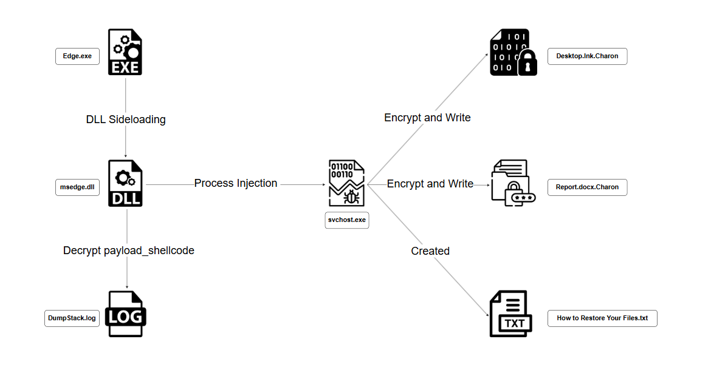

### 1. File "msedge.dll" Analysis

- Mã độc thực hiện kỹ thuật DLL-SideLoading sử dụng file hợp pháp liên quan đến trình duyệt "Edge.exe" thực hiện nạp vào bộ nhớ địa chỉ của thư viện "msedge.dll" [ Map DLL vào không gian bộ nhớ -> resolve imports, chạy TLS callbacks -> gọi entry của DLL và ở đây là DllEntryPoint ] .

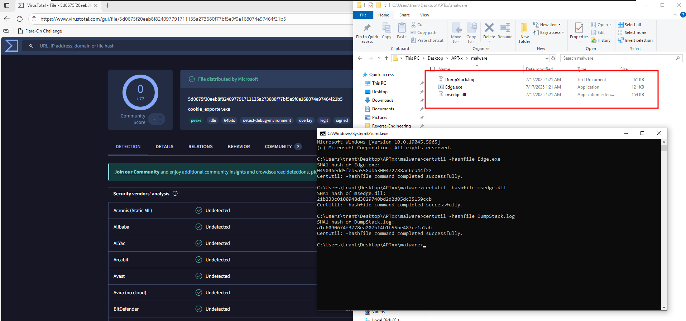


- File mã độc "msedge.dll" bị obfuscated nặng, trong hàm "DllEntryPoint(...)" thực hiện call các hàm thông qua function pointer thứ nhất trong đó function_pointer_1[0] và function_pointer_1[1] là hàm obfuscated còn function_pointer_1[2] là follow thực thi tiếp theo của malware ( Ở đây đặt tên là main_follow để theo dõi ).

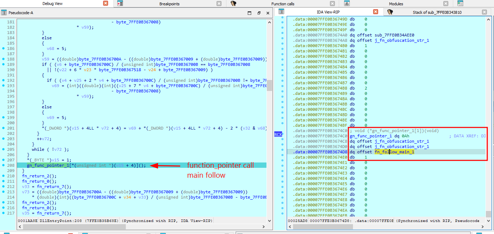

- Trong hàm main_follow tiếp theo cũng sẽ gọi các function_pointer thực hiện các hành vi sau:

  - Hàm kiểm tra tồn tại của file "DumpStack.log" đọc nội dung file và giải mã nội dung file thành payload_shellcode, trong hàm này cũng gọi một hàm khác thực hiện kiểm tra Anti Debug.

  - Thực hiện resolve các hàm WindowsAPI có tên trong nội dung được giải mã từ file "DumpStack.log" để thực hiện kỹ thuật gọi payload_shellcode (Các "function_pointer_x(...)" được call obfuscated ở các vị trí khác nhau).

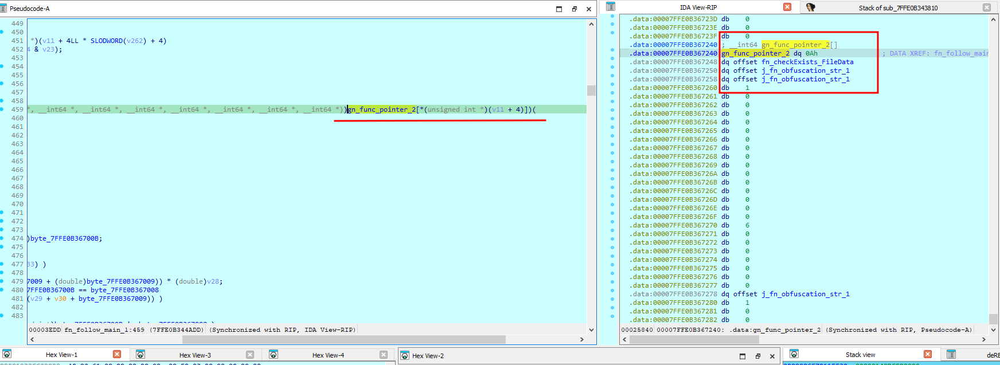


- Hàm kiểm tra file "DumpStack.log" tồn tại không, đọc nội dung file và thực hiện logic giải mã nội dung file thành các thông tin liên quan như string WindowsAPI, string "C:\Windows\System32\svchost.exe" và payload_shellcode.

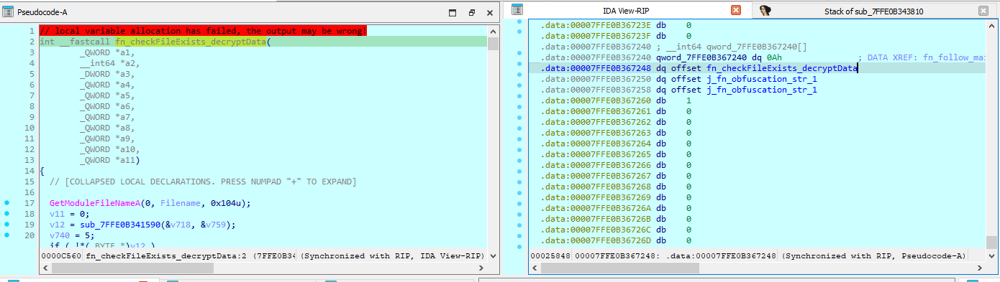


```cpp
'Kernel32.dll',0,
'CreateProcessA',0,
'VirtualAllocEx',0,
'WriteProcessMemory',0,
'GetThreadContext',0,
'SetThreadContext',0,
'ResumeThread',0,
'VirtualProtectEx',0,
'C:\\Windows\\System32\\svchost.exe;W1'
```

- Hàm Anti Debug (Logic call hàm này trong hàm xử lý file "DumpStack.log") - Kiểm tra process có đang chạy trong debugger nào không ?

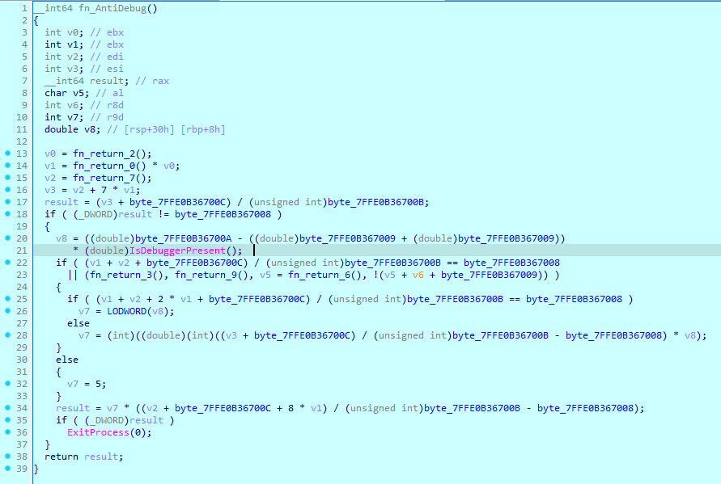

- Sau khi xử lý file "DumpStack.log", hàm main_follow tiếp tục gọi các function_pointer khác để resolve các hàm WindowsAPI có tên trong strings được giải mã từ file "DumpStack.log" .

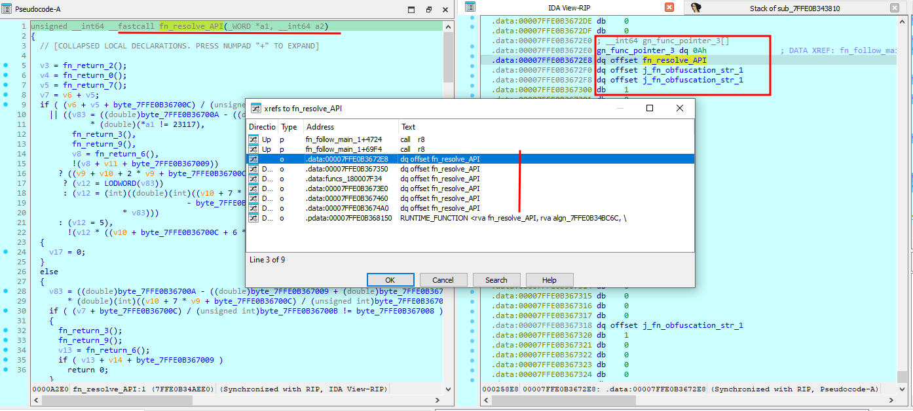

- DLL độc hại thực hiện kỹ thuật Process Injection bằng CreateProcessA (suspended) + WriteProcessMemory + VirtualProtectEx + SetThreadContext + ResumeThread vào tiến trình "C:\Windows\System32\svchost.exe" để thực thi payload_shellcode được decrypt từ file "DumpStack.log" .

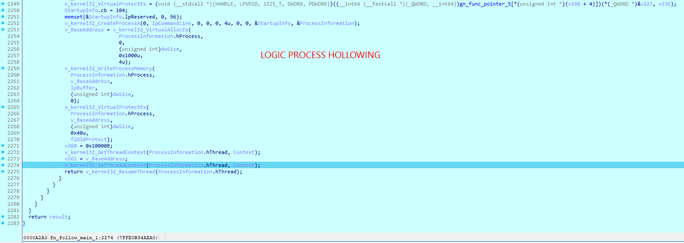

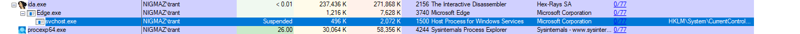

- Đây là một dạng Process-Hollowing khi tạo process suspended sau đó sửa giá trị thanh ghi RIP trong struct "\_CONTEXT" để trỏ đến địa chỉ vùng nhớ chứa shellcode trong process "svchost.exe" . Địa chỉ chứa giá trị thanh ghi RIP ở offset 0xf8 trong struct "\_CONTEXT".

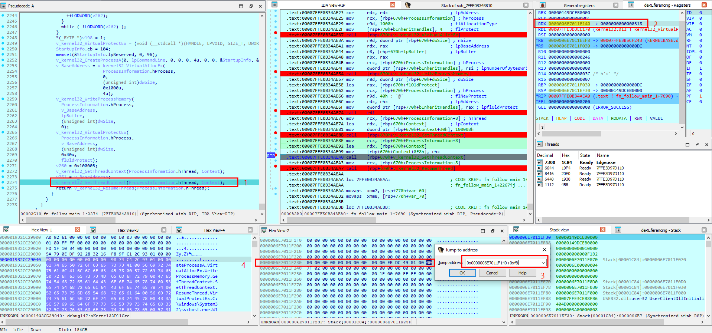


```cpp
typedef struct DECLSPEC_ALIGN(16) _CONTEXT
{
    DWORD64 P1Home;
    DWORD64 P2Home;
    DWORD64 P3Home;
    DWORD64 P4Home;
    DWORD64 P5Home;
    DWORD64 P6Home;

    DWORD ContextFlags;
    DWORD MxCsr;

    WORD   SegCs;
    WORD   SegDs;
    WORD   SegEs;
    WORD   SegFs;
    WORD   SegGs;
    WORD   SegSs;
    DWORD EFlags;

    DWORD64 Dr0;
    DWORD64 Dr1;
    DWORD64 Dr2;
    DWORD64 Dr3;
    DWORD64 Dr6;
    DWORD64 Dr7;

    DWORD64 Rax;
    DWORD64 Rcx;
    DWORD64 Rdx;
    DWORD64 Rbx;
    DWORD64 Rsp;
    DWORD64 Rbp;
    DWORD64 Rsi;
    DWORD64 Rdi;
    DWORD64 R8;
    DWORD64 R9;
    DWORD64 R10;
    DWORD64 R11;
    DWORD64 R12;
    DWORD64 R13;
    DWORD64 R14;
    DWORD64 R15;

    DWORD64 Rip;

    union {
        XMM_SAVE_AREA32 FltSave;
        struct {
            M128A Header[2];
            M128A Legacy[8];
            M128A Xmm0;
            M128A Xmm1;
            M128A Xmm2;
            M128A Xmm3;
            M128A Xmm4;
            M128A Xmm5;
            M128A Xmm6;
            M128A Xmm7;
            M128A Xmm8;
            M128A Xmm9;
            M128A Xmm10;
            M128A Xmm11;
            M128A Xmm12;
            M128A Xmm13;
            M128A Xmm14;
            M128A Xmm15;
        };
    };

    M128A VectorRegister[26];
    DWORD64 VectorControl;

    DWORD64 DebugControl;
    DWORD64 LastBranchToRip;
    DWORD64 LastBranchFromRip;
    DWORD64 LastExceptionToRip;
    DWORD64 LastExceptionFromRip;
} CONTEXT, *PCONTEXT;
```

### 2. Payload Shellcode Analysis

- Khi phân tích payload_shellcode có thể debug qua PID của "svchost.exe" sử dụng IDA attach nhưng lời khuyên là dump shellcode từ process memory khi debug "msede.dll" và patch header vào shellcode thành file exe rồi debug ( Tools shellcode2exe: https://github.com/repnz/shellcode2exe ) .

```python
import idaapi
import binascii

start_address = 0x000001932CC382C0
end_address = start_address + 0x000000000000F1B2
data = idaapi.get_bytes(start_address, 0x000000000000F1B2)

with open("dumped_data.bin", "wb") as f:
    f.write(data)
    f.close()
    print("Success dump file data!")
```

```ps1
.\shellcode2exe.bat 64 dumped_data.bin payload_shellcode.exe
```

- Chương trình thực hiện resolve các API như "ntdll_LdrLoadDll; ntdll_NtAllocateVirtualMemory; ntdll_NtProtectVirtualMemory; ntdll_NtFreeVirtualMemory" để thực hiện logic tạo memory chứa payload mới, đưa payload vào memory vừa cấp phát và cấp quyền thực thi cho memory chứa payload, cuối cùng là dọn dẹp memory.

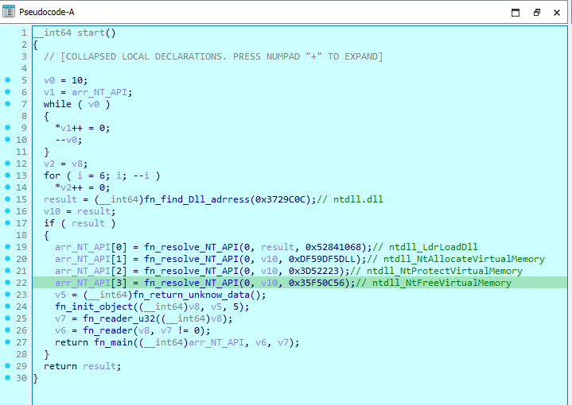

- Tiếp theo chương trình dùng thuật toán XOR giải mã một đoạn shellcode trong payload_shellcode và gọi đến các hàm được giải mã đó .

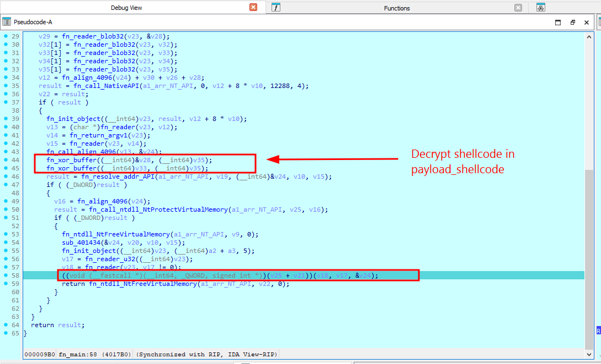

- Phân tích tiếp thì có thể xác định payload_shellcode là payload trung gian. Sau khi giải mã layer này thì tệp PE cuối được tạo ra, đây là ransomware_payload Charon và có thể xác minh nhanh chóng bằng việc dump PE File ra chạy thử.

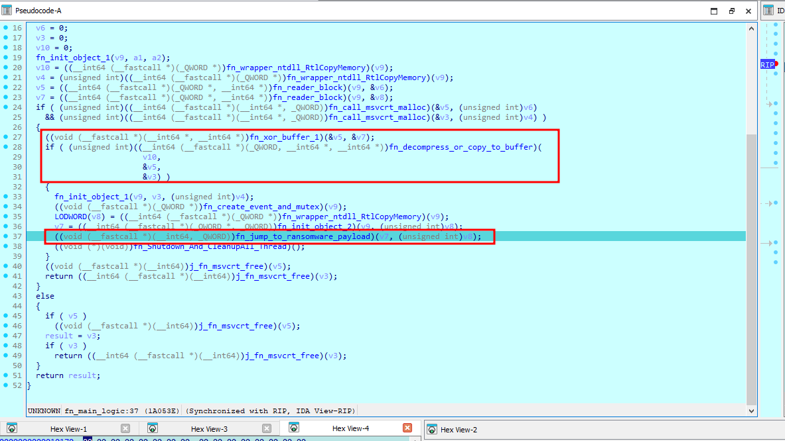

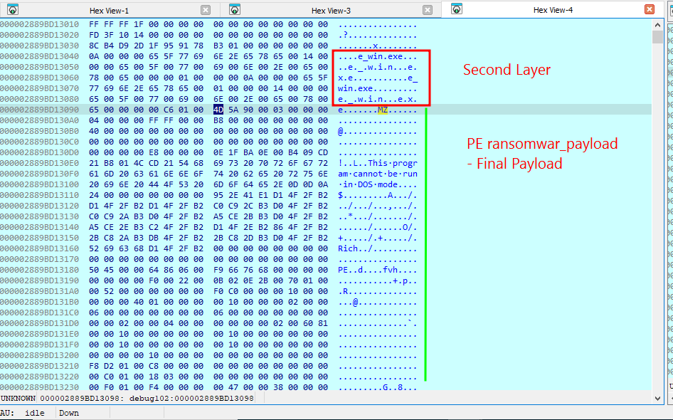

- payload_shellcode tiếp tục sử dụng kỹ thuật Process-Hollowing sau đó sửa giá trị thanh ghi RIP trong struct "\_CONTEXT" để trỏ đến địa chỉ hàm main trong PE-File được decrypt ( PE-File Charon_Ransomware vẫn nằm trong bộ nhớ của process thay vì được extract ra rồi thực thi ) .

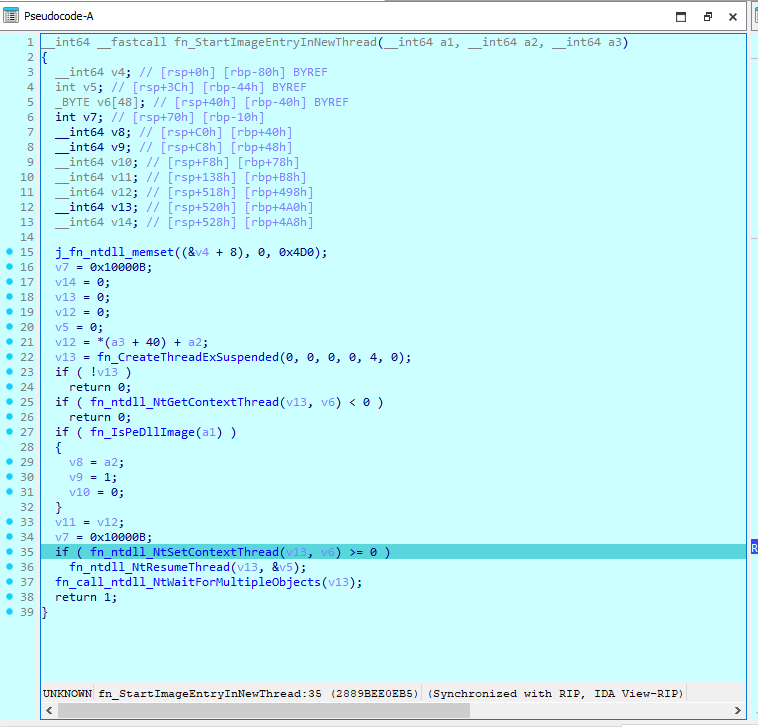

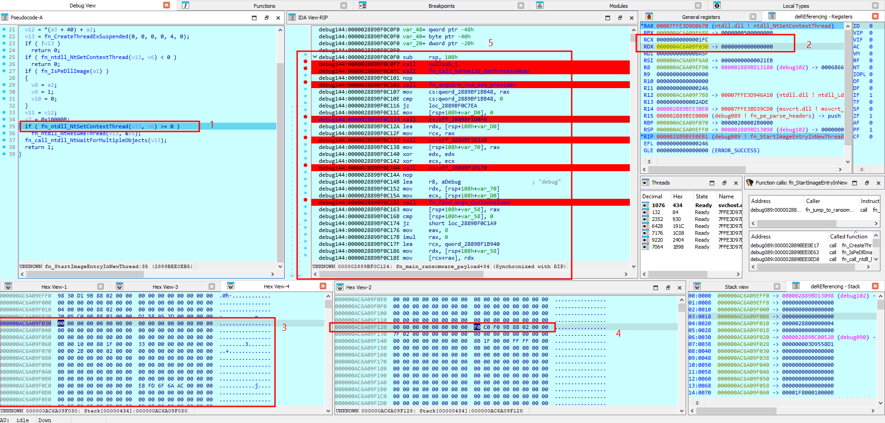

- Đoạn này DEBUG tiến hành kiểm tra và tính toán theo offset để check RIP được đặt trong struct "\_CONTEXT" khi gọi hàm "ntdll_NtSetContextThread" nếu DEBUG sử dụng IDA attach PID "svchost.exe" .

- Một lần nữa lời khyên là dump PE-File Charon_Ransomware để debug ( Dump từ debug IDA attach PID "svchost.exe" thay vì file payload_shellcode do khi patch header của payload_shellcode làm sai gì đó khiến tính toán size_file theo e_lfanew bị sai ? ) nhưng không có size của PE-File nên cần tính toán size từ field "e_lfanew" [ - Script-IDA [dump_PE_in_payload_shellcode.py](./files/dump_PE_in_payload_shellcode.py) - ]. Logic tính File-Size :

```
address_MZ = 0xABCDEFGH

addr_e_lfanew = address_MZ + 0x3C

value_e_lfanew = 4 byte little edian at addr_e_lfanew

addr_PE_header = address_MZ + value_e_lfanew

addr_number_of_section = addr_PE_header + 4 + 2

value_number_of_section = 2 bytes little edian at addr_number_of_section

offset_from_first_section_to_last_section = 0x28 * (value_number_of_section - 1)

addr_first_section = addr_PE_header + 0x108

addr_last_section = addr_first_section + offset_from_first_section_to_last_section

addr_size_of_raw_data = addr_last_section + 0x10

addr_pointer_to_raw_data = addr_last_section + 0x14

size_of_raw_data = 4 byte little edian at addr_size_of_raw_data

pointer_to_raw_data = 4 byte little edian at addr_pointer_to_raw_data

file_size = size_of_raw_data + pointer_to_raw_data

=> dump byte to file start addr address_MZ to (address_MZ + file_size)
```

## II. Technical analysis of the Charon Ransomware

- Thông tin cơ bản File "Charon_Ransomware" - Payload thực hiện quá trình mã hóa:

| Tên file              | SHA-1 hash                               |
| --------------------- | ---------------------------------------- |
| Charon_Ransomware.exe | 92750eb5990cdcda768c7cb7b654ab54651c058a |

### 1. Anti-Detection & Anti-Recovery (Pre-Encryption Behaviors)

- Khi khởi chạy, "Charon_Ransomware.exe" nhận các đối số để thực thi các logic như ghi log lỗi, liệt kê các máy chủ trong mạng, địa chỉ IP và tất cả các folder được share trên máy chủ này (ngoại trừ ADMIN),...

| Tham số                         | Mô tả                                                                                                                                                                                                           |
| ------------------------------- | --------------------------------------------------------------------------------------------------------------------------------------------------------------------------------------------------------------- |
| `--debug=<đường_dẫn + tên_tệp>` | Bật ghi log lỗi vào đường dẫn tệp chỉ định. Ghi lại mọi lỗi trong suốt quá trình mã hóa.                                                                                                                        |
| `--shares=<chia_sẻ_mạng>`       | Liệt kê tên máy chủ trong mạng/địa chỉ IP mục tiêu, đồng thời liệt kê và mã hóa tất cả các share folder có thể truy cập trên các máy chủ này (ngoại trừ `ADMIN$`).                                              |
| `--paths=<đường_dẫn_cụ_thể>`    | Liệt kê các đường dẫn cụ thể hoặc ký tự ổ đĩa cần mã hóa; có thể là đường dẫn cục bộ (`C:\folder`) hoặc ký tự ổ đĩa (`D:`).                                                                                     |
| `--sf`                          | Viết tắt của "**Shares First**". Khi đặt cờ này, thứ tự mã hóa thay đổi: ưu tiên mã hóa các share mạng trước rồi đến ổ đĩa cục bộ; nếu không đặt cờ, mặc định là ưu tiên ổ đĩa cục bộ trước rồi đến share mạng. |

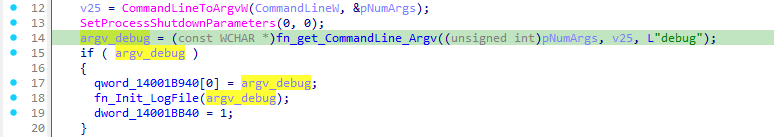

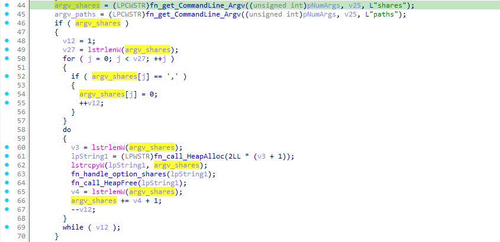

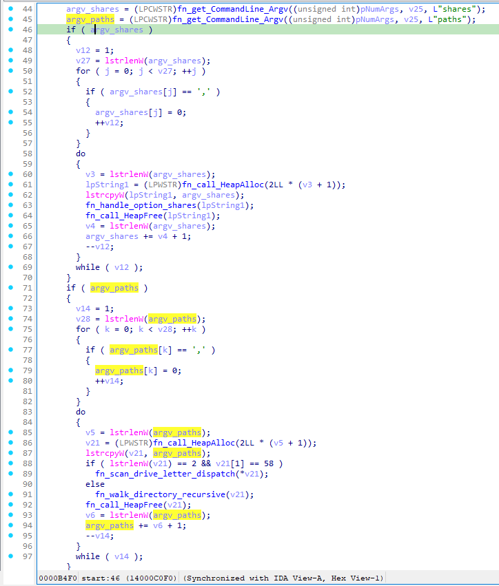

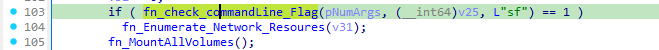

- Chương trình tạo Mutex có tên là "OopsCharonHere" tránh chạy trùng lặp process.

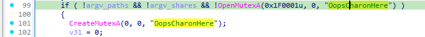

- Trình tự các hành vi thực hiện trước khi mã hóa:

  - Dừng các Service liên quan đến bảo mật.

  - Kết thúc các tiến trình liên quan đến bảo mật.

  - Xóa bản sao bị ẩn, làm trống thùng rác và khởi tạo nhiều luồng cho quá trình mã hóa.

- Trước khi bắt đầu quy trình mã hóa, Ransomware thực hiện một loạt hành động gây gián đoạn nhằm tối đa hóa khả năng thành công và giảm thiểu khả năng khôi phục hoặc can thiệp trong quá trình mã hóa. Ransomware dừng các service liên quan đến bảo mật và kết thúc các tiến trình đang hoạt động ( "sql.exe", bao gồm cả các serivice liên quan đến bảo mật - khi phân tích thì hành vi kết thúc tiến trình "sql.exe" nhằm tránh hai tiến trình cùng tham chiếu đến 1 đối tượng dẫn đến tiến trình mã hóa không thể mã hóa đối tượng file đang được sử dụng). Điều này đảm bảo phần mềm chống vi-rút và EDR bị vô hiệu hóa, giảm khả năng bị phát hiện hoặc gián đoạn. Danh sách các tên dịch vụ và tiến trình có thể được tìm thấy tại đây.

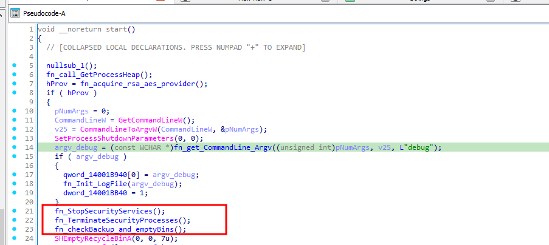

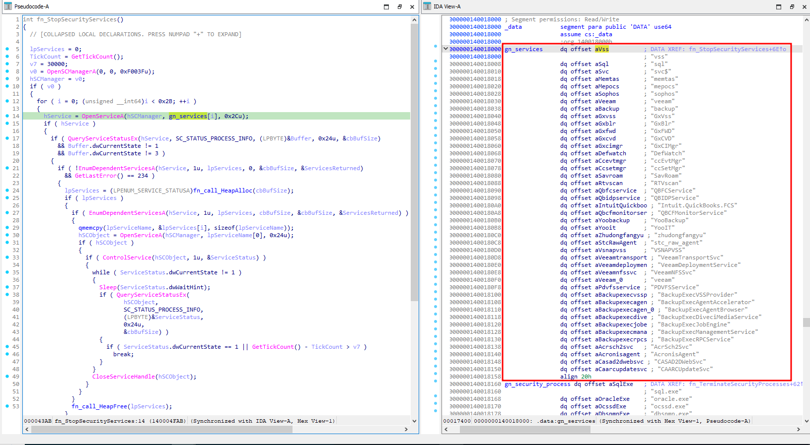


- Tiếp theo, Ransomware xóa có hệ thống tất cả các bản sao nhằm loại bỏ các bản sao ẩn và bản sao lưu có thể được dùng để phục hồi tệp. Để tiếp tục cản trở nỗ lực khôi phục, Ransomware cũng dọn sạch nội dung "Thùng rác", đảm bảo rằng các tệp mới bị xóa không thể dễ dàng được khôi phục ( Phân tích việc xóa các bản sao ẩn thông qua COM Interface ) .

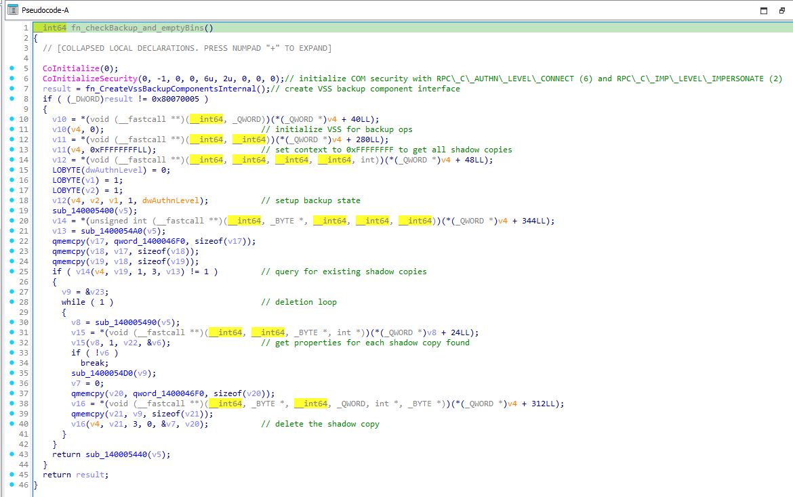

- Sau khi hoàn tất chuẩn bị, Ransomware sẽ đếm số core bộ xử lý khả dụng trên hệ thống và chạy multi-threading cho việc mã hóa tệp. Bằng cách sử dụng multi-threading, Ransomware tối đa hóa tốc độ và hiệu quả mã hóa cho phép nhanh chóng mã hóa khối lượng lớn dữ liệu trên máy chủ bị lây nhiễm.

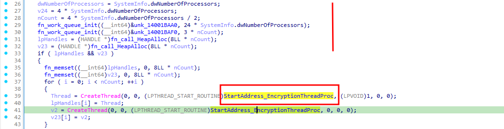

### 2. Encryption Logic Analysis

- Hàm này thực hiện hai logic chính là lọc các file để mã hóa và mã hóa nội dung của chúng.

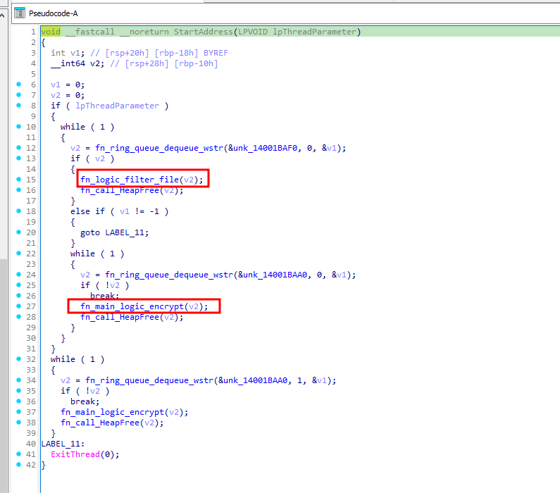

Trong quá trình mã hóa, Ransomware đặc biệt tránh mã hóa các tệp với phần mở rộng và tên tệp sau:

- ".exe"

- ".dll"

- ".Charon"

- "How To Restore Your Files.txt"

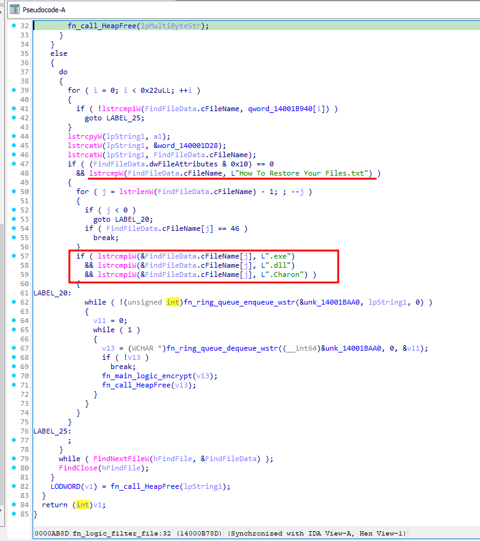

- Sau đó chương trình mã hóa các tập tin, thêm extension ".Charon", rồi thêm dấu hiệu đã bị mã hóa "hCharon is enter to the urworld!" vào các tập tin được mã hóa.

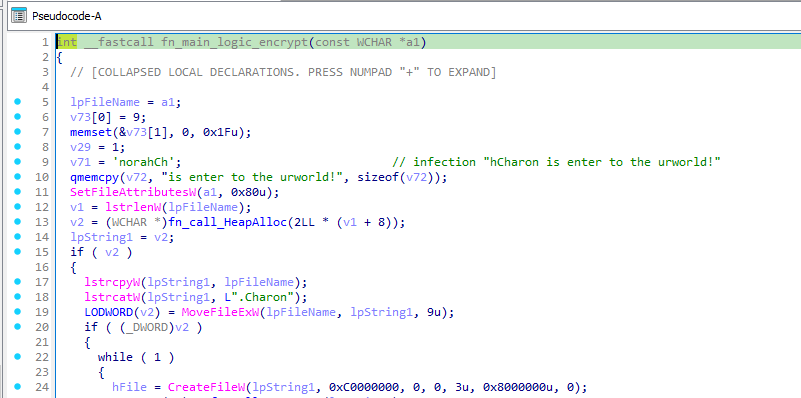

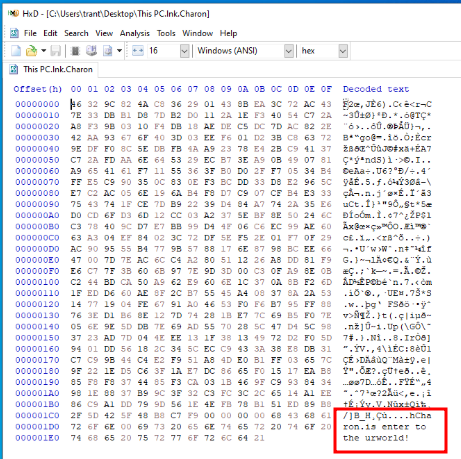

- Quy trình mã hóa sử dụng một sơ đồ mã hóa kết hợp (hybrid cryptographic scheme) giữa mật mã đường cong "elliptic Curve25519" với mã hóa "ChaCha20". Thuật toán mã hóa bắt đầu bằng việc tạo ra một khóa riêng (private key) ngẫu nhiên 32 byte bằng các hàm mật mã của Windows, sau đó được định dạng đúng theo đặc tả của Curve25519.

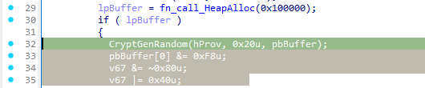

- Khóa riêng này được dùng để sinh khóa công khai (public key), sau đó kết hợp với khóa công khai được hardcode sẵn (nhúng trong tệp nhị phân) để tạo ra một khóa bí mật chung (shared secret) thông qua mật mã đường cong elliptic. Khóa bí mật này được xử lý qua một hàm băm tùy chỉnh để tạo ra khóa 256-bit, dùng để khởi tạo bộ mã dòng ChaCha20 đã được chỉnh sửa nhằm thực hiện mã hóa tập tin thực tế.


- Mỗi tập tin đã mã hóa sẽ có thêm một phần đuôi dài 72 byte chứa khóa công khai của nạn nhân và siêu dữ liệu liên quan đến mã hóa, cho phép việc giải mã tập tin thông qua một khóa riêng.

- Charon triển khai cơ chế mã hóa từng phần (partial encryption) để cân bằng giữa tốc độ và hiệu quả:

  - Tập tin <= 64KB: Mã hóa toàn bộ.

  - Tập tin 64KB–5MB: Mã hóa 3 khối ở đầu (0%), giữa (50%), và cuối (75%).

  - Tập tin 5MB–20MB: Mã hóa 5 khối phân bố đều (mỗi khối chiếm 1/5 kích thước).

  - Tập tin >20MB: Mã hóa 7 khối tại các vị trí 0%, 12.5%, 25%, 50%, 75%, 87.5% và gần cuối.

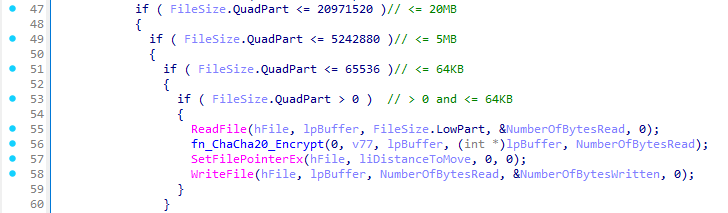

- Đoạn mã của quy trình mã hóa hiển thị logic mã hóa tệp một phần của nó và thêm phần chân khóa 72 byte cho mỗi tệp được mã hóa :

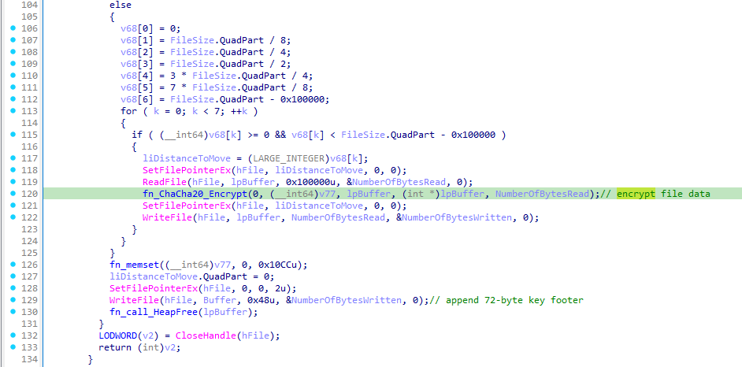

- Cuối cùng, quá trình mã hóa drop tập tin "How To Restore Your Files.txt" làm ghi chú đòi tiền chuộc ở tất cả các ổ đĩa, mạng được chia sẻ và thư mục.

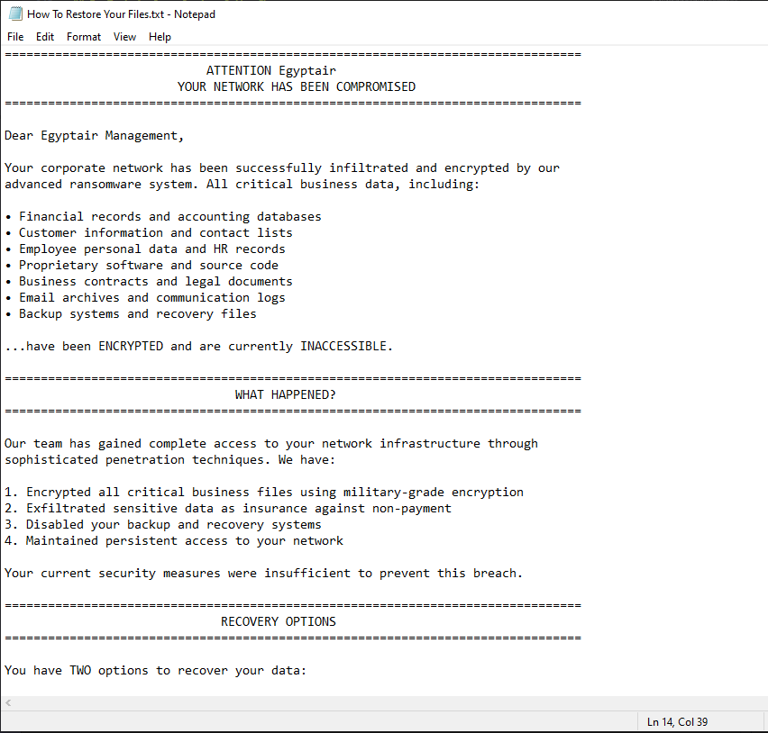

### 3. Other Behaviors Beyond Encryption

- Ngoài chức năng mã hóa, Charon_Ransomware còn một số hành vi khác. Nó có khả năng lây lan trong mạng, tích cực quét và mã hóa các chia sẻ mạng (network shares) có thể truy cập được trong hạ tầng thông qua "NetShareEnum" và "WNetEnumResource". Nó xử lý cả ổ đĩa được ánh xạ (mapped drives) và các đường dẫn UNC, nhưng bỏ qua các chia sẻ ADMIN$ trong quá trình liệt kê để tránh bị phát hiện.

- Trong quá trình phân tích routine khởi tạo, phát hiện Charon_Ransomware chứa một package được build để bypass các hệ thống EDR (Endpoint Detection and Response). Ransomware này bao gồm một driver được biên dịch từ ( https://github.com/SaadAhla/dark-kill ), được thiết kế để vô hiệu hóa các giải pháp EDR [ - [dump_PE_in_payload_ransomware.py](./files/dump_PE_in_payload_ransomware.py) - ].


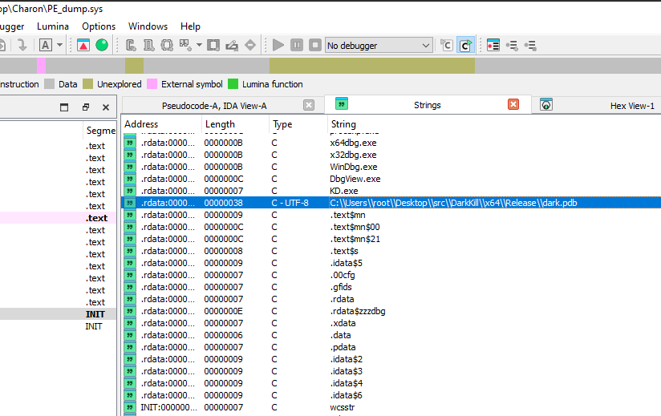

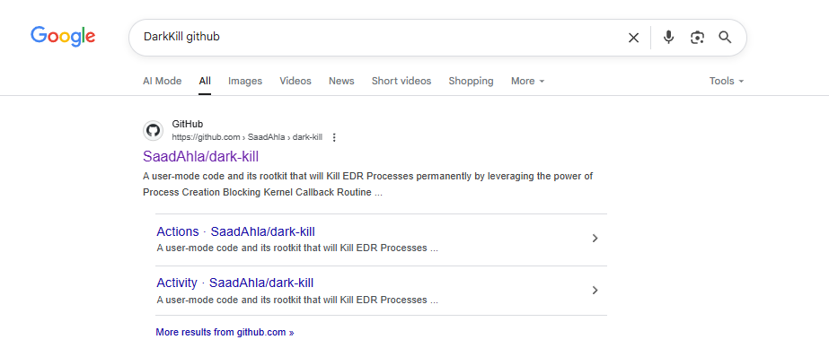

- Phân tích thấy có hàm drop file được build trên thành driver "%SystemRoot%\System32\Drivers\WWC.sys" và đăng ký nó như một dịch vụ "WWC". Tuy nhiên, khi phân tích thấy hàm chống EDR này tồn tại nhưng không được gọi khi thực thi. Điều này cho thấy tính năng này vẫn đang trong giai đoạn phát triển và chưa được kích hoạt trong biến thể hiện tại, có thể để dành cho các phiên bản của Ransomware trong tương lai.

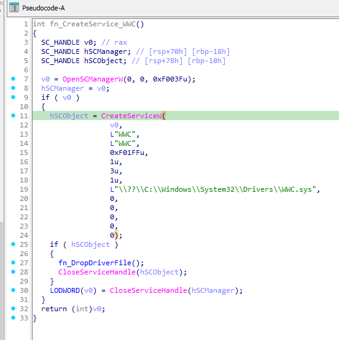


## III. IoC and MITRE-ATT&CK Framework

- File Python [decode_dumpstack.py](./files/decode_dumpstack.py) - decrypt "DumpStack.log" để xác định và phân loại các mẫu cùng kỹ thuật mã hóa, triển khai file mã độc của APT Earth-Baxia.

### 1. IoC Table

| **SHA1**                                 | **Detection**                 | **Description**                                                                                                                   |
| ---------------------------------------- | ----------------------------- | --------------------------------------------------------------------------------------------------------------------------------- |
| 92750eb5990cdcda768c7cb7b654ab54651c058a | Ransom.Win64.CHARON.THGBCBE   | Payload (Charon Ransomware)                                                                                                       |
| a1c6090674f3778ea207b14b1b55be487ce1a2ab | Ransom.Win64.CHARON.A.enc     | Shellcode (DumpStack.log)                                                                                                         |
| 21b233c0100948d3829740bd2d2d05dc35159ccb | Trojan.Win64.SWORDLDR.THGBCBE | SWORDLDR (msedge.dll)                                                                                                             |
| f523d7eab793bf83594363aeb63257765a6296fa | Ransom.Win64.CHARON.A.note    | Ransom note dropped after encryption (How To Restore Your Files.txt) - contains payment instructions, victim ID, and TOR/contacts |

Charon thao tác các process và services sau:

- Service names:

```
vss
sql
svc$
memtas
mepocs
sophos
veeam
backup
GxVss
GxBlr
GxFWD
GxCVD
GxCIMgr
DefWatch
ccEvtMgr
ccSetMgr
SavRoam
RTVscan
QBFCService
QBIDPService
Intuit.QuickBooks.FCS
QBCFMonitorService
YooBackup
YooIT
zhudongfangyu
stc_raw_agent
VSNAPVSS
VeeamTransportSvc
VeeamDeploymentService
VeeamNFSSvc
veeam
PDVFSService
BackupExecVSSProvider
BackupExecAgentAccelerator
BackupExecAgentBrowser
BackupExecDiveciMediaService
BackupExecJobEngine
BackupExecManagementService
BackupExecRPCService
AcrSch2Svc
AcronisAgent
CASAD2DWebSvc
CAARCUpdateSvc
```

- Process names:

```
sql.exe
oracle.exe
ocssd.exe
dbsnmp.exe
synctime.exe
agntsvc.exe
isqlplussvc.exe
xfssvccon.exe
mydesktopservice.exe
ocautoupds.exe
encsvc.exe
firefox.exe
tbirdconfig.exe
mydesktopqos.exe
ocomm.exe
dbeng50.exe
sqbcoreservice.exe
excel.exe
infopath.exe
msaccess.exe
mspub.exe
onenote.exe
outlook.exe
powerpnt.exe
steam.exe
thebat.exe
thunderbird.exe
visio.exe
winword.exe
wordpad.exe
notepad.exe
```

### 2. MITRE-ATT&CK Framework

- Dưới đây là bảng "map" Windows API <-> MITRE ATT\&CK <-> Hành vi .

| Windows API / Interface (ví dụ tiêu biểu)                                                                                        | MITRE ATT\&CK (ID – Tên)                                                                 | Hành vi trong chiến dịch Charon                                                                                                                                                                                                       |
| -------------------------------------------------------------------------------------------------------------------------------- | ---------------------------------------------------------------------------------------- | ------------------------------------------------------------------------------------------------------------------------------------------------------------------------------------------------------------------------------------- |
| **Netapi32!NetShareEnum**                                                                                                        | **T1135 – Network Share Discovery**                                                      | Liệt kê các network share, xử lý cả mapped drives và đường dẫn UNC; dùng để quét và mã hóa các share truy cập được; bỏ qua **ADMIN\$** khi enumerate.                                                                                 |
| **Mpr!WNetOpenEnum / WNetEnumResource**                                                                                          | **T1135 – Network Share Discovery**                                                      | Dò quét tài nguyên mạng (shares) trên hạ tầng để phục vụ lan truyền/mã hóa qua mạng.                                                                                                                                                  |
| **Kernel32!CreateMutexW** (tên mutex: `OopsCharonHere`)                                                                          | **T1480.002 – Execution Guardrails: Mutual Exclusion**                                   | Tạo mutex để đảm bảo chỉ chạy một phiên bản, tránh tái nhiễm hoặc va chạm tiến trình.                                                                                                                                                 |
| **COM/VSS**: `CoInitializeEx` => `CoCreateInstance(CLSID_VSSBackupComponents)` => **IVssBackupComponents::DeleteSnapshots**      | **T1490 – Inhibit System Recovery**                                                      | Xóa **shadow copies** qua COM interface để cản trở khôi phục.                                                                                                                                                                         |
| **Shell32!SHEmptyRecycleBinW**                                                                                                   | **T1070.004 – Indicator Removal: File Deletion**                                         | Dọn trống **Recycle Bin** để làm khó quá trình khôi phục tệp vừa xóa.                                                                                                                                                                 |
| **Advapi32!OpenSCManagerW / OpenServiceW / ControlServiceW**                                                                     | **T1489 – Service Stop** _(và)_ **T1562.001 – Impair Defenses: Disable or Modify Tools** | Dừng các **dịch vụ bảo mật** đang chạy để giảm khả năng bị phát hiện/gián đoạn.                                                                                                                                                       |
| **Kernel32!OpenProcess / TerminateProcess** _(hoặc API tương đương)_                                                             | **T1562.001 – Impair Defenses: Disable or Modify Tools**                                 | **Chấm dứt tiến trình** liên quan bảo mật trước khi mã hóa.                                                                                                                                                                           |
| **Advapi32!CreateServiceW / StartServiceW** _(đăng ký driver)_                                                                   | **T1543.003 – Create or Modify System Process: Windows Service**                         | Cố gắng thả driver **`%SystemRoot%\System32\Drivers\WWC.sys`** và **đăng ký service "WWC"** (thành phần chống EDR, hiện ở trạng thái dormant).                                                                                        |
| **LoadLibraryW / ntdll!LdrLoadDll**                                                                                              | **T1574.002 – Hijack Execution Flow: DLL Side-Loading**                                  | Chuỗi **DLL sideloading**: lợi dụng **Edge.exe** hợp pháp để nạp **msedge.dll (SWORDLDR)** và triển khai payload.                                                                                                                     |
| **CreateProcess(… CREATE_SUSPENDED)** + **VirtualAllocEx / WriteProcessMemory / SetThreadContext / ResumeThread**                | **T1055.012 – Process Injection: Process Hollowing**                                     | **Inject/hollow** vào **svchost.exe** để thực thi payload sau khi giải mã từ `DumpStack.log`.                                                                                                                                         |
| **CNG/CryptoAPI**: _ví dụ_ **BCryptGenRandom** (sinh seed), **(ECDH/X25519) secret agreement**, **ChaCha20** triển khai trong mã | **T1486 – Data Encrypted for Impact**                                                    | Dùng **Windows cryptographic functions** tạo **private key 32-byte**, sinh **shared secret** (Curve25519) => băm ra **khóa 256-bit** để khởi tạo **ChaCha20** mã hóa; áp dụng **partial encryption** và thêm **72-byte footer**/file. |

## IV. Resource References

- https://www.trendmicro.com/en_fi/research/25/h/new-ransomware-charon.html

---
