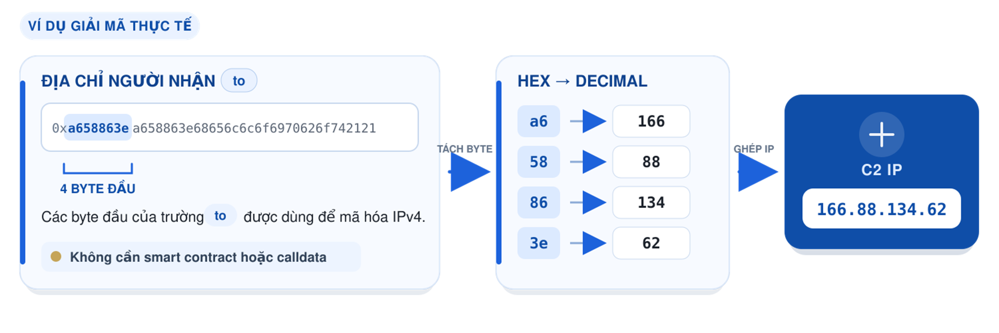
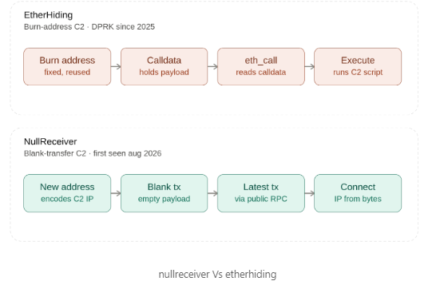

> _Lưu ý: Đây là tài liệu thứ hai được tôi tổng hợp và chuẩn bị cho Security Bootcamp 2026, tổ chức tại TP. Buôn Ma Thuột, tỉnh Đắk Lắk từ ngày 10–12/09/2026. Trong quá trình biên soạn, tôi có sử dụng AI để hỗ trợ tra cứu, hệ thống hóa và biên tập nội dung. Mặc dù đã kiểm tra lại các thông tin, tài liệu vẫn có thể còn thiếu sót hoặc nhận định chưa chính xác. Nếu có ai đó đọc bài viết này và thấy sai xót đâu đó, rất mong nhận được góp ý từ bạn đọc để tôi tiếp tục chỉnh sửa và hoàn thiện._

> **TL;DR.** "NullReceiver" là một kỹ thuật phân giải hạ tầng C2 (Command & Control) dựa trên blockchain, được nhóm tấn công liên hệ với **Triều Tiên (DPRK)** sử dụng trong chiến dịch **Contagious Interview**. Báo cáo từ OpenSourceMalware đã xác định kỹ thuật này bên trong hai gói npm đã bị cài mã độc (`bianira-ui@1.27.0`, `fluid-type-ui@2.0.8`) giả dạng plugin của Tailwind CSS. Thay vì nhúng con trỏ C2 vào calldata của smart contract (như cách EtherHiding làm), mã độc **giải mã địa chỉ IP C2 trực tiếp từ các byte của địa chỉ người nhận** trong một giao dịch chuyển Ethereum thông thường, **giá trị bằng 0, không có dữ liệu** - không smart contract, không calldata, không có gì để lấy dấu vân tay ngoài một giao dịch ví-tới-ví trông y hệt mọi giao dịch khác.



> Kỹ thuật này như một bản vá trực tiếp và có chủ đích cho điểm yếu duy nhất đã biết của EtherHiding: một địa chỉ đích cố định, ai cũng có thể theo dõi công khai.

---

## I. Bối cảnh: từ dead drop đến blockchain

Các chiến dịch phát tán package npm độc hại có liên quan đến **Contagious Interview**, **BeaverTail** và **InvisibleFerret** cho thấy cơ chế phân giải C2 liên tục được cải tiến nhằm giảm các dấu hiệu mà "Blue Team" có thể chặn hoặc theo dõi.

Google Threat Intelligence Group theo dõi một phần hoạt động này dưới tên **UNC5342**. Một số báo cáo liên hệ nó với tập hoạt động rộng hơn được CrowdStrike gọi là **Famous Chollima**; tuy nhiên, đây nên được xem là mối liên hệ do các hãng bảo mật báo cáo, không phải sự đồng nhất 1:1 đã được xác nhận.

- **C2 được hardcode trong malware:** Tên miền hoặc địa chỉ IP của máy chủ điều khiển được ghi trực tiếp trong mã. Khi mẫu mã độc bị phân tích, địa chỉ này dễ bị phát hiện, đưa vào danh sách chặn hoặc vô hiệu hóa.

- **Dead-drop resolver:** Malware không lưu C2 thật mà truy xuất một "địa chỉ chỉ dẫn" được đăng trên các dịch vụ hợp pháp như Pastebin, GitHub Gist hoặc hồ sơ Steam. Attacker có thể thay đổi C2 mà không cần sửa malware, nhưng trang trung gian vẫn là một điểm cố định có thể bị nhận diện và gỡ bỏ.

- **EtherHiding:** Con trỏ C2 hoặc payload được chuyển sang blockchain công khai và lưu trong calldata hoặc smart contract. Dữ liệu trên blockchain khó bị gỡ bỏ, nhưng malware vẫn phải truy vấn một địa chỉ contract, ví hoặc địa chỉ burn cố định - tạo ra điểm quan sát cho defender. Guardio Labs công bố kỹ thuật này trong chiến dịch ClearFake vào tháng 10/2023; đến tháng 10/2025, GTIG ghi nhận UNC5342 sử dụng nó trong hoạt động Contagious Interview.

- **NullReceiver:** Malware theo dõi giao dịch mới nhất từ ví của attacker và giải mã IP C2 từ địa chỉ nhận. Giao dịch không chuyển ETH, không chứa calldata và không cần smart contract; địa chỉ nhận có thể được tạo mới cho mỗi lần cập nhật. Vì vậy, defender không còn một địa chỉ đích cố định hoặc trường dữ liệu chứa payload để lấy dấu vân tay. Tuy nhiên, ví nguồn của attacker vẫn là điểm tham chiếu cần thiết và có thể bị theo dõi sau khi được phát hiện.

Nhìn tổng thể, sự tiến hóa này không loại bỏ hoàn toàn dấu vết, mà liên tục chuyển dấu vết C2 sang những vị trí khó nhận diện và khó vô hiệu hóa hơn.

---

## II. EtherHiding là gì ?

EtherHiding lợi dụng blockchain làm nơi lưu trữ hoặc phân giải payload. Dữ liệu có thể là địa chỉ C2, cấu hình hoặc mã JavaScript và thường được mã hóa bằng Base64, XOR hoặc một vài thuật toán mã hóa đối xứng khác.

Kỹ thuật này có hai cách triển khai chính:

- **Lưu trong smart contract:** Malware gọi một hàm chỉ đọc, chẳng hạn thông qua `eth_call`, để lấy dữ liệu hiện đang được lưu trong contract. Việc đọc không tạo giao dịch mới và không tốn gas.
- **Lưu trong calldata của giao dịch:** Attacker đặt dữ liệu trong trường `input` của giao dịch, thường gửi tới địa chỉ burn như `0x000...dEaD`. Malware truy vấn chi tiết hoặc lịch sử giao dịch qua RPC hay blockchain explorer API, đọc `calldata`, giải mã rồi thực thi payload.

Tháng 10/2025, Google Threat Intelligence Group lần đầu báo cáo một tác nhân cấp nhà nước sử dụng EtherHiding. GTIG theo dõi cụm Triều Tiên này dưới tên **UNC5342** và xác định kỹ thuật đã được đưa vào chiến dịch Contagious Interview từ tháng 2/2025.

Trong chuỗi lây nhiễm, **JADESNOW** đóng vai trò downloader dựa trên JavaScript: nó lấy và thực thi dữ liệu được lưu trên BNB Smart Chain và Ethereum, sau đó tải backdoor **INVISIBLEFERRET.JAVASCRIPT**. Đây là hai thành phần riêng biệt trong cùng chuỗi tấn công, không phải một họ mã độc duy nhất.

Song song với UNC5342, cụm có động cơ tài chính **UNC5142** đã sử dụng EtherHiding trong chiến dịch ClearFake từ năm 2023. Nhóm này xâm nhập các website, chủ yếu là WordPress, rồi chèn JavaScript để phát tán infostealer thông qua các payload lưu trên blockchain.

**Điểm yếu của EtherHiding:** malware vẫn cần một điểm tham chiếu tương đối ổn định để tìm dữ liệu, chẳng hạn địa chỉ burn, địa chỉ ví hoặc smart contract do attacker kiểm soát. Sau khi điểm tham chiếu này bị phát hiện, defender có thể gắn nhãn, chặn truy cập hoặc tiếp tục theo dõi các lần cập nhật mới.

OpenSourceMalware nhận định địa chỉ burn cố định là "cột mốc" giúp GTIG phát hiện hoạt động của UNC5342. Đây là một suy luận phù hợp với cơ chế kỹ thuật, nhưng GTIG không trực tiếp công bố rằng đó chính là phương pháp họ sử dụng để phát hiện chiến dịch.

> **Ba nhóm tín hiệu thường gặp của EtherHiding**
>
> 1. Điểm tham chiếu ổn định như địa chỉ burn, ví hoặc smart contract.
> 2. `Calldata` không rỗng hoặc dữ liệu mã hóa được lưu trong contract.
> 3. Truy vấn bất thường tới RPC, blockchain explorer API hoặc smart contract.
>
> **NullReceiver** giảm đáng kể cả ba nhóm tín hiệu: không dùng smart contract, để trống `calldata` và tạo một địa chỉ nhận mới cho mỗi lần cập nhật. Đổi lại, nó chỉ chứa được vài byte - đủ để mã hóa địa chỉ IP, không đủ cho một URL hoặc script hoàn chỉnh.
>
> Tuy nhiên, NullReceiver không hoàn toàn "không có điểm cố định": malware vẫn phải biết ví nguồn của attacker để tìm giao dịch mới nhất. Khi ví này bị nhận diện, defender vẫn có thể tiếp tục theo dõi hoạt động của chiến dịch.

---

## III. NullReceiver làm khác điều gì ?

### III.1 Sơ đồ: nullreceiver Vs etherhiding



> Nguồn ảnh: https://www.linkedin.com/pulse/nullreceiver-blockchain-c2-resolution-via-blank-ethereum-hamza-khella-5ygte/

### III.2 Luồng thực thi

Hai package `bianira-ui` và `fluid-type-ui` **không gọi smart contract** và **không lưu dữ liệu trong calldata**.

Khi mã độc chạy trên máy của lập trình viên, nó thực hiện các bước sau:

1. Lấy địa chỉ ví của attacker được hardcode sẵn trong mã.
2. Tìm giao dịch gửi đi mới nhất của ví đó qua RPC endpoint công khai.
3. Đọc trường `to` của giao dịch - một địa chỉ giả được tạo nhằm mã hóa dữ liệu, không phải để nhận tiền.
4. Giải mã địa chỉ IP C2 trực tiếp từ các byte của địa chỉ `to`.
5. Kết nối tới IP vừa giải mã qua HTTP hoặc HTTPS.

Toàn bộ quá trình trên máy nạn nhân chỉ là **truy vấn dữ liệu blockchain**: không gọi contract, không thay đổi trạng thái blockchain và không tạo giao dịch mới. Vì vậy, phía nạn nhân **không phải trả gas**. Chi phí gas duy nhất do attacker trả khi đăng giao dịch dead drop lên blockchain.

Giao dịch được phân tích có **giá trị bằng 0** và **calldata rỗng** (`"input": "0x"`), khiến nó trông giống một giao dịch trống thông thường giữa hai địa chỉ. Địa chỉ nhận giải mã thành IP C2 **`166.88.134.62`**; các byte còn lại tạo thành chuỗi ASCII **`helloipbot!!`**, đóng vai trò như dấu vân tay của attacker.

### III.3 Cách giải mã địa chỉ

Địa chỉ người nhận trong mẫu đã phân tích:

```
0xa658863ea658863e68656c6c6f6970626f742121
```

Tách ra (20 byte = 4 + 4 + 12):

| Phần hex                   | Ý nghĩa                                                           |
| -------------------------- | ----------------------------------------------------------------- |
| `a6` `58` `86` `3e`        | 4 byte đầu -> đổi sang thập phân -> **166.88.134.62** (IP của C2) |
| `a658863e`                 | Lặp lại lần hai (được hiểu là dư thừa / để xác nhận)              |
| `68656c6c6f6970626f742121` | Chuỗi ASCII -> **`helloipbot!!`**                                 |

Phép giải mã rất đơn giản:

```
0xa6 = 166
0x58 =  88
0x86 = 134
0x3e =  62
```

Chuỗi `helloipbot!!` ở đuôi cho thấy kẻ tấn công nhét được cả dữ liệu chức năng lẫn chuỗi "chữ ký" vào cùng một trường địa chỉ.

### III.4 Logic dropper khôi phục được (từ gói độc hại)

```javascript
global.i = "A10-npm3!", global.r = require, "object" ==
typeof module && (global.m = module);
let http = require("http"),
    https = require("https"),
    S = "0xa322e5f3d311d3080e6f0121063e9adc2490ef1a",
    R = ["https://1rpc.io/eth", "https://eth.drpc.org"],
    hx = t => "0x" + t.toString(16),
    J = (e, o, r) => new Promise(a => {
        var t = new URL(e);
        https.request({
            hostname: t.hostname,
            path: t.pathname + t.search,
            method: o || "GET"
        }, t => {
            let e = [];
            t.on("data", t => e.push(t)), t.on("end", ()
=> a(JSON.parse(Buffer.concat(e) + "")))
        }).end(r)
    }),
```

> Nguồn Code: https://www.linkedin.com/pulse/nullreceiver-blockchain-c2-resolution-via-blank-ethereum-hamza-khella-5ygte/

Trong đó `S` là ví của kẻ tấn công, `R` là danh sách RPC endpoint công khai dùng để tra cứu,
và `global.i = "A10-npm3!"` là chuỗi chữ ký tĩnh dùng được làm dấu hiệu phát hiện.

---

## IV. Phân tích so sánh

| Đặc điểm                         | EtherHiding                                                      | NullReceiver                                                   |
| -------------------------------- | ---------------------------------------------------------------- | -------------------------------------------------------------- |
| **Bí mật nằm ở đâu**             | Calldata của giao dịch                                           | Địa chỉ người nhận (`to`) của giao dịch                        |
| **Địa chỉ đích được dùng**       | Địa chỉ burn cố định (`0x000...dEaD`) / các contract tái sử dụng | Địa chỉ mới, dùng-một-lần, bịa ra, đổi mỗi lần tra cứu         |
| **Calldata / payload giao dịch** | Không rỗng - chứa payload                                        | Rỗng hoàn toàn (`"input": "0x"`)                               |
| **Dung lượng**                   | Lớn - cả URL hoặc script đầy đủ                                  | Nhỏ - vừa đủ cho một địa chỉ IP                                |
| **Chi phí**                      | Trả gas cho từng byte calldata                                   | Hình thái giao dịch rẻ nhất có thể (~21.000 gas)               |
| **Tương tác smart contract**     | Có                                                               | Không                                                          |
| **Dấu hiệu phát hiện có sẵn**    | Có - địa chỉ burn là một cột mốc đã biết                         | Không - không có gì cố định để theo dõi trước khi bị phát hiện |
| **Điểm yếu chung**               | Ví _gửi_ bị tái sử dụng xuyên suốt chiến dịch                    | Tương tự - ví gửi bị tái sử dụng                               |

Thuộc tính duy nhất mà cả hai kỹ thuật vẫn cùng chia sẻ: **ví gửi bị tái sử dụng xuyên suốt một chiến dịch**
(cùng một ví, `0xa322e5f3d311d3080e6f0121063e9adc2490ef1a`, đứng sau cả hai gói bị cài mã độc ở đây).
Đó vẫn là điểm xoay (pivot) cho blue team sử dụng để quan sát và ngăn chặn.

---

## V. Đường lây nhiễm (Infection Chain)

**Vector ban đầu:** tấn công chuỗi cung ứng qua các gói **npm độc hại giả mạo plugin Tailwind CSS phổ biến**.

Hai gói được phát hiện đầu tiên (đều publish ngày **28/07/2026**, sau đó bị gỡ khỏi npm):

- `bianira-ui@1.27.0` - ~109 lượt tải
- `fluid-type-ui@2.0.8` - ~587 lượt tải

Tài khoản npm đăng tải: `npmuser1101` và `npmuser3002`.

**Các gói liên quan được xác định thêm:**

| Gói                          | Lượt tải |
| ---------------------------- | -------- |
| `tailwindcss-anim`           | 1.357    |
| `tailwind-anim`              | 1.301    |
| `post-css-transfer`          | 318      |
| `scrollbar-hide-plugin`      | 247      |
| `tailwind-animation-founder` | 124      |

**Payload sau khai thác:**

- **Giai đoạn chính:** **BeaverTail** - mã độc đánh cắp thông tin đăng nhập và ví tiền mã hoá, đồng thời làm bệ phóng cho payload tiếp theo.
- **Giai đoạn hai:** các biến thể của **INVISIBLEFERRET**, vốn đã xuất hiện trong các chiến dịch Contagious Interview trước đó.

---

## VI. Quy kết (Attribution) và Ánh xạ MITRE ATT&CK

1. Attribution:

- Liên hệ với các nhóm tấn công **Triều Tiên (DPRK)**.

- Thuộc chiến dịch **Contagious Interview** - dùng lời mời tuyển dụng giả trên LinkedIn để dụ nạn nhân (thường là lập trình viên) chạy mã độc dưới vỏ bọc "bài test kỹ thuật".

- Kết nối với chiến dịch rộng hơn mang tên **PolinRider**, trải trên các hệ sinh thái **npm, Go và PHP** với hơn 20 gói bị nhiễm.

2. Mapping MITRE ATT&CK :

- **Khớp nhất:** **T1102.001** - Web Service: Dead Drop Resolver (chiến thuật TA0011, Command and Control).
  Mã độc sử dụng một tra cứu hạ tầng bên thứ ba hợp pháp (một RPC endpoint công khai đọc trạng thái blockchain)
  để phân giải ra con trỏ tới C2 thật - đúng chính xác mô thức mà kỹ thuật con này mô tả.

- **Khoảng trống cần nêu:** MITRE hiện **chưa có** kỹ thuật con nào dành riêng cho blockchain.
  Cả EtherHiding lẫn NullReceiver đều bị ép khớp vào T1102.001, vốn được viết ra với dead drop kiểu
  Pastebin/GitHub/mạng xã hội trong đầu, chứ không phải dữ liệu on-chain. Đáng để theo dõi như một khoảng trống
  ứng viên mà cộng đồng (hoặc hệ phân loại nội bộ của chính bạn) có thể muốn lấp đầy.

- **Chiến lược phát hiện liên quan:** MITRE D3FEND / ATT&CK Detection Strategy **DET0058** bao quát việc phát hiện
  dead-drop resolver nói chung (tiến trình/script tiếp cận một dịch vụ web phổ biến và trích xuất ra một con trỏ C2
  thứ cấp đã bị làm rối) - cùng logic đó áp dụng được ở đây, chỉ cần thay "dịch vụ web" bằng "RPC endpoint".

3. Điểm yếu của kỹ thuật: ví gửi vẫn bị tái sử dụng

Dù NullReceiver xoá được các tín hiệu phát hiện của EtherHiding, nó vẫn còn **một lỗ hổng cấu trúc: kẻ tấn công tái sử dụng chính ví gửi trong suốt chiến dịch.**

Hệ quả: khi phía blue team đã xác định được ví `0xa322...ef1a`, họ có thể:

- Giám sát **mọi giao dịch outbound trong tương lai** -> biết trước C2 mới ngay khi nó được công bố lên chain.
- **Giải mã ngược toàn bộ dead drop trong quá khứ** -> dựng lại lịch sử hạ tầng C2 của chiến dịch.

Tính đến thời điểm phân tích, ví này ghi nhận **68 giao dịch kể từ 27/07/2026**, tất cả đều trỏ tới cùng địa chỉ `0xa658863e...2121`.

Nói cách khác: blockchain vừa là kênh phát tán không thể kiểm duyệt của kẻ tấn công, vừa là **sổ cái công khai bất biến** chống lại chính họ.

---

## VII. Ưu điểm của NullReceiver so với EtherHiding

1. **Không thể takedown.** Không có domain để sinkhole, không có server để thu giữ. Dead drop nằm trên sổ cái Ethereum - bất biến và không kiểm duyệt được.
2. **Tàng hình nhờ sự tối giản.** Một giao dịch rỗng, giá trị 0 chính là **hình dạng giao dịch rẻ nhất và ít gây chú ý nhất** trên mạng lưới. Nó lẫn vào hàng triệu giao dịch hợp pháp.
3. **Xoay vòng C2 tức thì.** Kẻ tấn công chỉ cần gửi một giao dịch mới để trỏ toàn bộ implant sang hạ tầng khác.
4. **Đảo ngược mô hình phát hiện.** Các quy tắc săn blockchain hiện tại tập trung vào _tương tác smart contract_ và _phân tích calldata_. NullReceiver không chạm vào cả hai - với những quy tắc đó, nó **trông hoàn toàn bình thường**.

---

## VIII. IOC tổng hợp

Bảng dưới đây hợp nhất IOC từ cả hai tài liệu. Cột **Nguồn** cho biết IOC đó có trong bài LinkedIn (📄) hay chỉ đến từ nguồn khác (⊕).

| Loại                                        | Giá trị                                      | Nguồn |
| ------------------------------------------- | -------------------------------------------- | ----- |
| Gói npm                                     | `bianira-ui@1.27.0`                          | 📄 ⊕  |
| Gói npm                                     | `fluid-type-ui@2.0.8`                        | 📄 ⊕  |
| Gói npm liên quan                           | `tailwindcss-anim`                           | ⊕     |
| Gói npm liên quan                           | `tailwind-anim`                              | ⊕     |
| Gói npm liên quan                           | `post-css-transfer`                          | ⊕     |
| Gói npm liên quan                           | `scrollbar-hide-plugin`                      | ⊕     |
| Gói npm liên quan                           | `tailwind-animation-founder`                 | ⊕     |
| Ví Ethereum của kẻ tấn công                 | `0xa322e5f3d311d3080e6f0121063e9adc2490ef1a` | 📄 ⊕  |
| Địa chỉ người nhận mã hoá kiểu NullReceiver | `0xa658863ea658863e68656c6c6f6970626f742121` | 📄 ⊕  |
| IP của C2                                   | `166.88.134.62` (cổng 443, 80)               | 📄 ⊕  |
| Chữ ký phát hiện tĩnh                       | `A10-npm3!`                                  | 📄 ⊕  |
| Chuỗi đặc trưng trong mã                    | `helloipbot!!`                               | 📄 ⊕  |
| RPC endpoint bị lạm dụng                    | `https://1rpc.io/eth`                        | 📄 ⊕  |
| RPC endpoint bị lạm dụng                    | `https://eth.drpc.org`                       | 📄 ⊕  |
| Tài khoản npm                               | `npmuser1101`                                | ⊕     |
| Tài khoản npm                               | `npmuser3002`                                | ⊕     |

Dạng danh sách thuần để copy vào công cụ:

```
npm/bianira-ui@1.27.0
npm/fluid-type-ui@2.0.8
npm/post-css-transfer
npm/scrollbar-hide-plugin
npm/tailwind-anim
npm/tailwind-animation-founder
npm/tailwindcss-anim

0xa322e5f3d311d3080e6f0121063e9adc2490ef1a
0xa658863ea658863e68656c6c6f6970626f742121

166.88.134.62:443
166.88.134.62:80

https://1rpc.io/eth
https://eth.drpc.org

A10-npm3!
helloipbot!!

npmuser1101
npmuser3002
```

---

## IX. Detect and Hunting

### IX.1 Giám sát on-chain

- Theo dõi ví đã biết: `0xa322e5f3d311d3080e6f0121063e9adc2490ef1a`.
- Tìm các giao dịch **zero-value, zero-data** từ ví khả nghi tới địa chỉ nhận mới hoặc dùng một lần.
- Giải mã 4 byte đầu của trường `to` thành IPv4 và đối chiếu với threat intelligence.
- Xây dựng baseline để loại trừ các giao dịch zero-value hợp pháp.

Không nên chỉ giám sát smart contract: NullReceiver giấu C2 trong chính địa chỉ nhận của giao dịch.

### IX.2 Phát hiện hành vi "resolve-then-connect"

Tín hiệu đáng chú ý nhất là chuỗi hành vi:

1. `node.exe` truy vấn Ethereum RPC hoặc blockchain API công khai.
2. Ngay sau đó, cùng tiến trình kết nối trực tiếp tới một IP ngoài mạng qua cổng 80/443.

```eql
sequence by process.entity_id with maxspan=5m
  [network where process.name in ("node", "node.exe") and
    destination.domain in ("1rpc.io", "drpc.org", "publicnode.com",
                           "infura.io", "alchemy.com", "ankr.com")]
  [network where process.name in ("node", "node.exe") and
    destination.domain == null and
    not cidrmatch(destination.ip,
      "10.0.0.0/8", "172.16.0.0/12", "192.168.0.0/16")]
```

Đặc biệt cảnh báo lưu lượng này trên **máy lập trình viên, build agent và CI/CD runner** không có nhu cầu Web3. Nên áp dụng egress allowlist và giám sát hành vi bằng EDR.

### IX.3 Phát hiện IOC và mã độc

```yara
rule NullReceiver_NodeJS_Dropper
{
  meta:
    description = "Detects known NullReceiver Node.js resolver artifacts"
    date = "2026-08-02"

  strings:
    $sig    = "A10-npm3!" ascii
    $wallet = "0xa322e5f3d311d3080e6f0121063e9adc2490ef1a" ascii nocase
    $rpc1   = "1rpc.io/eth" ascii
    $rpc2   = "eth.drpc.org" ascii

  condition:
    $sig or ($wallet and 1 of ($rpc*))
}
```

Chặn hoặc cảnh báo đối với:

- Ví: `0xa322e5f3d311d3080e6f0121063e9adc2490ef1a`
- IP C2: `166.88.134.62`
- Package và phiên bản độc hại đã công bố

Đây là IOC có độ tin cậy cao nhưng có thể bị thay đổi, vì vậy cần kết hợp phát hiện hành vi.

### IX.4 Bảo vệ chuỗi cung ứng

- Giám sát tiến trình `node` kết nối ra ngoài trong lúc `npm install`, build hoặc CI.
- Kiểm tra `preinstall`, `postinstall`, entry point và thay đổi trong lockfile.
- Pin dependency bằng lockfile và chỉ cập nhật sau khi rà soát.
- Dùng registry nội bộ, allowlist package và công cụ phân tích như Socket, Phylum hoặc GuardDog.
- Khi phù hợp với dự án, dùng `npm install --ignore-scripts` để vô hiệu hóa lifecycle script.
- Không chạy repo hoặc "bài test tuyển dụng" trên máy làm việc; sử dụng VM dùng một lần, không chứa credential và không kết nối mạng nội bộ.

Trọng tâm blue team nên chuyển từ IOC đơn lẻ sang **chuỗi hành vi: cài package -> Node.js truy vấn blockchain -> kết nối tới IP C2**.

---

## Phụ lục - Vì sao gửi tới một địa chỉ "bịa" vẫn được?

Nếu địa chỉ người nhận là bịa ra và không ai sở hữu, liệu giao dịch có hợp lệ không? **Có** - và nếu gửi ETH thật vào đó thì giao dịch vẫn thành công, nhưng số ETH đó mất vĩnh viễn.

**Ethereum không có khái niệm "địa chỉ tồn tại / không tồn tại".** Một địa chỉ chỉ là **20 byte bất kỳ**. Không có bước đăng ký, không có "tạo tài khoản", và giao thức **không kiểm tra** xem có ai nắm private key tương ứng hay không. Quan hệ này là một chiều:

| Hành động                    | Cần gì                                           |
| ---------------------------- | ------------------------------------------------ |
| **Gửi tới** một địa chỉ      | Không cần gì - chỉ cần 20 byte hợp lệ về cú pháp |
| **Tiêu tiền từ** một địa chỉ | Phải có private key ký được giao dịch            |

Bình thường địa chỉ được suy ra từ khoá công khai (`keccak256(pubkey)[12:]`), nhưng chiều ngược lại không bắt buộc: bất kỳ 20 byte nào - kể cả byte của một địa chỉ IP ghép với chuỗi ASCII `helloipbot!!` - đều được chấp nhận làm trường `to`. Xác suất có người nắm private key khớp với `0xa658863e...2121` là gần như bằng 0.

Đây chính là cơ chế của các **burn address** như `0x000...dEaD`: chúng cũng chỉ là những địa chỉ không ai có key. Ethereum không có cơ chế "bounce back" hay báo lỗi như chuyển khoản ngân hàng sai số tài khoản.

**"Bịa" không có nghĩa là "không hợp lệ".** Cần phân biệt hai chuyện: địa chỉ `0xa658863e...2121` **không được sinh ra từ một cặp khoá** nào, nhưng nó vẫn **đúng định dạng 20 byte** mà giao thức quy định. Node Ethereum xác thực giao dịch, trừ gas của ví gửi và ghi giao dịch vào block hoàn toàn bình thường - không có bước nào trong quá trình đó hỏi "địa chỉ này của ai". Khác biệt duy nhất nằm ở chiều ngược lại: không tồn tại private key nào ký được giao dịch _chi tiêu từ_ địa chỉ đó.

> Có thể hình dung như một hòm thư đúc liền khối bê tông đặt ở rìa đường: vẫn có khe để bỏ thư vào, hệ thống vẫn nhận ra đó là một hòm thư, nhưng nó không có cửa và cũng không có chìa. Thư bỏ vào thì nằm lại đó vĩnh viễn.

Vì vậy giới crypto gọi đây là **"ví chết"** hoặc **"hố đen"**, chứ không gọi là địa chỉ ảo hay địa chỉ không tồn tại.

**Burn address được dùng hợp pháp như thế nào.** Cơ chế "gửi được, không rút được" này vốn là một công cụ bình thường: các dự án token chuyển tài sản tới địa chỉ như `0x000...dEaD` để loại vĩnh viễn một lượng token khỏi lưu thông (buyback and burn), tiêu huỷ phần token thừa sau đợt phát hành, hoặc chứng minh công khai rằng một giá trị đã bị loại bỏ. Địa chỉ `0x000...dEaD` được ưa dùng hơn địa chỉ zero (`0x000...000`) vì nhiều bản cài đặt ERC-20 phổ biến chặn thẳng thao tác chuyển token tới địa chỉ zero.

Điểm đáng chú ý là **NullReceiver dùng chính cơ chế đó theo hướng ngược lại**:

|                 | Burn address của dự án token                 | Địa chỉ nhận của NullReceiver            |
| --------------- | -------------------------------------------- | ---------------------------------------- |
| **Mục đích**    | Tiêu huỷ giá trị, giảm nguồn cung            | Lưu 20 byte dữ liệu lên sổ cái công khai |
| **Số lượng**    | Một địa chỉ cố định, công khai, ai cũng biết | Địa chỉ mới cho mỗi lần cập nhật C2      |
| **Giá trị gửi** | Lượng token thật, thường rất lớn             | `value = 0`                              |
| **Tính chất**   | Là _đích đến_ của giao dịch                  | Là _nội dung_ của giao dịch              |

Chính cột bên phải là thứ khiến kỹ thuật này khó săn: một địa chỉ burn cố định là cột mốc mà defender có thể theo dõi nhiều năm, còn địa chỉ dùng-một-lần thì không để lại cột mốc nào cho tới khi ví nguồn bị phát hiện.

**Còn smart contract thì sao?** Contract cũng **không có private key** - địa chỉ của nó được sinh ra từ địa chỉ người triển khai và nonce (`CREATE`), hoặc từ salt và mã khởi tạo (`CREATE2`). Nhưng điều đó **không** biến mọi contract thành burn address: tài sản trong contract do **mã nguồn** quyết định, không do khoá quyết định.

- Contract có hàm rút hoặc chuyển tiền và điều kiện được thoả mãn -> ETH đi ra bình thường. Toàn bộ DEX, liquidity pool và cầu nối đang vận hành theo đúng cách này.
- Contract **không** có `receive()` hay `fallback()` payable -> giao dịch chuyển ETH thuần tới nó bị **revert**, tiền không rời khỏi ví người gửi.
- Contract **nhận được** ETH nhưng **không có đường rút** (do lỗi lập trình, hoặc thư viện phụ thuộc bị `selfdestruct`) -> khi đó ETH mới thực sự kẹt vĩnh viễn, biến contract thành một burn address ngoài ý muốn. Vụ Parity Multisig tháng 11/2017 đóng băng một lượng lớn ETH theo đúng kịch bản này.

Đặt cạnh nhau, ba khả năng trên cho thấy vì sao EtherHiding phải dùng contract còn NullReceiver thì không: EtherHiding cần một **nơi chứa dữ liệu đọc lại được** nên phải có contract với hàm getter, và mỗi lần cập nhật payload là một lần ghi trạng thái tốn gas. NullReceiver bỏ hẳn lớp đó - dữ liệu nằm trong chính trường `to`, và "nơi chứa" chỉ là lịch sử giao dịch vốn đã bất biến của chain.

**Vì sao chọn `value = 0`:** mục tiêu không phải chuyển tiền mà là **ghi 20 byte kia lên blockchain công khai** để mã độc đọc lại. Gửi ETH thật sẽ vừa lãng phí (mỗi lần đổi C2 là đốt luôn một khoản không lấy lại được) vừa dễ lộ hơn (giao dịch có giá trị dễ lọt vào radar phân tích luồng tiền). Với `value = 0` và calldata rỗng, giao dịch chỉ tốn **21.000 gas** - mức sàn tuyệt đối gọi là _"hình thái giao dịch rẻ nhất có thể"_.

Một chi tiết phụ: từ EIP-161 (Spurious Dragon), gửi 0 ETH tới một địa chỉ chưa từng có gì thậm chí **không tạo ra bản ghi nào** trong state trie. Giao dịch vẫn nằm vĩnh viễn trong lịch sử block (nên `eth_getTransaction*` vẫn đọc được trường `to`), nhưng không để lại dấu vết trong trạng thái hiện tại của chain.

Tóm lại, "địa chỉ bịa" không phải lỗ hổng trong kỹ thuật - nó là **toàn bộ mấu chốt**: trường `to` bị dùng sai mục đích, biến từ "nơi nhận tiền" thành **40 ký tự hex làm kho chứa dữ liệu**.

---

## Nguồn tham khảo

### Nguồn do bài LinkedIn dẫn

1. **OpenSourceMalware** - "NullReceiver's Blank Crypto Transfers Solves the Challenges of EtherHiding",
   Paul McCarty (6mile), 2 tháng 8, 2026.
   https://opensourcemalware.com/blog/nullreceiver-dprk-c2-technique

2. **Google Cloud / Google Threat Intelligence Group (Mandiant)** - "DPRK Adopts EtherHiding:
   Nation-State Malware Hiding on Blockchains", Blas Kojusner, Robert Wallace, Joseph Dobson, 16 tháng 10, 2025.
   https://cloud.google.com/blog/topics/threat-intelligence/dprk-adopts-etherhiding

3. **Google Cloud / GTIG** - "New Group on the Block: UNC5142 Leverages EtherHiding to Distribute Malware",
   16 tháng 10, 2025.
   https://cloud.google.com/blog/topics/threat-intelligence/unc5142-etherhiding-distribute-malware

4. **Guardio Labs** (Nati Tal, Oleg Zaytsev) - "'EtherHiding' - Hiding Web2 Malicious Code in Web3 Smart Contracts",
   13 tháng 10, 2023 (phát hiện gốc).
   https://medium.com/@guardiosecurity/etherhiding-hiding-web2-malicious-code-in-web3-smart-contracts-65ea78efad16

5. **MITRE ATT&CK** - T1102.001, Web Service: Dead Drop Resolver.
   https://attack.mitre.org/techniques/T1102/001/

6. **MITRE ATT&CK** - Detection Strategy DET0058 (Dead Drop Resolver).
   https://attack.mitre.org/detectionstrategies/DET0058/

7. **CSO Online** - bài đưa tin về báo cáo UNC5342/EtherHiding của GTIG, tháng 10, 2025.
   https://www.csoonline.com/article/4074916/north-korean-threat-actors-turn-blockchains-into-malware-delivery-servers.html

8. **BleepingComputer** - bài đưa tin về báo cáo UNC5342/EtherHiding của GTIG, tháng 10, 2025.
   https://www.bleepingcomputer.com/news/security/north-korean-hackers-use-etherhiding-to-hide-malware-on-the-blockchain/

### Nguồn bổ sung (dùng cho các mục đánh dấu ⊕)

9. **The Hacker News** - "Trojanized npm Packages Employ NullReceiver Tactic to Decode C2 IP from Blockchain".
   https://thehackernews.com/2026/08/trojanized-npm-packages-decode-c2-ip.html

10. **GBHackers** - "NullReceiver Is Harder to Discover but Still Exposes a Reusable Attacker Wallet".
    https://gbhackers.com/nullreceiver-wallet-trail/

11. **Hard2bit** - "NullReceiver: hidden blockchain C2 in npm packages".
    https://hard2bit.com/en/blog/nullreceiver-hidden-c2-blockchain-ethereum-npm/

12. **SOC Prime** - "NullReceiver Hides C2 in Blank Ethereum Transfers".
    https://socprime.com/active-threats/nullreceiver-advances-etherhiding-with-blank-crypto-transfers/

13. **Cyber Press** - "DPRK NullReceiver Malware Hides C2 IPs in Zero-Value Ethereum Transactions".
    https://cyberpress.org/nullreceiver-hides-ethereum-c2/

### Tài liệu gốc

14. **Hamza K.** (SOC Analyst) - "NullReceiver: Blockchain C2 Resolution via Blank Ethereum Transfers",
    LinkedIn, 3 tháng 8, 2026. _(File PDF trong thư mục này.)_
    https://www.linkedin.com/pulse/nullreceiver-blockchain-c2-resolution-via-blank-ethereum-hamza-khella-5ygte/

### Nguồn nền tảng blockchain (dùng cho phần Phụ lục)

15. **Ethereum Foundation** - "Ethereum accounts" (phân biệt EOA và contract account,
    cách sinh địa chỉ contract qua CREATE / CREATE2).
    https://ethereum.org/en/developers/docs/accounts/

16. **EIP-161** - "State trie clearing (invariant-preserving alternative)", Spurious Dragon hard fork.
    https://eips.ethereum.org/EIPS/eip-161

17. **Solidity Documentation** - `receive()` và `fallback()`: điều kiện để một contract nhận được ETH.
    https://docs.soliditylang.org/en/latest/contracts.html#receive-ether-function

18. **Parity Technologies** - "A Postmortem on the Parity Multi-Sig Library Self-Destruct",
    15 tháng 11, 2017. _(Ví dụ điển hình về ETH bị khoá vĩnh viễn trong contract.)_
    https://www.parity.io/blog/a-postmortem-on-the-parity-multi-sig-library-self-destruct/

---
